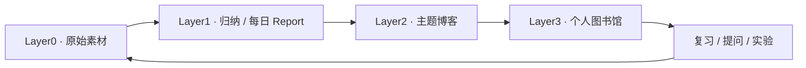

# 盘铭 · Panming

> 苟日新，日日新，又日新。

盘铭是面向个人研究者的每日内容消化与知识沉淀平台。将网页、文件、视频、GitHub 更新、AI 对话和随手笔记收进同一个素材库，经过有来源的归纳、主题写作和持续复习，形成自己的知识体系。

**当前状态：v0.4.1 已接入既有 LLM API，2026-10-07。** 读取 `~/.env` 中 `LLM_*` 配置，支持真实模型证据消化、逐素材处理策略、请求/token 额度与调用账本，保留本地 mock。已用合成 Join/Spill 素材验证真实 API → 引用校验 → Report 更新；原有草稿/版本/备份能力保留。语义 Topic Delta、真实素材质量评估、自动订阅、定时 Report 与多人身份继续迭代。

## 本机运行

```bash
cd /Users/lism/xwork/xlab/panming
./scripts/setup.sh           # 安装独立依赖、初始化专用 PostgreSQL、构建前端
./scripts/run.sh             # 启动；已 setup 后可直接运行
```

打开 [盘铭 · 本机工作台](http://127.0.0.1:8788)。首次可以点击“用一组体验资料探索”，或直接收集自己的素材。刷新/重启后数据仍保留。`./scripts/stop.sh` 只停止盘铭进程与专用数据库。

前置依赖：Python 3.11+、Node 20.19+/22.12+ 和 PostgreSQL；当前本机使用 PostgreSQL 17。可选 `uv` 安装 Python 锁定依赖。默认数据库位于 `data/postgres/`，监听 `127.0.0.1:55432`，与已有 PostgreSQL 服务隔离；也可以通过 `PANMING_DATABASE_URL` 指定盘铭专用数据库。

详见 [当前实现与运行说明](docs/07-running-prototype.md)。该文件描述已实现功能；下列六份设计文稿描述目标架构，未勾选部分不能视为已交付。

## 产品主线



每日 Report 是一天的阅读和写作入口；博客承载个人观点；图书馆承载跨时间的概念、专题、章节和修订。每一层都能追溯到证据，自动生成与人工采纳有清楚的状态。

## 文档导航

| 文档 | 回答的问题 |
| --- | --- |
| [产品设计](docs/01-product-design.md) | 为谁解决什么问题，四层如何运作，MVP 做什么，如何验收价值 |
| [交互与视觉设计](docs/02-experience-design.md) | 今日页、素材、Report、写作台、图书馆的布局、操作、异常状态与 Raft 风格转译 |
| [技术架构](docs/03-technical-design.md) | CLI / API / Worker / Scheduler 的边界、存储、任务可靠性、安全、部署与备份 |
| [数据模型与接口契约](docs/04-data-api-contracts.md) | 核心实体、版本、约束、API、事件、CLI、导入导出格式 |
| [内容流水线与质量](docs/05-content-pipelines.md) | 抓取、去重、LLM 归纳、Report、博客、图书馆、引用验证与成本治理 |
| [交付与验收计划](docs/06-delivery-plan.md) | 设计决策、实施阶段、风险、测试矩阵、14 天试用与待验证假设 |
| [当前实现与运行说明](docs/07-running-prototype.md) | v0.2 如何启动、如何使用、实际验证与功能边界 |
| [功能与可靠性审计](docs/08-functional-audit-2026-10-07.md) | 正常路径、17 个已复现问题、测试命令和本轮未覆盖风险 |
| [下一轮迭代路线](docs/09-iteration-roadmap.md) | v0.3 可信内核、有证据消化、持续输入与活的图书馆 |
| [v0.3 可靠性内核交付](docs/10-v03-reliability-release.md) | 实际修复、草稿/版本/备份用法、验证证据与剩余限制 |
| [v0.4 证据基础切片](docs/11-v04-evidence-foundation.md) | 消化任务、证据规则、mock/policy/额度、恢复暂停、实际验证及未完成边界 |
| [v0.4.1 既有 API 接入](docs/12-v041-existing-llm-api.md) | LLM_* 配置、真实模型使用、策略、请求/token 账本与实际验收 |
| [实施清单](TASKS.md) | 按阶段推进的可勾选 backlog |
| [每日 Report 模板](templates/daily-report.md) | 可直接讨论、迭代的每日内容结构 |
| [博客创作简报模板](templates/blog-brief.md) | 素材如何变成选题、论点、证据与写作任务 |
| [图书馆条目模板](templates/library-entry.md) | 博客如何变成稳定、可复习的知识 |

文档分工：产品行为以 01 为准，界面细节以 02 为准，系统边界以 03 为准，字段和状态枚举以 04 为准，内容生成与验证以 05 为准，阶段范围和验收以 06 为准。跨文档冲突必须修订，不能由实现自行选择一种解释。

v0.2 历史审计发现 17 个问题，记录在 08；v0.3 已修复对应复现场景。当前 180 个 Python 用例和 5 个草稿用例通过，0 xfail。实际状态以 10 / 11 / 12 为准；浏览器无头 CI、定期备份、连接器与真实素材质量评估继续推进。

## 已采用的设计基线

- 独立项目，未来可与 Liminalis、刻白集成；运行态不直接共享数据库表。
- 个人自托管优先；Python + FastAPI + PostgreSQL + React/TypeScript。
- CLI 和 Web 使用同一 HTTP API；Server 持续处理任务并执行日级调度。
- Layer0 原始内容按版本保留；Layer1–3 均具备来源、版本与采纳状态。
- PostgreSQL 持久任务队列作为首版执行基础；本地文件存储通过 `BlobStore` 抽象。
- RSS、公开网页、Markdown、笔记、AI 对话导入和 GitHub Releases 优先；受限平台通过链接、粘贴、导出或授权连接扩展。
- LLM 不直接修改数据库、发布博客或覆写用户正文；输入、预算、模型输出及人类修改均可追踪。
- 知识对象与运行数据默认私有；数据目录不进入源码仓库。

## 与当前仓库的关系

设计参考现有 [Liminalis 架构边界](../liminalis/docs/architecture-unification.md)、[知识展示页面](../liminalis/src/pages/KnowledgeCollectionPage.jsx)、[个人上下文维护 POC](../liminalis/llm-wiki/README.md) 和 [刻白主题订阅设计](../swift/projects/daylog/docs/research-subscriptions-design.md)。这些是已存在的阅读坐标，不表示相关功能已经接入盘铭。

视觉参考 [Raft 公开首页](https://raft.build/)，观察日期 2026-10-07；只借鉴公开界面的结构与视觉语言。
