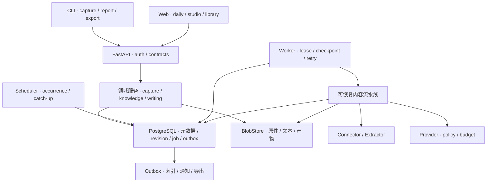

# 盘铭技术架构

## 1. 架构目标与约束

首版以单用户、单服务器、自托管实现完整的四层闭环。所有业务状态持久化，可恢复异步任务；来源、模型产物和人工版本互相独立，具备引用、幂等、预算与审计。

设计容量：20 个关注源、50 项/日、约 2 万个历史素材、少量并发编辑和最多 2 个模型生成任务。视频原件与大规模代码仓库分析不计入该基线。先做可测量的模块化单体，按实际负载再拆分。

本轮是设计；未来运行目录、进程和命令尚未存在。P0/P1 范围以 [交付计划](06-delivery-plan.md) 为准。

## 2. 推荐技术栈

| 层 | 选择 | 原因与边界 |
| --- | --- | --- |
| API / 领域服务 | Python + FastAPI + Pydantic | 与现有采集/LLM Python 能力接近；明确 HTTP / schema |
| CLI | Python + Click + HTTP client | 同一个发行包；CLI 不直接操作生产数据库 |
| 事务/持久化 | PostgreSQL + SQLAlchemy async + Alembic | 业务状态、任务、幂等和引用可以事务提交 |
| 原件与产物 | 本地内容寻址存储；`BlobStore` 可换 S3 | 降低首版部署复杂度；元数据与内容分离 |
| 异步执行 | 独立 Python Worker + PostgreSQL job table | 避免 API 进程内后台任务丢失；首版不要求 Redis |
| 日程 | 独立 Scheduler + occurrence 表 | 每期唯一、时区可追溯、停机可补跑 |
| Web | React + TypeScript + Vite | 页面/组件复用度高；前后端契约生成 TS 类型 |
| 搜索 | PostgreSQL 元数据过滤、全文/中文 trigram | P0 先可靠检索；P1 可选 pgvector |
| 模型 | Provider adapter + schema 校验 + usage ledger | 不绑定单一家厂商；是否支持结构化输出按能力判断 |

具体依赖版本在实施时锁定，与平台支持版本一起验证。本设计不把训练参数或厂商价格写死。参考：[FastAPI](https://fastapi.tiangolo.com/)、[React](https://react.dev/)、[SQLAlchemy asyncio](https://docs.sqlalchemy.org/en/20/orm/extensions/asyncio.html)。

### 2.1 与已有系统的集成

当前 [Liminalis](../../liminalis/docs/architecture-unification.md) 已有 PostgreSQL、FastAPI、共享抓取/LLM helper 和服务层约束；[jobs.py](../../liminalis/backend/_shared/jobs.py) 使用 arq/Redis。盘铭初版独立持久任务队列，避免将现有 queue client 的存在等同于完成可靠业务执行器。

允许经过接口评估复用纯组件：HTTP 超时、正文提取、provider、Markdown 阅读器。先抽共享 package 再引用，禁止用跨目录 import 直接耦合两个业务服务。未来接入 Liminalis 时，可以采用相同身份入口/导航，但保持 Panming API 和领域模型。

刻白订阅简报可作为一个 capture adapter；Liminalis Radar 的已收集结果可作为另一个 adapter。每个输入仍写盘铭自己的版本及 provenance，不互相改表。个人社交上下文 POC 与专业知识库的数据处理目的不同，不自动互通隐私内容。

## 3. 总体拓扑



API 处理短事务和上传；Worker 执行抓取、解析、LLM、写作、图书馆整合；Scheduler 只创建持久执行期次。Web 通过轮询或 SSE 读取状态，关闭浏览器不取消服务器工作。

## 4. 模块边界与未来代码组织

```text
panming/
├── README.md / TASKS.md / docs/ / templates/        已有设计资产
├── pyproject.toml                                  待实现
├── src/panming/
│   ├── api/                 routers、auth、HTTP schemas
│   ├── cli/                 capture、process、report、export
│   ├── domain/              material、topic、artifact、lineage、review
│   ├── services/            业务事务、版本、采纳、删除、导出
│   ├── pipelines/           ingest、digest、daily、blog、library
│   ├── ports/               BlobStore、Connector、Extractor、LLMProvider
│   ├── adapters/            filesystem、RSS、GitHub、provider
│   ├── persistence/         repositories、uow、models、migrations
│   ├── jobs/                scheduler、leases、checkpoints、outbox
│   └── observability/       metrics、structured logs、cost
├── web/                     React/TypeScript，待实现
├── tests/                   unit / contract / integration / e2e
└── data/                    忽略，未来默认运行态目录
```

依赖方向：HTTP/CLI → 服务 → 领域与 ports；adapter 实现 ports，不能反向驱动人工采纳；repository 不执行模型；LLM 不拥有写数据库权限。Unit of Work 是唯一 commit/rollback 的入口。

## 5. 存储、原子性与可移植性

### 5.1 BlobStore

接口：`put_stream`、`open`、`stat`、`exists`、`delete_unreferenced`。返回 `blob_id/hash/size/media_type/storage_key`。首版文件路径为 `data/workspaces/<workspace_id>/blobs/sha256/<prefix>/<hash>`，路径由服务端生成，不接受客户端指定。

原始文件、规范化文本、导出产物分别是不可变 blob。Layer0 允许增量 source revision；AI 生成只产生 artifact revision。标题或标签修改不重写原件。去重仅在 workspace 内进行，不通过共享 hash 泄露别人的内容是否存在。

### 5.2 文件与数据库提交协议

1. 接收流到 staging，累计 hash/大小并验证限额；文件扫描与格式识别在受限执行环境完成。
2. fsync 文件，原子 rename 到内容地址，fsync 目录；已有同 hash 则复用。
3. 短 DB 事务写 blob metadata、material revision、capture occurrence 和后续 job/outbox。
4. DB commit 后才向客户端返回“服务器已归档”。

进程在步骤 2 与 3 间崩溃可能留下无引用 blob；GC 延迟至少 24 小时、检查 active staging 与 jobs 后回收。DB 引用前保证对象已经落盘；若底层磁盘丢数据，校验/备份恢复标记 `missing_blob`，不能宣称已处理成功。

产物遵守同样协议。模型响应先保存候选 blob，通过 schema/引用验证，再在事务中提交 revision。超时或取消后的迟到结果只允许保存审计候选，不更新当前 revision。

### 5.3 原件、工作副本与导出

业务真相由 DB revision + blob 组成；Markdown 导出是快照。用户从导出文件再导入时必须带 artifact ID、base revision 和 checksum，通过版本冲突检查；普通文件导入默认当新素材，不绕过文章编辑协议。

导出包包含 manifest、Markdown、引用的 source metadata、可选原件和 hash 清单。默认私有备份包不能作为公开博客发布包；公开导出要移除私有引用、密钥、对话和不允许分发的完整原件。

## 6. 任务执行、幂等与恢复

### 6.1 Job 数据与状态

持久字段：kind、payload reference、dedupe key、state、attempt、available_at、lease_owner、lease_until、fence、checkpoint、cancel_requested、last_error、created/updated。统一状态：`queued / running / retry_wait / succeeded / failed / cancelled`。

领取使用短事务：选 `available_at <= now()` 的任务，`FOR UPDATE SKIP LOCKED`，更新 lease/fence 并提交，然后开始外部 I/O；不在模型请求期间持有数据库事务。PostgreSQL 将 `SKIP LOCKED` 描述为适合避免队列消费者锁争用的方式，首版只用于 job 领取，不用于一般业务一致性读取。[SELECT 锁行为](https://www.postgresql.org/docs/current/sql-select.html)

每次领取递增 fence；写 checkpoint/提交业务结果须验证 job ID、当前 fence、租约尚有效且未取消。旧 worker 的迟到响应不能覆盖新 worker。每 20 秒续租，默认租约 90 秒；长外部调用允许续租但仍受单步 deadline 约束。

### 6.2 幂等层次

| 操作 | 幂等身份 | 保证 |
| --- | --- | --- |
| 客户端 mutation | workspace + operation + Idempotency-Key | 网络重试返回相同资源/任务；同 key 不同 body 拒绝 |
| Connector 输入 | source + external item ID + revision fingerprint | 重复拉取不产生同一 source revision |
| Digest | material revision + pipeline/model/prompt/policy context hash | 同一输入不会反复归纳 |
| 自动日程 | workspace + schedule ID + logical occurrence | 多 scheduler 不创建重复期次 |
| Report 自动执行 | workspace + report_day + automatic | 调整配置不让同日自动任务重复发布 |
| 手动重生成 | request key + frozen input hash | 独立新版本，重试仍只提交一次 |
| 采纳提案 | proposal ID + base revision | 重复采纳返回同一 revision |

首版目标是业务副作用幂等，外部模型请求不能保证 exactly-once。网络断连时使用相同 provider request ID（若支持）；否则记录未知用量，在预算内有限重试，不能写“没有发生费用”。

### 6.3 Outbox 与检查点

提交业务 revision 和 outbox event 在同一事务；索引/通知异步消费。每个 consumer 记录 event ID，重复投递无重复通知或索引项。通知只在可读产物提交后发送；通知失败不影响阅读。

checkpoint 冻结到 chunk ID、输入/偏好/prompt 版本、各步骤产物与预算使用。重试从最近有效检查点继续；用户明确“重新归纳”用新 pipeline generation，不把旧 checkpoint 当新内容。

## 7. 日级调度与 Report 快照

Scheduler 每分钟扫描到期 occurrence。日级边界取 workspace 固定 IANA 时区，存 UTC 范围和本地 `report_day`；夏令时重复时间只跑一个 logical occurrence，不存在时间顺延到当天首个有效时刻。

日程修改不影响正在运行的冻结上下文。默认补跑最近 7 天，按缺失期次顺序执行，限制单次补跑数量/预算；超过窗口显示未补跑天数，用户显式 backfill。

Report 构建在短事务中拿到 workspace 的 input sequence 高水位，冻结 capture IDs、source revision IDs、可用 digest IDs、source-run 覆盖状态。源输入 sequence 在 workspace 行锁下递增，确保更低序号不能在快照冻结后才提交。尚无 digest 的固定 source revision 可以按本次冻结的 extractor/model context 完成处理；最终产物另存 resolved digest map，不能通过“读取最新版本”改变 source 输入。

v1 不追随运行期间的正文更新。新入库、失败后恢复、晚到输入用新 revision 或下一日补录。补录账本记录“一项 revision 最早被哪份 Report 正文实质使用”，只出现在 pending coverage 不算已消费。

同一 report_day 同时有两次手动重生成时，允许两份候选运行，但提交 head 通过 base revision compare-and-swap；冲突版本保留为 candidate 并展示，不按响应先后随机覆写。Report head 更新与 delivery outbox 同事务。

## 8. 索引、检索与知识依赖

P0 先做范围过滤、标题/标签、正文关键词与 trigram；中文不能仅依赖 PostgreSQL 英文默认词法。查询显式 layer/topic/date/privacy 过滤，用户内容才有可见结果。

P1 embedding 使用 model + dimension + text hash + policy namespace 存储；换模型新建 index generation，完成后原子切换。任何检索候选先按 workspace、有效版本、删除状态和处理策略过滤，再做排序；向量相似不能扩大访问范围。pgvector 支持精确/近似向量搜索，但语义相关性需产品数据评测。[pgvector 文档](https://github.com/pgvector/pgvector)

来源与知识建立显式有向关系 `derived_from / supports / contradicts / supersedes / references`。图书馆目录是有序树，知识关系可为图；来源派生链不允许循环。语义 source revision 更新/删除传播 `needs_review`，先标记并解释，再由用户采纳重建。

## 9. 模型执行与成本

Provider port 返回 structured output、finish reason、usage 和 request ID。支持能力由 adapter 声明：JSON schema、流式、上下文窗口、embedding、费用表版本。未经能力验证不把“OpenAI-compatible”当作完整 schema 支持。

调用前计算 egress 允许的输入、token 上界、任务/日 budget reservation；调用后结算 usage。并发任务共享 DB 预算锁/预留，不能两个 worker 都认为尚有余额。预算不足用 `budget_deferred` 原因和 partial 产物；自动重试不跨过用户上限。

缓存 key 至少包括 workspace、source revision、text hash、模型、prompt、分类/偏好、处理策略与 pipeline version。阅读文章而没有更换相关输入，不重新发模型。Profile 收窄/删除素材时必须撤销受影响缓存的可用性。

schema 输出只能保证格式；引用定位检查及人工/模型支持性审查独立执行。有关模型能力参考 [Structured outputs](https://developers.openai.com/api/docs/guides/structured-outputs)，不能用结构化 JSON 作为事实正确证明。

## 10. 安全与内容隔离

### 10.1 身份与策略

单 owner 仍需要认证。服务器 Web 使用 HttpOnly/SameSite cookie 和 CSRF 保护；CLI 用带 scope 的可撤销 token；管理接口、任务读取、blob 下载与 SSE 统一鉴权。默认绑定 loopback；远程访问通过 HTTPS reverse proxy 或 SSH tunnel。

敏感度 `public_reference / private / sensitive` 与外发策略 `local_only / provider_allowlist` 分开。公开网页内容也默认在私有 workspace 展示；来源公开不意味着产物公开发布。

`local_only` 指模型/embedding 处理必须留在用户配置的盘铭部署机器，不影响 CLI 向用户选择的 Server 归档。用户在连接 profile 时明确选择原件保存的服务器；完全不允许离开客户端的内容留在 offline spool，不执行远端 sync。没有本地模型时仍能保存/提取，LLM 步骤显示 policy_blocked，不自动降级到云 provider。

派生产物继承所有输入中最严格策略。搜索、LLM 上下文、摘要缓存、导出、通知同样执行策略。用户可手工创建脱敏副本，其 lineage 可追溯但新副本引用不含敏感段；不自动将私有素材降级成公开文章。

冻结 policy 用于解释历史执行；每次外发/读取/产物提交还要检查当前 policy。规则收窄立即阻止后续发送并取消受影响任务；已经在旧授权下发出的请求不能撤回，记录审计，迟到输出不进入可用 head。

### 10.2 非可信内容

抓取器拒绝 localhost、内网、link-local、云 metadata endpoint 和非 HTTP(S)；每次 DNS/重定向都验证目标，公网 proxy 层进一步限制出站地址，防 DNS rebinding。不得因为页面指令调用 shell、上传其他文档、打印凭据或改系统配置。

HTML/Markdown 渲染 sanitize，禁 script、事件 handler 和危险 URI；第三方图片默认代理或点击加载。代码和 repo 文件只是内容，不运行脚本、安装依赖或执行宏。PDF/OCR/transcript 进程放进隔离环境并有限时/内存。

凭据使用环境/secret store/本机 keychain，DB 保存 secret reference；日志不含 token、完整原文和对话。错误只输出 provider/request ID、分类与脱敏说明。

### 10.3 删除与遗忘

回收站立即隐藏素材并取消相关 job；引用显示“来源已移除”，不回读隐藏原件。永久清除时按引用图列出受影响派生对象，执行全文、chunk、embedding、缓存、候选产物与 blob 的 purge；只有清除 task 完成才表示已遗忘。

备份默认保留 30 天，原件默认长期保留直到用户删除，回收站保留 30 天；时长可配置。永久清除使用独立、追加写的删除控制账本，只保留对象 ID/删除时间/受影响关系、不保留正文。purge job 必须在清除与账本持久复制均确认后才宣告完成。

恢复旧备份时需要从独立保存的最新删除控制账本重放 tombstone，再允许索引与模型任务；旧 snapshot 自带的 tombstone 表可能缺少备份后的删除事件。控制账本不能随旧备份一起回滚，缺失或不能确认最新水位时恢复停在校验状态。外部已发布内容只能记录撤回任务与状态，首版没有外部发布连接。

## 11. 部署与运行

首版 Docker Compose：`api`、`worker`、`scheduler`、`postgres`；共享本地 blob volume，仅 server 进程写入。reverse proxy 提供 TLS/Web 静态文件，PostgreSQL 不公开端口。可选 S3 配置替代 blob volume。

初始资源假设 2–4 vCPU / 4–8GiB，磁盘按原件量估算；模型使用远端 API，本机大模型资源另测。推荐默认 Worker model concurrency=2、fetch concurrency=4，所有指标需压测验证。

health liveness 只检查进程；readiness 检查 DB/迁移/blob 读写；来源/provider 失效体现为 degraded 能力，不能把 API 整体判死。Scheduler leader 不是正确性的唯一保障，数据库唯一键承担重复期次保护。

首次初始化：创建 owner、workspace/timezone、来源、provider allowlist/预算；先手动跑一个真实样例，成功后用户在产品中启用日程。

## 12. 备份、恢复与可观测性

备份包含 DB snapshot、引用 blob manifest、schema version、输入/产物 hash 和偏好，不含凭据。期间用备份 pin 保留被 manifest 引用的对象；生成 manifest 前后的新增对象不影响 snapshot 一致性。恢复先校验 hash/引用，暂停日程和 job，检查凭据连接后再恢复。

日志字段：workspace/job/run/source/material revision/trace ID、阶段、耗时、重试和预算。指标包括 backlog、最老任务年龄、租约过期、解析成功率、引用有效性、partial Report 比例、provider usage、blob orphan 和恢复耗时。

初始 SLO：capture 元数据响应 P95 <1s（不含大文件上传）、已缓存 Report 列表 P95 <500ms、50 项文本日报目标 15 分钟内完成（provider 正常）、暂停后 5 秒内拒绝新任务领取；属于后续验收目标，不是现有性能。

运行备份目标：每日一致快照，RPO ≤24h、RTO ≤2h，需恢复演练确认。不要将 `rsync --delete` 当作唯一备份；它传播误删且没有事务时间点。

## 13. 演进触发条件

当数据库 job 领取/排队已成为实测瓶颈时引入 Redis/arq 等分发层，jobs 仍是业务真相；当 CPU 密集解析拖慢正文处理时独立 parser worker；当部署多机时 BlobStore 必须采用共享对象存储；团队版需要 membership 与跨 workspace 防泄漏专项验收。

没有容量证据前保持一份业务模型、一套 API 和一份事务真相。
