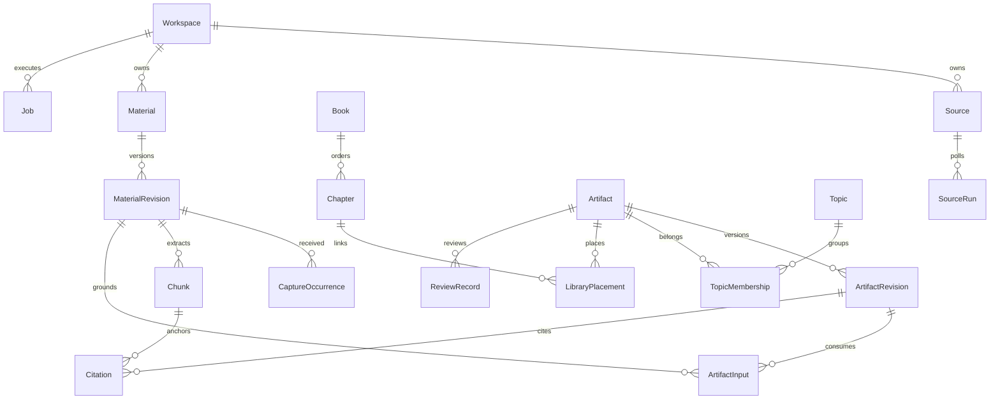

# 盘铭数据模型与接口契约

## 1. 通用规则

这是待实现的数据与接口契约。所有对象 ID 为服务端生成的 opaque string；示例中的 `mat_demo_01` 等为缩写演示 ID。实体以 `workspace_id` 隔离，使用 UTC 时间存储，日级归属单独保存日期与 IANA 时区。

客户端不得提交 owner/workspace 身份覆盖鉴权上下文。跨对象引用在事务中校验 workspace 相同；建议使用 `(workspace_id, id)` 复合唯一/外键约束防止串联错误。

版本正文不可变，元数据编辑通过 `entity_version` 乐观锁。生成物保存 `author_type=human|model|system`、pipeline/prompt/model/profile/policy 版本以及 input manifest。相同 ID 不代表当前版本相同。

## 2. 领域关系



Diagram 为主要逻辑关系，元数据、策略和执行期次另见下表。`ArtifactInput` 既可引用 source revision，也可引用上游 artifact revision；两者恰好选择一个。数据库需检查派生关系无循环。

## 3. Layer0 数据

| 表/对象 | 关键字段 | 约束与用途 |
| --- | --- | --- |
| `workspaces` | id, owner_id, timezone, input_sequence, profile_head, policy_head | 单 owner 首版，sequence 在事务内分配 |
| `sources` | type, locator, config, credentials_ref, enabled, schedule, entity_version | type 与 config schema 一致；不存明文密钥 |
| `source_runs` | source_id, occurrence_id, cursor_before/after, outcome, counts, error | 每次采集结果；先保存输入再推进 cursor |
| `materials` | id, kind, source_id?, logical_key?, title, canonical_url?, sensitivity, processing_policy, archive_state, head_revision | 逻辑原素材；笔记/对话保留来源类别 |
| `material_revisions` | material_id, revision_no, original_blob_id?, metadata_blob_id?, content_hash, published_at?, received_at, parse_state | `(material_id, revision_no)` 唯一；original/metadata 至少一个 |
| `extractions` | source_revision_id, extractor_version, text_blob_id, text_hash, quality, language, status | 派生解析也可重跑；新 extractor 不覆盖旧解析 |
| `capture_occurrences` | source_revision_id, parent_capture_id?, client_capture_id, received_at, report_day, input_sequence, reason, source_run_id? | 同一归档可多次收集；不得丢“为何保存” |
| `blobs` | id, hash, size, media_type, storage_key, state | workspace 内 hash 去重；DB 指针只引用落盘对象 |
| `chunks` | extraction_id, ordinal, stable_anchor, text_hash, text_blob_id | anchor 包含段落/行号/视频时间/commit |
| `material_feedback` | material_id/revision_id, feedback_type, note, created_by | 有价值、已知、无关、不同意、待验证 |

`kind` 首版枚举：`web_page / markdown / plain_text / user_note / ai_conversation / github_release / github_repository / video_reference / transcript / attachment`。未知格式映射 attachment，原件保留。

`parse_state`：`pending / ready / stored_only / needs_input / failed`；归档生命周期 `active / trashed / purged` 单独管理。needs_input 表示需粘贴正文、提供字幕或在独立授权流程重新连接；凭据不得当作素材正文输入。stored_only 表示可归档但当前 extractor 不支持。两者在 UI 显示不同原因。

URL 提交尚未拿到正文时存 immutable metadata blob；抓取成功形成新的 content revision，并追加 `reason=resolved_capture` 的 occurrence，通过 parent_capture_id 关联原提交；原 occurrence 的 source revision 不修改。新 occurrence 分配新的 input sequence，保留原采集上下文，列表按 material 合并展示。Report 只能选择截止前已提交的 revision；截止后才取得正文时走新版/补录。不得把用户给的 URL 当成已读取正文。

### 3.1 逻辑身份与去重

- URL canonicalization 只删除明确的 tracking 参数，保留改变内容语义的 query；登录 URL 不保留 token query。
- Feed/GitHub 逻辑身份用 source + external item ID；变更 fingerprint 形成新 revision。
- CLI watch 的文件身份用注册的 device+root+relative path；普通上传可返回 material ID，以后显式向该 material 上传 revision。
- 笔记每次 capture 新建逻辑对象，客户端 retry key 防重复；不同来源的相同文本不自动合并成同一个 Material。
- 同一原文转载形成 duplicate_group，但保留不同 author/source provenance；Report 可以合并展示，独立证据不重复计数。
- 同一 material/内容重新捕获形成 occurrence；不会重复生成 digest。人工确认“这是不同材料”可以拆开分组。

## 4. Layer1–3、引用与结构

| 表/对象 | 关键字段 | 规则 |
| --- | --- | --- |
| `artifacts` | kind, title, lifecycle, head_revision, entity_version | kind=`digest/report/blog_brief/blog/library_entry` |
| `artifact_revisions` | artifact_id, revision_no, body_blob_id, structured_blob_id?, author_type, base_revision_id?, generation_context_hash, quality_state, created_at | 内容不可变；新版本 CAS 更新 head |
| `artifact_inputs` | artifact_revision_id, source_revision_id? / upstream_artifact_revision_id?, role | 固定输入，source/upstream 二选一 |
| `citations` | artifact_revision_id, block_id, source_revision_id, chunk_id, locator, quote_hash?, evidence_kind, validation_state | 来源最终落到 Layer0；完整性与语义验证分开 |
| `report_runs` | artifact_revision_id?, report_day, timezone, cutoff_at, input_sequence_max, base_revision_id?, input_manifest_blob_id, coverage_state | 时间、版本与范围不漂移 |
| `report_inputs` | report_run_id, capture/revision_id, inclusion_reason, state, digest_revision_id? | 本日/补录/复习；pending 项也在覆盖清单 |
| `report_deliveries` | source_revision_id, first_report_day, first_artifact_revision_id | 正文实质采用才消耗补录；仅列未处理不算 |
| `topics` / `categories` | name, aliases, questions, exclusions, parent_id?, redirect_to? | 主题 merge 保留重定向，历史分类保留 |
| `topic_memberships` | topic_id, material_id? / artifact_id?, confidence?, assigned_by | 对象二选一，人工指派优先 |
| `series` | title, audience, goals, ordered_blog_ids | 写作系列与知识目录分离 |
| `books` / `chapters` | title, description, parent_id, position | chapter 是有序树，无循环 |
| `library_placements` | chapter_id, entry_artifact_id, position | 同一概念可多处链接，不复制正文 |
| `knowledge_edges` | from_revision, to_revision, relation, rationale, state | supports / contradicts / supersedes / references |
| `integration_proposals` | target_artifact_id?, base_revision_id?, patch_blob_id, input_manifest, state | 新条目或补丁；采纳校验 base |
| `review_records` | entry_id, reviewed_revision_id, grade, next_due_at, note | 打开页面不写复习事件 |
| `annotations` | artifact_id, revision_id, block_id?, body, author | 批注版本可追溯，不隐式迁移 |

博客生命周期：`draft / in_review / accepted / archived`。图书馆条目生命周期：`draft / accepted / archived`，另有 `freshness=current|needs_review|source_removed`。Report 成品的状态是覆盖状态而非人工采纳状态。

`coverage_state=complete|partial|no_updates|failed`；`quality_state=unchecked|validated|needs_review|rejected`。完整处理不等于事实已经人工认可，两种字段不能混用。

`evidence_kind=external_statement|user_observation|model_inference|experiment`。`validation_state=anchor_valid|support_reviewed|broken|not_supported|unverified`。`anchor_valid` 仅表示定位正确，不能当作已经语义证实。

## 5. 执行与治理数据

| 表/对象 | 内容与约束 |
| --- | --- |
| `jobs` / `job_steps` | 租约/fence、checkpoint、重试、取消；step 输出与输入 context hash 匹配 |
| `schedule_occurrences` | schedule、logical occurrence、计划/实际时间；唯一键阻止重复创建 |
| `idempotency_requests` | workspace、operation、key、body hash、response reference；默认保留 7 天 |
| `outbox_events` / `consumer_receipts` | 业务提交后的索引/通知/导出事件；consumer + event 唯一 |
| `processing_policies` | version、sensitivity allowlist、provider allowlist、scope |
| `preference_profiles` | version、语言/篇幅/写作结构/兴趣；冻结旧值 |
| `model_calls` | request ID、context hash、provider/model、usage、费用表版本、outcome |
| `budget_reservations` | job/call/day、预留/结算/释放；并发事务防超额 |
| `deletion_tombstones` | 被清除对象 ID、时间、受影响关系；不含正文 |
| `deletion_ledger_checkpoints` | 最新独立控制账本水位/复制确认；恢复不能从旧 snapshot 静默降水位 |
| `audit_events` | 谁修改/采纳/取消/导出什么版本；不记录完整敏感正文 |

首版每 workspace 同时发布一份 Report head；排队日程按日串行。手动生成允许保存冲突候选；候选不是已交付 Report，不消费补录账本。重复收集的同一 revision 在同日正文只出现一次。

## 6. 索引与约束清单

必要索引：`materials(workspace_id, archive_state, received_at)` 的 received_at 为列表投影；`capture_occurrences(workspace_id, report_day, input_sequence)`；`jobs(state, available_at)`；`artifact_revisions(artifact_id, revision_no)`；`citations(source_revision_id)`；`knowledge_edges(to_revision)`；`review_records(next_due_at)`；来源 external ID/revision fingerprint 唯一索引。

数据库强约束：revision sequence 唯一，artifact input 二选一，同 workspace FK，blob hash namespace，幂等 request body mismatch，采纳 proposal ID 唯一，Report automatic key 唯一。tree/lineage 的循环检查在业务事务内并发序列化；不能只依赖前端。

## 7. HTTP API 约定

所有路径带 `/api/v1`；认证上下文决定 workspace。JSON 时间用 ISO8601 UTC，日期 `YYYY-MM-DD`，分页 cursor 是 opaque token。请求 body 默认 1MiB，文件端点独立限制 50MiB，limits 可以配置。

Mutation 支持 `Idempotency-Key`，实体修改/采纳支持 `If-Match`。长任务返回 `202` 和 job reference；元数据保存 `201/200`，直到 commit 才成功。使用 OpenAPI 生成 TS client 和 CLI request schemas，schema 版本变化必须迁移。

首个 owner 由部署端初始化命令创建，bootstrap 完成后不能远程匿名再次初始化。Web 会话端点为 `POST /auth/session`、`DELETE /auth/session`、`GET /auth/me`；CLI token 通过 owner 管理端点创建/撤销，展示一次完整 token，持久化只保存 hash。登录 rate-limit 与 reset 流程在 M0 明确实现。

### 7.1 端点目录

| 方法/路径 | 行为 | 关键返回 |
| --- | --- | --- |
| `POST /captures` | URL、note、对话文本、video reference | material、occurrence、归档状态、job |
| `POST /captures/files` | multipart 原件上传 | 同上；逐个文件独立归档 |
| `GET /materials` | 日期/主题/来源/状态筛选 | page + totals |
| `GET /materials/{id}` | 元数据、原件版本、知识卡 | 对象 + head/etag |
| `PATCH /materials/{id}` | 标题、备注、主题、策略 | entity_version |
| `POST /materials/{id}/revisions` | 上传新原件或重抓取 | 新 revision / job |
| `POST /materials/{id}/process` | 解析/归纳当前或指定版本 | job；冻结 context |
| `DELETE /materials/{id}` | 回收站，停任务，隐藏派生检索 | deletion preview / job |
| `POST /materials/{id}/restore` | 从回收站恢复 | 恢复引用/待重建提示 |
| `POST /materials/{id}/purge` | 按确认的依赖清单清除 | 完整 purge/控制账本功能启用后返回 job；未启用拒绝 |
| `GET /days/{date}` | 今日素材 + Report + late/failed/review | 今日页 aggregate |
| `POST /reports/runs` | 生成/更新/backfill 一日 Report | job + input manifest |
| `GET /reports/{date}` | Report head 或 query revision | coverage + sections + citations |
| `GET /reports/{date}/revisions` | 历史、差异基线 | version list |
| `POST /blog-briefs` | 从 Report/主题/选中素材生成选题 | job；不可无输入生成事实 |
| `POST /blogs` | 从 brief 或人工新建文章 | draft artifact |
| `POST /blogs/{id}/suggestions` | 大纲/章节改写/引用检查 | suggestion job，不改正文 head |
| `POST /blogs/{id}/revisions` | 保存人工正文，CAS | revision + etag |
| `POST /blogs/{id}/accept` | 采纳指定 revision | lifecycle + integration candidates |
| `GET/POST /topics`、`/series`、`/books` | 分类与目录管理 | etag / ordered children |
| `POST /library/proposals` | 从 accepted blog 生成整合提案 | job/proposal |
| `POST /library/proposals/{id}/accept` | 采纳 diff/创建条目 | new revision，不重复采纳 |
| `POST /library/entries/{id}/reviews` | 写复习反馈 | review event / next_due |
| `GET/POST /sources` | 来源配置，不自动启用 | capability + connection state |
| `POST /sources/{id}/test`、`/enable`、`/pause` | 试采集/启用/暂停分开 | job 或 schedule state |
| `GET /search` | 关键词/范围/图书馆检索 | results + revision + source status |
| `POST /exports` | 指定版本的 md/bundle | job / authenticated download |
| `GET /jobs/{id}`、`POST /jobs/{id}/cancel` | 状态和取消 | checkpoint / saved scope |
| `GET /events` | SSE 工作流状态 | event ID / resource pointer |
| `GET/PATCH /settings` | 时区、provider、预算、偏好 | effective version |

无 `POST /publish` 首版接口；export 与对外发布不同。接口中批量 backfill 先创建父 job，再创建逐日 run，不使一个 HTTP 请求阻塞数小时。

### 7.2 Capture 示例

```json
{
  "kind": "web_page",
  "url": "https://example.org/articles/external-join",
  "capture_reason": "想比较 Join 和 Aggregate 的 spill 边界",
  "topic_ids": ["topic_demo_external_execution"],
  "sensitivity": "public_reference",
  "processing_policy_id": "policy_demo_public_sources"
}
```

返回示意：

```json
{
  "data": {
    "material_id": "mat_demo_01",
    "occurrence_id": "cap_demo_01",
    "archive_state": "saved",
    "parse_state": "pending",
    "duplicate_of": null,
    "job_id": "job_demo_ingest_01"
  },
  "meta": {"request_id": "req_demo_01"}
}
```

### 7.3 Report 请求与冻结清单

请求 `{date, timezone, mode:auto|manual|backfill, base_revision_id?, include_late:true}`。时区必须与该日现有 Report 一致，否则需要显式创建独立版本/重归属任务。

冻结 manifest 示例：

```json
{
  "report_day": "2026-10-07",
  "timezone": "Asia/Shanghai",
  "cutoff_at": "2026-10-07T13:30:00Z",
  "input_sequence_max": 128,
  "inputs": [
    {"source_revision_id": "src_demo_01", "reason": "today", "digest_revision_id": "dig_demo_01"},
    {"source_revision_id": "src_demo_02", "reason": "carryover", "digest_revision_id": null}
  ],
  "source_run_ids": ["poll_demo_01"],
  "profile_version": 1,
  "policy_version": 1,
  "pipeline_version": "daily-v1"
}
```

`coverage` 分开统计 received/unique/duplicates/ready/failed/needs_input/policy_blocked/budget_deferred/late；分子不能把“链接存好了”记成“内容已归纳”。sources_expected/sources_checked 也独立列出。

### 7.4 错误与并发

统一 `{error:{code,message,retryable,details},meta:{request_id}}`。`details` 不含原始 provider 错误中的密钥/完整内容。

| 状态 | code 示例 | 客户端处理 |
| --- | --- | --- |
| 400/422 | INVALID_INPUT / UNSUPPORTED_FORMAT | 保留输入并提示 |
| 401/403 | AUTH_REQUIRED / PROCESSING_NOT_ALLOWED | 登录/配置明确策略 |
| 404 | RESOURCE_NOT_FOUND | 也用于跨 workspace 隐藏资源 |
| 409 | IDEMPOTENCY_MISMATCH / REVISION_CONFLICT | 比较不同版本，不能盲重试覆写 |
| 409 | FEATURE_NOT_READY | 本部署未启用完整操作；例如永久清除 |
| 413 | UPLOAD_TOO_LARGE | 保存链接或减小文件 |
| 429 | CAPTURE_RATE_LIMIT / BUDGET_EXHAUSTED | Retry-After 或等待预算周期 |
| 503 | STORAGE_UNAVAILABLE / PROVIDER_UNAVAILABLE | 未归档则可 offline；已归档不重复上传 |

客户端重试必须沿用 Idempotency-Key；改动正文、隐私策略或输入清单时生成新 key。下载文件经过认证/短期签名；artifact body 不直接暴露本机存储路径。

## 8. CLI 契约

以下是目标命令，还未实现。`panming` 默认读 profile/server URL 和 token reference，所有在线 mutation 走 HTTP API。

```bash
panming capture file ./notes/hash-join.md --topic external-execution
panming capture url https://example.org/article --reason "比较实现思路"
panming capture note --text "今天发现的边界条件"
panming capture conversation ./conversation.md --sensitivity private
panming capture directory ./reading --dry-run
panming capture file ./notes.md --offline
panming sync-spool --wait
panming process --pending --wait
panming report generate --date 2026-10-07 --wait
panming report backfill --from 2026-10-01 --to 2026-10-06 --dry-run
panming blog brief --report 2026-10-07 --topic external-execution
panming library propose --blog blog_demo_01
panming search "spill 内存边界" --layer 3 --json
panming export report 2026-10-07 --format markdown --output ./exports/
panming jobs inspect job_demo_01
```

目录导入默认遵守 `.gitignore` 与隐藏目录规则；须用 Git-aware matcher，不能将 rsync filter 语法假定与 Git 完全等价。并列展示 included/excluded/size，支持显式 include。`watch` 后续新增，删除本机文件不传播到档案。

退出码：0 成功；2 参数/格式；3 认证/策略；4 网络不可达且未保存 spool；5 服务端 job 失败；6 `--wait` 超时（返回 job ID，任务可能继续）；7 部分批量成功。`--json` 输出稳定 JSON，日志到 stderr。

## 9. 导出/导入与事件契约

Markdown frontmatter 使用 artifact ID、kind、revision、day、timezone、source IDs、privacy 和生成/人工标记；sidecar `manifest.json` 记录精确 source revision、blob hash、引用定位与 schema version。

事件类型：`material.archived / extraction.completed / digest.completed / report.committed / blog.accepted / library.proposal_created / library.revision_accepted / source.failed / content.purged`。Envelope 包含 event ID、workspace、object ID/revision、occurred_at、schema version；不放正文或 token。

SSE 支持 Last-Event-ID；事件超出保留窗口返回 resync_required，客户端重新拉取资源。事件只是刷新提示，服务器资源状态是最终依据。

导入前验证 schema/manifest/hash/引用；非法路径与 zip 路径穿越拒绝；凭据永不导入。恢复任务先暂停日程、重放 tombstone，成功后再由用户恢复运行。
