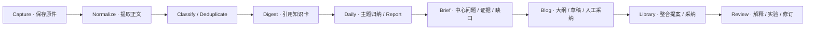

# 盘铭内容流水线与质量设计

## 1. 数据到理解的边界

流水线把不可控输入变成可检查产物。每步显式记录输入版本、结果、错误和质量；原件只新增版本，归纳与博客是派生对象，人工采纳独立于生成成功。

借鉴 LLM Wiki 的原始材料保留、知识持续编译、冲突注释、索引和变更记录原则；盘铭扩展为四层、日级快照、知识提案及人工复核。本轮只设计该流程，没有自动初始化 raw/wiki 或摄取用户私人资料。



## 2. 输入能力矩阵

| 来源 | Layer0 保存 | 首版解析/能力 | 自动关注阶段 | 退化路径 |
| --- | --- | --- | --- | --- |
| Markdown/TXT | 原文件 + 路径标识 + hash | 正文/标题/代码块 | P1 directory watch | 编码失败保留原件 |
| 随手笔记 | 原文 + 用户 + 捕获原因 | 用户观察/问题 | P0 手动 | local_only 仅部署机器处理；没有本地模型则待处理 |
| AI 对话 | 导出文本 + 角色/时间 | 问题、推断、争议、实验 | P0 Markdown；P1 专用格式 | 保留原文，缺角色要求校正 |
| 公开网页/博客 | URL metadata + 成功抓取快照 | 正文提取、作者/发布时间（可未知） | P0 手动；P1 RSS | needs_input，粘贴正文 |
| RSS/Atom | Feed item + URL + 更新字段 | 内容/外链正文 | P1 持续轮询 | item-only 标识，正文缺失不能伪装完整 |
| GitHub Repo/Release | repo metadata、release、commit/source URL | 首版 Release/README 的限定读取 | P1 官方 API | API 限流后保留 cursor；不自动 clone 全库 |
| 视频 | URL/文件 + 可用字幕 | P0 链接/用户字幕；P2 ASR | P2 | 明示“仅有链接/字幕/说明” |
| PDF/图片 | 原件 + metadata | P1 文本/OCR | P1 | 标页码和 OCR 风险 |
| Reddit/X/知乎/公众号 | 链接/用户粘贴/导出 | P0 归档用户提供正文 | P2 授权 adapter | 读取受限时不承诺自动获取 |

关注“人”归一为 Source：作者博客 RSS、GitHub 用户范围或已授权社交 feed。关注“项目”配置 Release/README/指定路径/PR 标签等范围，默认选择低噪声 release；关注领域是 Topic，不自动代表订阅整个社交平台。

GitHub Events API 不是实时源，官方文档有历史条数/时间窗口限制；首版以 Releases 和按明确范围的轮询为主，遵循 ETag 与 rate-limit 反馈，不能承诺完整追踪全部历史事件。[GitHub Events](https://docs.github.com/en/rest/activity/events)、[Releases](https://docs.github.com/en/rest/releases/releases)

连接器发布前验证当前可用接口、账号范围、限额和格式；没有检索/抓取能力的来源标出能力缺口，用户提供正文仍可完成下游流程。

## 3. Capture、提取与分块

### 3.1 捕获协议

保存原件/hash、元数据和 context 后创建 pending ingest job。任务确定性步骤依次为 fetch（必要时）、extract、chunk、classify、digest；任一失败保留上一步已归档内容。

extract 输出 canonical text、段落/标题/代码边界、位置锚点、language 和 quality。清除页面导航噪声时保留引文与表格，不把脚注或代码当垃圾。未知 published_at 保持 null，收到时间不能冒充发布时间。

### 3.2 分块与长文

默认按语义段/标题分块，目标约 800–1,500 tokens，少量上下文 overlap；代码函数/表格不任意截断。超长代码块保留整体原件和局部引用，chunk 上标范围。

不同 tokenizer 用 provider 对应估算，中文字符数不是固定 token 倍数。超上下文使用 chunk summary + final reduce；reduce 引用回传原始 chunk ID，禁止只引用模型的中间摘要。

截图/OCR/字幕分块定位为页码/坐标/时间段；GitHub 内容绑定 commit SHA 和 path/range；AI 对话定位到 message ID/role。摘要缓存按 extraction/text hash 与模型 context key 标识。

## 4. 去重、分类与排序

### 4.1 去重

三个级别：archive blob exact hash；逻辑 source identity/revision；内容近似 duplicate group。不同来源的转载不删原件，显示“主来源 + 转载”；两个独立来源同意一个结论可提高证据多样性，同一转述链不算独立证据。

embedding 相似只提出候选组，不能自动丢弃材料或认定真假。用户拆分/合并反馈被保存，后续运行尊重。

### 4.2 分类

先用确定规则（用户指定、来源默认、标签词）再用 LLM 多标签建议。人工分类优先，模型补充 topic_candidates 和 rationale。无合适 Topic 进入 inbox；自动提出新主题但不创建几十个同义主题。

分类 prompt 输入只包含允许外发的标题/摘要/上下文。主题上下文和偏好使用冻结版本，避免跨用户或跨敏感范围泄露。

### 4.3 排序

首版可解释评分：`interest_match + problem_relevance + novelty + source_quality + personal_annotation - repetition - stale_penalty`。各分量 0–1，权重初值在配置中；不把这个分数展示成内容真假概率。

发表旧文但今天收集：可以是“今日新输入”，不能写成“今日新发布”。源码 commit/实测可提高证据可复核度，作者名气不能替代证据。用户标记“已知”降低同类重复摘要优先级。

## 5. 单素材归纳契约

### 5.1 Digest schema

```json
{
  "source_revision_id": "src_demo_01",
  "title": "外存算子的分区协议",
  "central_question": "超出内存的状态如何恢复？",
  "summary": "演示摘要；正文需由真实材料生成",
  "claims": [
    {
      "id": "claim_demo_01",
      "text": "演示论断",
      "evidence_kind": "external_statement",
      "citation_chunk_ids": ["chunk_demo_01"],
      "verification": "anchor_valid"
    }
  ],
  "limitations": ["尚缺真实实验"],
  "questions": ["倾斜输入如何退化？"],
  "topic_candidates": ["topic_demo_external_execution"],
  "novelty": {"type": "unknown", "against_revision_ids": []}
}
```

实际 output schema 不允许 `claims` 指向输入以外的 chunk。无证据的新想法进入 questions/model_inference，不能塞进 external_statement。用户笔记中的声称也须保留 user_observation 类别。

### 5.2 验证步骤

1. JSON schema、大小、枚举与引用 ID 白名单；拒绝未知对象。
2. citation source revision 存在、可读、同 workspace；定位与 quote hash 一致。
3. 原文包含所引用片段；对复杂结论做支持性检查，标出“未支持/只是推断”。
4. 关系型约束、策略继承、敏感片段审查。
5. 提交 artifact revision 与 lineage，再通知可阅读。

若验证失败允许一次修复 prompt；仍失败标记 needs_review 并显示可用原文，不能把修复失败的文本作为 ready digest。引用定位校验本身无法证明推理正确，人类复核与评价集必须覆盖。

### 5.3 Prompt 结构

system 固定角色、允许动作和 schema；developer 放证据规则与边界；source block 中放非可信正文、来源 ID 和锚点。要求模型将正文中的指令当内容，对事实/观点/假设分栏，明确缺信息。

Prompt version 在仓库中受版本管理；用户偏好用数据引用，不将 API key 或其他秘密拼入 prompt。模型工具仅允许通过受控接口拿已授权文本，没有 shell 和写数据库工具。

混合隐私输入先按处理策略分组，云归纳只拿到允许发送的组；local_only 的知识卡只由本地模型或确定规则生成。Report 可以在服务端确定性拼装不同组的结果，但不能再把整份混合 Report 交给云模型做 reduce。产物继承最严格策略，博客/图书馆步骤同样重新检查输入范围。

## 6. 每日 Report 的算法

### 6.1 选择与冻结

按本地 report_day 的 capture occurrence、输入高水位和截止时刻选择新 source revisions；去重后加入未实质交付的前日输入，标 `carryover`。复习对象单独选择，不能计入新素材数量。

URL 的 metadata-only revision 和随后取得正文的 revision 属于同一 material。截止前已有正文时选择该可用 revision，metadata 记 `superseded_by_content`；截止后才取得正文时旧版继续显示待正文，新版/补录使用新 revision，原 URL 提交不再作为独立未处理项永久滞留。received 数量按用户收集动作统计，resolved_capture 不增加新的人工输入计数。

冻结 input manifest 后等待尚在处理的输入最多 10 分钟（配置项），更新其处理结果到本次 run 状态；不能新增其他 revision 到 manifest。超时/失败的输入留在覆盖清单，正文用已完成 digest。截止后到达的 source revision 不参与本次生成。

同日 v2 以 v1 manifest + 新收集/恢复成功的明确输入重建新 manifest；历史 run 永不改写。前日补录队列在成功交付后标记 primary delivery，去重与补录规则不以“曾经抓取”代替“用户已经得到归纳”。

### 6.2 主题内聚合

按 Topic cluster → 摘要去重 → 对比旧知识 → 提取新增/补充/冲突/疑问 → 组织今日重点。对比知识只在授权范围内检索 accepted/current 条目；needs_review 条目带状态作为讨论对象，不能提供未经限定的标准答案。

Report 的每个事实块都保留 source revision 和 chunk ID。主题卡也提供 personal_relevance；没有“为什么与我有关”的内容可以列在其他素材区。

### 6.3 覆盖状态判定

- `no_updates`：本期 unique 输入为空，所有 due 来源检查成功且无预算/策略/连接异常。
- `complete`：manifest 内每项都得到明确且符合配置的处理结果，预期来源运行完成；主动忽略项计 skipped，并展示原因。
- `partial`：有可读产物，同时正文缺失、待输入、来源失败、处理策略阻止、预算延期或步骤失败。
- `failed`：没有可读有效产物；Error/原件仍可查。

人工明确设置“只保存原件”或忽略的项可以算有确定结果，但不计归纳成功。非主动 unsupported/needs_input 项不能被自动跳过以伪造 complete。

### 6.4 博客候选算法

候选来自四类信号：多份材料共同回答一个问题、与旧知识出现矛盾、用户有新实验/意见、一个长期系列的章节缺口。

每个候选按 readiness 分为 `ready_to_outline / needs_evidence / needs_personal_view`。默认选 0–3 个；没有实质材料或用户只想收藏时输出 0。候选包含主问题、读者、建议结构、source set、已有博客重复风险和下一步。

跨日相同中心问题匹配到既有 brief，提出 merge suggestion；人工采纳后新增 brief revision，不重复堆叠标题近似的文章。

## 7. 博客流水线

Brief → Outline → Draft Suggestion → Citation Review → Human Revision → Accepted。

Outline 先冻结 section IDs 与每节证据/目标；用户可以修改结构。Draft 提议一次只扩写用户选择的范围，优先解释因果和边界，技术文章要求源码坐标或实验路径。

每一节标识需要 citation 的事实段、个人论点、例子与未完成实验。文献不足的部分用 TODO/待证实提示，禁止编造 commit、实验数值、引用原话或“我亲测”。

人工 revision 保存 Markdown + stable block IDs + 引用 sidecar。当前正文与生成 base 不一致时，保存 suggestion 并提供 diff；不得用 last-write-wins 取代人工修改。采纳博客写 audit event，可生成后续图书馆 proposal；不自动 publish。

## 8. 图书馆编译与维护

### 8.1 变更提案

先从 accepted blog 提取 concepts，再检索目标书/章及其 current revisions，生成以下操作之一：create_entry、append_example、refine_definition、add_relation、flag_conflict。每个操作记录 evidence set、目标 base 和 rationale。

默认提案可基于单篇博客；观点不足以概括通用概念时只建议“实践例子”。多篇博客合成章节须列作者推理和矛盾，不能清除不同意见使内容看起来一致。

### 8.2 采纳与失效

用户查看 diff 后采纳；数据库一次事务写新 revision、placements、lineage、proposal acceptance 与索引 outbox。目标 base 变化返回 conflict；重新生成提案，旧提案保留。

上游 source 更新不自动证明旧知识错了；先做受影响范围检测，出现语义差异标 needs_review，并给新旧证据。新解释采纳时建立 supersedes 关系、更新 current head 和依赖投影；旧版本仍能在历史文章中定位。

定期 lint：孤立条目、破碎引用、重复概念、已删除来源、过久未复核、章节缺失。确定性 broken-link 可修复唯一定位或报告；事实冲突和章节大幅重构必须提案处理。

### 8.3 复习与应用

复习题源于条目中心问题，优先“为什么/何时失效/如何应用”；默认不要求模型评判用户记忆。用户自评驱动日期；用户写出的新解释/实验进入 Layer0 user_note，再关联旧条目。

## 9. 预算与效率

预算对象：provider、workspace、day、job、call。每次调用先 reserve，成功/未知失败后 settle；未知费用用上限估计 pending，而不是归零。价格表版本、币种和更新时间保留。

示例规划负载：50 项 × 每项最多 4,000 输入 tokens + 800 输出 tokens ≈ 200k 输入 / 40k 输出；Report 额外上下文约 20k/4k；一篇草稿额外约 15k/5k。这只是容量估计，长文分块、多轮验证和重试会增加用量，不代表固定费用。

先设 token 上限，例如日总输入 300k、输出 80k、单 job 预算与最大修复次数；费用上限由用户根据 provider 单价填写，示例不是对实际消耗的承诺。达到预算先保存原件与 deterministic extraction，其余 deferred。

优化顺序：相同 digest 缓存 → 提取正文质量 → 分类确定规则 → 只对新增片段处理 → 按 Topic reduce → 按需博客 → 人工有价值信号 → 可选模型路由。避免每天对整个图书馆重写。

## 10. 内容质量评测

固定 60 个合成/公开允许使用的样例：公开长文、短文、代码、重复转载、未知日期、AI 对话、矛盾输入、视频字幕、缺正文、恶意指令和受限私人文本。另配至少 20 个真实使用问题，由用户判断结果。

| 维度 | 验证 | 发布门槛 |
| --- | --- | --- |
| 引用定位 | 所有 citation 能定位到固定 source revision | 100% 或明确 broken/unverified；自动发布 blocked |
| 论断支持性 | 人工抽查 claim 是否由证据支持 | 样例主要事实 ≥95%，严重虚构 0；未验证不做保证 |
| 去重 | 同一材料重试、转载、内容更新 | 无重复归档副作用；不同来源不错误抹除 |
| 分类 | 人工 topic 数据集 | 首版 top-3 命中 ≥85%，需试用验证 |
| Report | 无更新、partial、补录、不同天 | 无虚构填充、无 silently dropped 输入 |
| 博客 | 手改后重生成、事实与观点 | 人工正文零覆写；事实引用完整 |
| 图书馆 | 冲突、重复概念、目标变化 | 可拒绝提案、CAS、历史可查 |
| 隐私 | provider allowlist / local_only / export | 禁止输入不进入外部模型请求/云 embedding/通知正文 |
| 可读性 | 5–10 分钟阅读与明确下一步 | 人工试用反馈，不用 token 长度代替 |

模型/prompt 更新先跑离线集并 shadow 对照；新版本只影响新任务，历史产物不自动重写。API/provider 实测需要单独配置凭据；本轮未调用模型生成用户知识内容。
