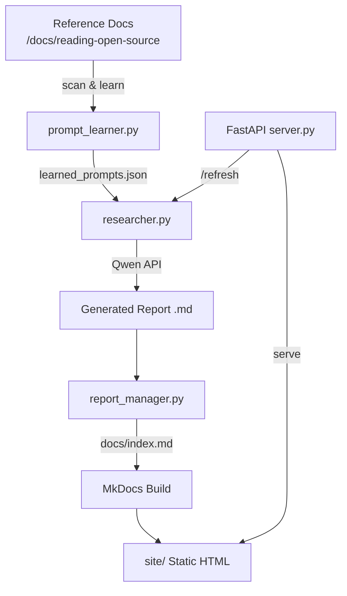

# LLM API Deep Research Hub

An automated pipeline that generates structured deep-research reports on LLM API products by learning writing styles from existing technical documents and calling the Qwen API.

## Architecture



## Quick Start

```bash
git clone <repo-url>
cd db-report

# Install dependencies into the project venv
make install

# Copy and configure environment
cp .env.example .env
# Edit .env and set QWEN_API_KEY=your-key

# Learn prompt styles from reference docs
make learn

# Generate a report
make refresh PRODUCT="Anthropic Claude API" DEPTH=deep

# Build and serve the web UI
make build
make serve
# Open http://localhost:8080
```

## Environment Variables

| Variable | Required | Default | Description |
|---|---|---|---|
| `QWEN_API_KEY` | Yes | — | Qwen/DashScope API key |
| `QWEN_BASE_URL` | No | `https://dashscope.aliyuncs.com/compatible-mode/v1` | OpenAI-compatible base URL |
| `QWEN_MODEL` | No | `qwen-max` | Model name to use |

## CLI Usage

```bash
# Standard usage
/home/lism/env/venv/bin/python -m src.__main__ --product "Claude API" --depth deep

# With language
/home/lism/env/venv/bin/python -m src.__main__ --product "Gemini API" --depth standard --language "Chinese"

# Force re-learn prompts
/home/lism/env/venv/bin/python -m src.__main__ --product "Mistral API" --learn
```

## API Endpoint Reference

| Method | Endpoint | Description |
|---|---|---|
| `GET` | `/refresh?product=NAME` | Generate report & rebuild site |
| `GET` | `/refresh?product=NAME&depth=deep` | With depth control |
| `GET` | `/reports` | List all generated reports |
| `GET` | `/` | Serve MkDocs site |

Query parameters for `/refresh`:
- `product` (required): LLM API product name
- `language` (optional, default: `English`): Report language
- `depth` (optional, default: `deep`): `standard` | `deep` | `executive`

## How to Add a New Prompt Template

1. Add a new `.md` file to `/home/lism/work/xlab/docs/reading-open-source/` with a prompt block before the first heading.
2. Run `make learn` to re-scan and update `prompts/learned_prompts.json`.
3. The next `make refresh` will incorporate the new style.

Supported prompt block formats:
- YAML front matter (`---`)
- Fenced code block (` ```prompt ``` `)
- Blockquote lines (`> ...`)
- HTML comment (`<!-- prompt: ... -->`)
- First paragraph before a heading (fallback)

## Contributing

1. Fork the repository and create a feature branch.
2. Install dev dependencies: `make install`
3. Run linting: `make lint`
4. Run tests: `make test` (target: ≥85% overall coverage)
5. Submit a pull request with a clear description.

## License

MIT
