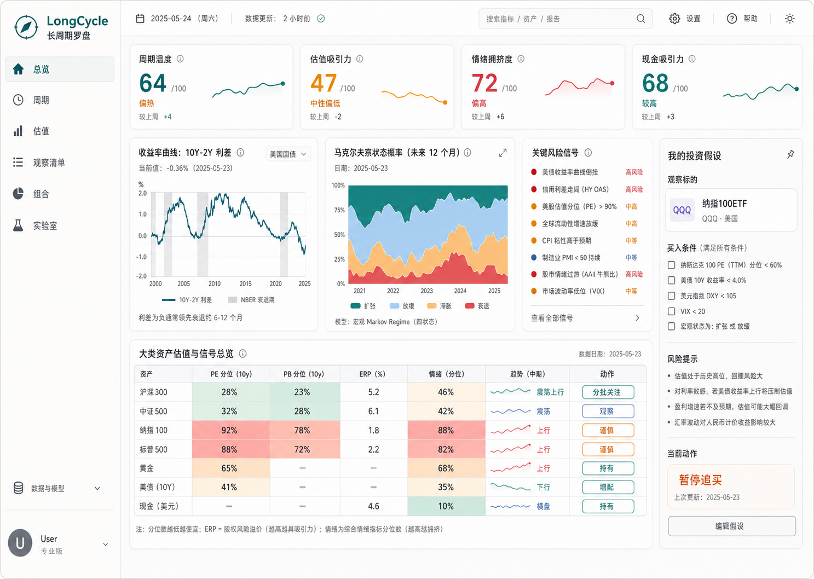

# Prototype Specification

## 1. Concept Image

The first high-fidelity dashboard concept is stored here:



This image establishes visual direction only. Data values are placeholders.

## 2. Prototype Goals

The prototype should demonstrate:

- A non-trading, research-first investment interface.
- A clear cycle and valuation summary.
- A thesis-centered watchlist.
- Standardized opportunity/risk scoring.
- Calm but information-dense visual hierarchy.
- A clickable multi-level website experience rather than a static dashboard.

## 2A. Multi-Level Website Prototype

### 2A.1 Interaction Map

```text
Overview
├── KPI Card -> score detail drawer or target module
├── Risk Signal -> evidence drawer
├── Asset Row -> asset detail drawer
└── Hypothesis Card -> thesis detail / edit

Cycle
├── Yield Curve Chart -> indicator detail
├── Regime Model Card -> model detail
└── Similar Period Card -> historical period detail

Valuation
├── Asset Class Filter -> matrix refresh
├── Time Window Selector -> percentile basis refresh
├── Heatmap Cell -> indicator detail
└── Asset Row -> asset detail drawer

Compare
├── Asset Multi-Select -> comparison table refresh
├── Indicator Group -> column set refresh
└── Asset Row -> detail drawer

Scenario
├── Rate Shock Slider -> simulated action states
├── Valuation Adjustment Slider -> simulated opportunity score
└── Sentiment Adjustment Slider -> simulated crowding risk
```

### 2A.2 Detail Drawer Pattern

```text
┌──────────────────────────────┐
│ Title                         │
│ Subtitle / status chip        │
├──────────────────────────────┤
│ Evidence summary              │
│ Metric cards                  │
│ Interpretation                │
│ Caveats                       │
├──────────────────────────────┤
│ [Create hypothesis] [Compare] │
└──────────────────────────────┘
```

The drawer should not block navigation permanently. It is a contextual inspection surface.

### 2A.3 Compare Page

```text
┌──────────────────────────────────────────────────────────────┐
│ Compare                                                      │
├──────────────────────────────────────────────────────────────┤
│ Assets: [沪深300 x] [纳指100 x] [美债 x] [+ Add]              │
│ Indicators: [估值] [情绪] [趋势] [全部]   Window: [10Y▼]      │
├──────────────────────────────────────────────────────────────┤
│ Asset       PE    PB    ERP   Sentiment   Trend   Action     │
│ 沪深300     31    26    67    42          48      分批关注    │
│ 纳指100     78    81    28    83          72      暂停追买    │
│ 美债        N/A   N/A   72    35          40      再平衡检查  │
├──────────────────────────────────────────────────────────────┤
│ Interpretation                                                │
│ 沪深300估值更便宜，纳指100拥挤，美债提供防守对冲属性。          │
└──────────────────────────────────────────────────────────────┘
```

### 2A.4 Scenario Simulator

```text
┌──────────────────────────────────────────────────────────────┐
│ Scenario Simulator                                           │
├───────────────────────┬──────────────────────────────────────┤
│ Inputs                 │ Simulated Actions                    │
│ Rate shock: +50bp      │ 纳指100: 暂停追买 -> 观察             │
│ Valuation: -15 pct     │ 美债: 再平衡检查 -> 观察              │
│ Sentiment: -20 pct     │ 沪深300: 分批关注 -> 分批关注         │
├───────────────────────┴──────────────────────────────────────┤
│ Triggered Watchlist Conditions                                │
│ - 纳指100ETF: 情绪分位 < 60% 接近触发                         │
└──────────────────────────────────────────────────────────────┘
```

This is a rule rehearsal tool, not a forecast engine.

### 2A.5 Historical Similar Period Detail

```text
┌──────────────────────────────────────────────────────────────┐
│ 2006 Similar Period                                          │
├──────────────────────────────────────────────────────────────┤
│ Why similar: yield curve compression + late-cycle valuation  │
│ What followed: risk premium repriced over the next 12-24m    │
│ Difference today: policy path and market composition differ  │
└──────────────────────────────────────────────────────────────┘
```

## 3. Page 1: Overview

### 3.1 Purpose

Answer in 30 seconds:

- What is the current market state?
- Which risks matter most?
- Which assets deserve attention?
- Which personal hypotheses need review?

### 3.2 Layout

```text
┌────────────────────────────────────────────────────────────────────────────┐
│ Left Nav │ Top Bar: Search, data status, date, settings                    │
├──────────┼─────────────────────────────────────────────────────────────────┤
│          │ KPI Strip                                                       │
│          │ Cycle Temp | Valuation Attractiveness | Sentiment | Cash         │
│          ├───────────────────────┬──────────────────────┬──────────────────┤
│          │ Yield Curve Spread     │ Regime Probability   │ Risk Signals     │
│          ├───────────────────────┴──────────────────────┴──────────────────┤
│          │ Asset Valuation Heatmap                         Hypothesis Drawer │
└──────────┴─────────────────────────────────────────────────────────────────┘
```

### 3.3 KPI Strip

Cards:

```text
周期温度: 64 / 100, 中性偏热
估值吸引力: 47 / 100, 中性
情绪拥挤度: 72 / 100, 偏拥挤
现金吸引力: 68 / 100, 有吸引力
```

Interactions:

- Click KPI -> open score decomposition drawer.
- Hover score -> show percentile definition.

### 3.4 Risk Signals

Example list:

```text
高: 10Y-2Y 利差处于历史低分位
中: 情绪拥挤度高于 70
中: 美股成长估值高于长期中位
低: A股宽基估值仍处观察区
```

Each item links to its source page.

### 3.5 Asset Heatmap

Columns:

```text
资产 | PE分位 | PB分位 | ERP | 情绪 | 趋势 | 动作
```

Rows:

```text
沪深300
中证500
纳指100
标普500
黄金
美债
现金
```

Action states:

- `分批关注`
- `观察`
- `谨慎`
- `暂停追买`
- `再平衡检查`

## 4. Page 2: Cycle

### 4.1 Purpose

Explain the yield-curve-to-recession relationship and current macro regime state.

### 4.2 Layout

```text
┌──────────────────────────────────────────────────────────────┐
│ Header: Cycle / Time Range / Region / Model                  │
├───────────────────────────────┬──────────────────────────────┤
│ Yield Curve Spread Chart       │ Regime Probability Chart      │
├───────────────────────────────┼──────────────────────────────┤
│ Similar Historical Periods     │ Model Card                    │
├───────────────────────────────┴──────────────────────────────┤
│ Indicator Table                                               │
└──────────────────────────────────────────────────────────────┘
```

### 4.3 Chart Requirements

Yield curve chart:

- Line: 10Y-2Y spread.
- Shaded regions: recession windows.
- Marker: current date.
- Tooltip: date, spread, percentile, regime.

Regime chart:

- Stacked or separate probability lines.
- Regime labels should be human-readable:
  - Expansion.
  - Slowdown.
  - Stress.
  - Recession-like.

### 4.4 Model Card

Fields:

```text
Model: statsmodels MarkovRegression
Input: 10Y-2Y spread, optional market return or unemployment proxy
Training range: 1990-present
Last run: yyyy-mm-dd hh:mm
Current state: Stress rising
Limitation: regime probability is not a deterministic recession forecast
```

## 5. Page 3: Valuation

### 5.1 Purpose

Provide a standardized table and visual matrix for long-term valuation comparison.

### 5.2 Layout

```text
┌──────────────────────────────────────────────────────────────┐
│ Header: Valuation / Asset Class Tabs / Lookback Selector     │
├──────────────────────────────────────────────────────────────┤
│ Asset Valuation Matrix                                       │
├───────────────────────────────┬──────────────────────────────┤
│ Percentile History Chart       │ Indicator Explanation Drawer  │
└───────────────────────────────┴──────────────────────────────┘
```

### 5.3 Asset Detail Drawer

Triggered by clicking an asset row.

Content:

```text
沪深300
Current PE: 12.4
PE percentile: 31%
PB percentile: 26%
ERP percentile: 67%
Sentiment percentile: 42%
State: 分批关注

Interpretation:
估值处于历史偏低区域，但情绪尚未极度悲观。若盈利预期继续下修，当前估值吸引力可能被削弱。
```

## 6. Page 4: Watchlist

### 6.1 Purpose

Turn investment views into explicit, reviewable hypotheses.

### 6.2 Layout

```text
┌──────────────────────────────────────────────────────────────┐
│ Header: Watchlist / Filters / New Hypothesis                 │
├───────────────────────┬──────────────────────────────────────┤
│ Hypothesis List        │ Hypothesis Detail                    │
│ - 沪深300ETF           │ Thesis                               │
│ - 纳指100ETF           │ Conditions                           │
│ - 黄金ETF              │ Risks                                │
│                        │ Evidence Snapshot                    │
│                        │ Review Timeline                      │
└───────────────────────┴──────────────────────────────────────┘
```

### 6.3 Hypothesis Detail

Fields:

```text
Asset: 纳指100ETF
Thesis: AI 与软件生产率提升驱动长期盈利增长
Current action: 暂停追买

Entry conditions:
[ ] PE percentile < 60%
[ ] Sentiment percentile < 60%
[ ] US 10Y real rate not rising rapidly

Review conditions:
[ ] Earnings expectation revised down materially
[ ] Valuation percentile > 85%
[ ] Thesis catalyst no longer valid

Risks:
- Rate reacceleration
- Earnings disappointment
- Multiple compression
```

Interactions:

- Changing action state requires a note.
- Saving a review creates an evidence snapshot.
- Editing thesis creates a new version.

## 7. Page 5: Lab

### 7.1 Purpose

Make overfitting visible.

### 7.2 Layout

```text
┌──────────────────────────────────────────────────────────────┐
│ Header: Lab / New Experiment / Experiment History            │
├────────────────────┬────────────────────┬────────────────────┤
│ Strategy Setup      │ Sample-In Result   │ Sample-Out Judgment │
├────────────────────┴────────────────────┴────────────────────┤
│ Parameter Sensitivity / Leakage Checks / Experiment Notes     │
└──────────────────────────────────────────────────────────────┘
```

### 7.3 Required Metrics

Sample-in:

- CAGR.
- Sharpe.
- Max drawdown.
- Win rate.
- IC if applicable.

Sample-out:

- CAGR.
- Sharpe.
- Max drawdown.
- Decay vs sample-in.
- Stability score.

Overfitting diagnosis:

```text
Risk: High
Reasons:
- Too many features for the available sample size.
- Performance decays by more than 70% out of sample.
- Parameter ranking is unstable across folds.
- Label overlap requires purging.
```

## 8. Empty States

### 8.1 No Data

Text:

```text
No local data yet. Run the data fetch workflow to build the first indicator panel.
```

Action:

```text
Fetch sample macro data
```

### 8.2 No Hypotheses

Text:

```text
Start with one asset you already follow. A good hypothesis states why you want exposure, what would make you wait, and what would prove you wrong.
```

Action:

```text
New hypothesis
```

### 8.3 No Experiments

Text:

```text
Create a strategy experiment to compare sample-in appeal with sample-out robustness.
```

Action:

```text
Create experiment
```

## 9. MVP Acceptance Checklist

The prototype implementation is acceptable when:

- Overview fits a 1440px desktop screen without awkward scrolling above the heatmap.
- All KPI cards have decomposition details.
- All asset heatmap colors have text labels.
- Cycle page includes model limitation text.
- Watchlist action change requires a note.
- Lab page shows sample-in and sample-out results side by side.
- The UI does not use daily up/down colors as primary semantics.
