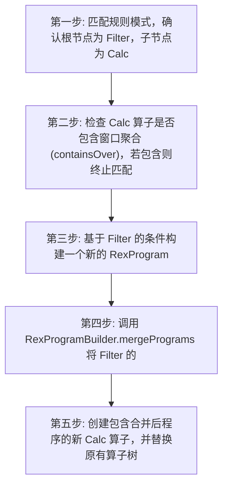
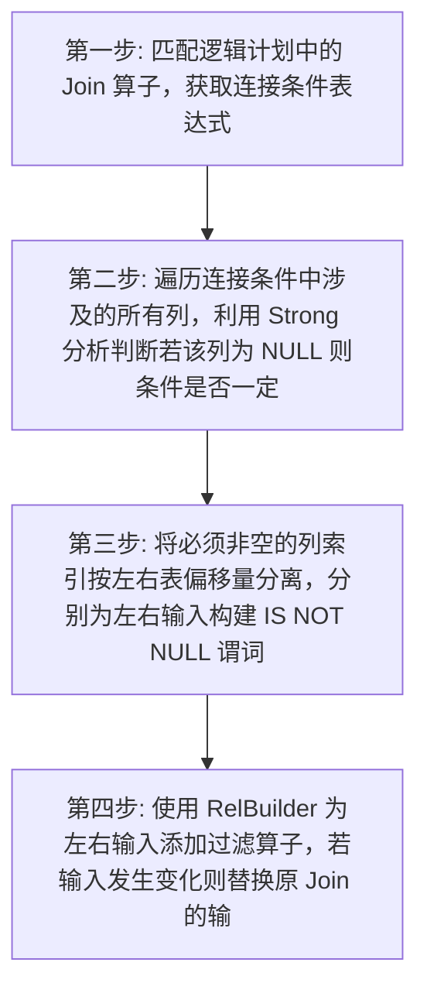
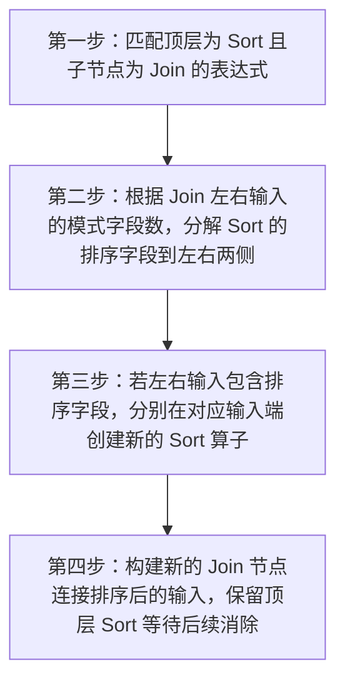
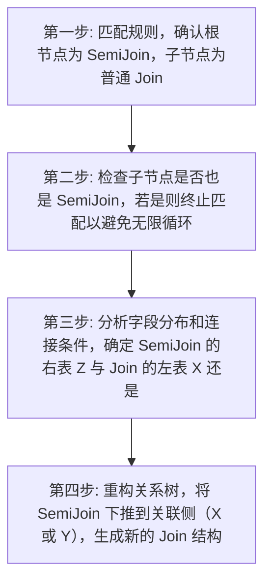
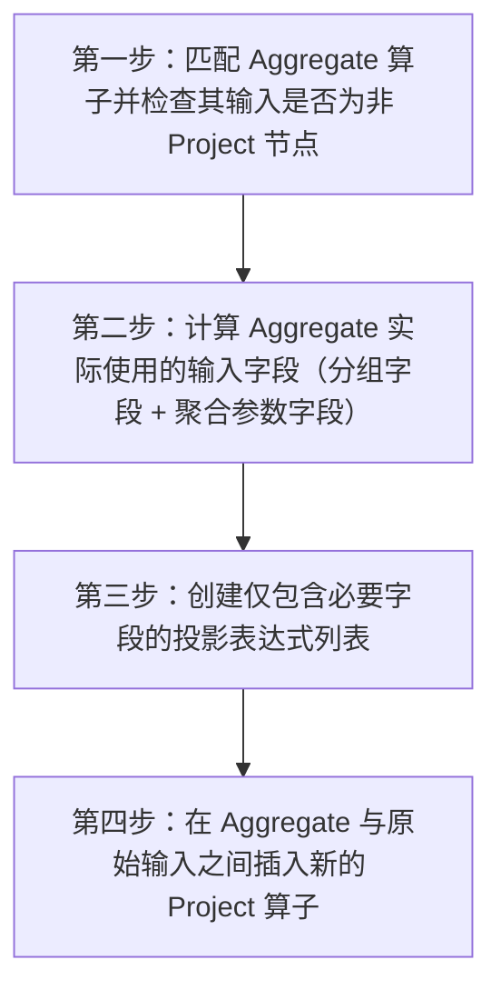
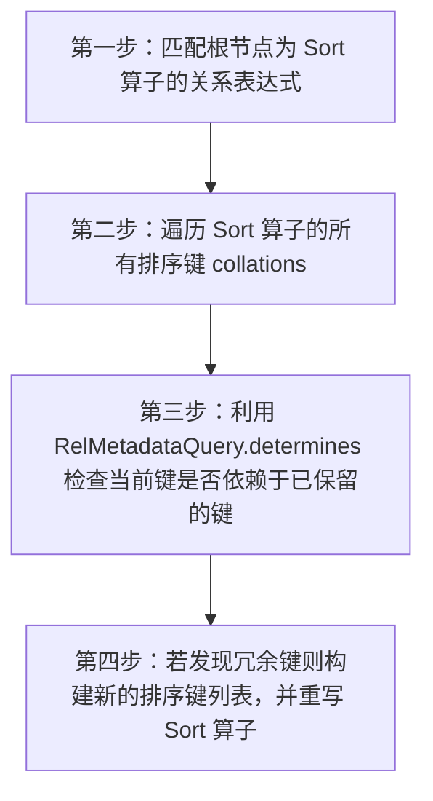
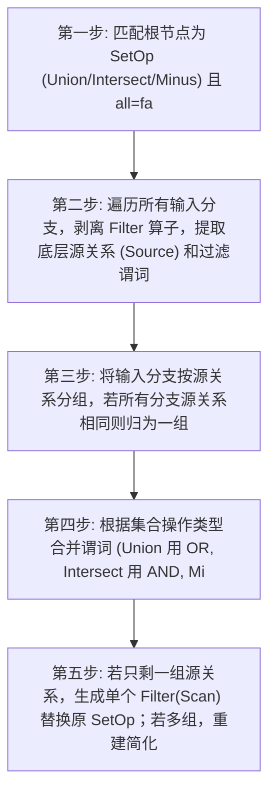
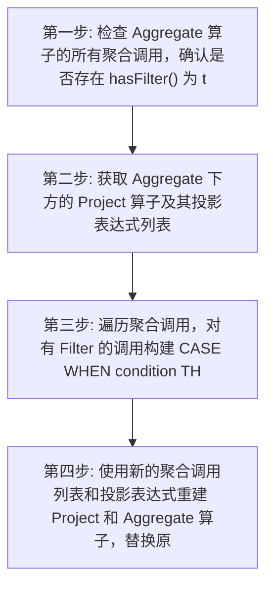
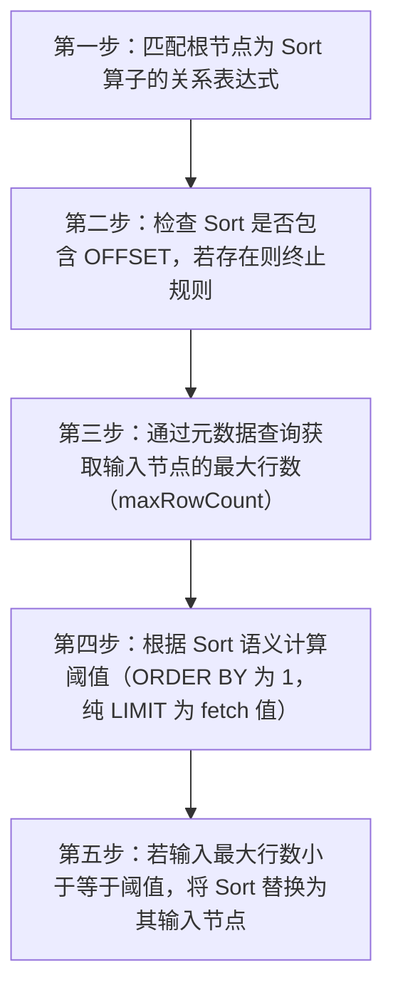
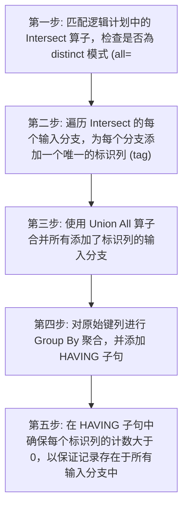

# Calcite 优化规则深度分析报告

> **生成时间:** 2026-04-06 13:09:31

> **引擎类型:** framework

> **优化器风格:** volcano

> **分析规则数:** 10


## 📑 目录

- [一、规则概览](#一规则概览)
- [二、关系代数符号说明](#二关系代数符号说明)
- [三、规则详细分析](#三规则详细分析)
  - [优化规则 (Rules)](#三1-优化规则-(Rules))
- [四、优化原理总结](#四优化原理总结)
- [五、最佳实践建议](#五最佳实践建议)

## 一、规则概览

### 1.1 规则分类统计

| 规则类别 | 数量 |
|----------|------|

| 优化规则 (Rules) | 10 |
| **总计** | **10** |

### 1.2 分析完成度

- 成功深度分析: 10/10 (100.0%)

## 二、关系代数符号说明


| 符号 | 名称 | 含义 | 示例 |
|------|------|------|------|
| σ | Sigma (选择) | 筛选满足条件的行 | `σ_{age>18}(Student)` |
| π | Pi (投影) | 选择特定列 | `π_{name,age}(Student)` |
| ⋈ | Theta Join | 条件连接 | `R ⋈_{R.id=S.id} S` |
| × | Cartesian | 笛卡尔积 | `R × S` |
| γ | Gamma (聚合) | 分组聚合 | `γ_{dept, AVG(salary)}(Employee)` |
| τ | Tau (排序) | 排序 | `τ_{salary DESC}(Employee)` |
| ∪ | Union | 并集 | `R ∪ S` |
| ∩ | Intersect | 交集 | `R ∩ S` |
| − | Difference | 差集 | `R − S` |
| → | Transform | 转换为 | `A → B` |
| ρ | Rho (重命名) | 重命名 | `ρ_{S}(R)` |

### 2.1 常用优化等价式

```
1. 选择下推: σ_{p}(R ⋈ S) ≡ R ⋈ σ_{p}(S)  (当p只涉及S的属性)
2. 投影下推: π_{A}(σ_{p}(R)) ≡ π_{A}(R)  (当A包含p的所有属性)
3. 选择合并: σ_{p1}(σ_{p2}(R)) ≡ σ_{p1∧p2}(R)
4. 投影合并: π_{A}(π_{B}(R)) ≡ π_{A∩B}(R)
5. 连接交换: R ⋈ S ≡ S ⋈ R  (对于内连接)
6. 连接结合: (R ⋈ S) ⋈ T ≡ R ⋈ (S ⋈ T)
```


## 三、规则详细分析


### 3.1 优化规则 (Rules)

> 共 10 条规则


#### 3.1.1 `FilterCalcMergeRule`

**📋 规则名称:** 过滤与计算合并规则

**📁 源码位置:** `rules/FilterCalcMergeRule.java`


**📝 功能概述:**

将上层的 Filter 算子与下层的 Calc 算子合并为一个 Calc 算子，将过滤条件逻辑与到 Calc 内部的条件中，从而减少算子数量。


**🔢 关系代数表达式:**

```
σ_p(Calc_{q,π}(R)) → Calc_{p∧q,π}(R)
```


**📥 输入模式:**

| 属性 | 值 |
|------|----|

| 算子类型 | Filter, Calc |
| 算子结构 | `Filter(Calc(Input))` |
| 触发条件 | 上层为 Filter 算子; 下层为 Calc 算子; Calc 算子不包含窗口聚合函数 (containsOver 为 false) |

**📤 输出模式:**

| 属性 | 值 |
|------|----|

| 算子类型 | Calc |
| 算子结构 | `Calc(Input)` |
| 结构变化 | Filter 算子被移除，其过滤条件合并到 Calc 算子的 RexProgram 条件中 |

**⚙️ 执行过程:**




**详细步骤:**

1. 第一步: 匹配规则模式，确认根节点为 Filter，子节点为 Calc
2. 第二步: 检查 Calc 算子是否包含窗口聚合 (containsOver)，若包含则终止匹配
3. 第三步: 基于 Filter 的条件构建一个新的 RexProgram
4. 第四步: 调用 RexProgramBuilder.mergePrograms 将 Filter 的程序与 Calc 原有程序合并
5. 第五步: 创建包含合并后程序的新 Calc 算子，并替换原有算子树


**✨ 优化收益:**

- 📊 数据量减少: 不直接减少数据量，但通过合并条件可能 enabling 进一步的下推优化
- ⏱️ 复杂度降低: 减少执行计划中的算子节点数量，降低遍历和执行开销
- 💾 IO优化: 若合并后的 Calc 能进一步下推到存储层，可减少 IO 读取


**🔗 依赖条件:**

无特殊依赖


**🎯 适用场景:**

- 包含多层投影和过滤的复杂查询
- 已经执行过 ProjectCalcMergeRule 后的计划优化
- 需要简化逻辑计划树结构的场景


**💡 SQL优化示例:**

**优化前:**
```sql
SELECT b FROM (SELECT a + 1 AS b FROM t WHERE a IS NOT NULL) WHERE b > 10
```

**优化后:**
```
Calc(project=[b=(a + 1)], condition=[(a IS NOT NULL) AND ((a + 1) > 10)])
  Scan(table=[t])
```

---

#### 3.1.2 `JoinDeriveIsNotNullFilterRule`

**📋 规则名称:** 连接派生非空过滤规则

**📁 源码位置:** `rules/JoinDeriveIsNotNullFilterRule.java`


**📝 功能概述:**

该规则分析内连接条件，推导出连接键必须非空才能匹配，从而在连接输入侧插入 IS NOT NULL 过滤器以提前剔除空值。


**🔢 关系代数表达式:**

```
⋈_cond(L, R) → ⋈_cond(σ_{L.keys IS NOT NULL}(L), σ_{R.keys IS NOT NULL}(R))
```


**📥 输入模式:**

| 属性 | 值 |
|------|----|

| 算子类型 | Join |
| 算子结构 | `Join(Left, Right)` |
| 触发条件 | 算子类型为内连接 (Inner Join); 连接条件中包含列引用; 通过强类型分析发现列值为 NULL 时连接条件不可能为真 |

**📤 输出模式:**

| 属性 | 值 |
|------|----|

| 算子类型 | Join, Filter |
| 算子结构 | `Join(Filter(Left), Filter(Right))` |
| 结构变化 | 在连接算子的左右输入端分别增加了 IS NOT NULL 过滤算子 |

**⚙️ 执行过程:**




**详细步骤:**

1. 第一步: 匹配逻辑计划中的 Join 算子，获取连接条件表达式
2. 第二步: 遍历连接条件中涉及的所有列，利用 Strong 分析判断若该列为 NULL 则条件是否一定不为真
3. 第三步: 将必须非空的列索引按左右表偏移量分离，分别为左右输入构建 IS NOT NULL 谓词
4. 第四步: 使用 RelBuilder 为左右输入添加过滤算子，若输入发生变化则替换原 Join 的输入并生成新计划


**✨ 优化收益:**

- 📊 数据量减少: 提前过滤掉连接键为 NULL 的行，减少参与连接计算的数据量
- ⏱️ 复杂度降低: 降低连接算子的构建成本，特别是哈希连接中的哈希表大小
- 💾 IO优化: 若过滤器能进一步下推至存储层，可减少磁盘 IO 读取


**🔗 依赖条件:**

无特殊依赖


**🎯 适用场景:**

- 内连接查询
- 连接键存在大量 NULL 值的场景
- 需要消除数据倾斜的场景


**💡 SQL优化示例:**

**优化前:**
```sql
SELECT * FROM A INNER JOIN B ON A.id = B.id
```

**优化后:**
```
SELECT * FROM (SELECT * FROM A WHERE A.id IS NOT NULL) A INNER JOIN (SELECT * FROM B WHERE B.id IS NOT NULL) B ON A.id = B.id
```

---

#### 3.1.3 `SortJoinCopyRule`

**📋 规则名称:** 排序连接复制规则

**📁 源码位置:** `rules/SortJoinCopyRule.java`


**📝 功能概述:**

将 Join 上层的 Sort 算子的排序要求复制到下层的左右输入端，顶层 Sort 保留以便后续优化消除。


**🔢 关系代数表达式:**

```
τ_order(R ⋈ S) → τ_order(τ_order_L(R) ⋈ τ_order_R(S))
```


**📥 输入模式:**

| 属性 | 值 |
|------|----|

| 算子类型 | Sort, Join |
| 算子结构 | `Sort(Join(Left, Right))` |
| 触发条件 | Sort 位于 Join 之上; Sort 包含排序字段; 排序字段可映射到 Join 的输入表 |

**📤 输出模式:**

| 属性 | 值 |
|------|----|

| 算子类型 | Sort, Join, Sort |
| 算子结构 | `Sort(Join(Sort(Left), Sort(Right)))` |
| 结构变化 | Sort 算子被复制到 Join 的输入端，原顶层 Sort 保留 |

**⚙️ 执行过程:**




**详细步骤:**

1. 第一步：匹配顶层为 Sort 且子节点为 Join 的表达式
2. 第二步：根据 Join 左右输入的模式字段数，分解 Sort 的排序字段到左右两侧
3. 第三步：若左右输入包含排序字段，分别在对应输入端创建新的 Sort 算子
4. 第四步：构建新的 Join 节点连接排序后的输入，保留顶层 Sort 等待后续消除


**✨ 优化收益:**

- 📊 数据量减少: 排序操作作用于更小的输入数据集而非连接后的结果集
- ⏱️ 复杂度降低: 降低排序操作的数据规模复杂度 O(N log N)
- 💾 IO优化: 可能利用输入表的有序索引扫描减少随机 IO


**🔗 依赖条件:**

需要: 物理属性


**🎯 适用场景:**

- 需要有序输出的连接查询
- 启用 Merge Join 优化
- 利用索引避免额外排序


**💡 SQL优化示例:**

**优化前:**
```sql
SELECT * FROM A JOIN B ON A.id = B.id ORDER BY A.name, B.name
```

**优化后:**
```
Sort(Join(Sort(Scan(A), [A.name]), Sort(Scan(B), [B.name])))
```

---

#### 3.1.4 `SemiJoinJoinTransposeRule`

**📋 规则名称:** SemiJoin 连接转置规则

**📁 源码位置:** `rules/SemiJoinJoinTransposeRule.java`


**📝 功能概述:**

将 SemiJoin 算子向下穿过普通的 Join 算子，根据参与条件将 SemiJoin 重写到 Join 的左子树或右子树，以便触发后续规则转换 SemiJoin。


**🔢 关系代数表达式:**

```
(X ⋈ Y) ⋉ Z → (X ⋉ Z) ⋈ Y 或 X ⋈ (Y ⋉ Z)
```


**📥 输入模式:**

| 属性 | 值 |
|------|----|

| 算子类型 | SemiJoin, Join |
| 算子结构 | `SemiJoin(Join(X, Y), Z)` |
| 触发条件 | 顶层算子为 SemiJoin; 子节点为普通 Join 而非 SemiJoin; SemiJoin 条件涉及 Join 的某一侧输入 |

**📤 输出模式:**

| 属性 | 值 |
|------|----|

| 算子类型 | Join, SemiJoin |
| 算子结构 | `Join(SemiJoin(X, Z), Y) 或 Join(X, SemiJoin(Y, Z))` |
| 结构变化 | SemiJoin 算子位置下移，与普通 Join 算子交换位置，作用于更底层的单表或子树 |

**⚙️ 执行过程:**




**详细步骤:**

1. 第一步: 匹配规则，确认根节点为 SemiJoin，子节点为普通 Join
2. 第二步: 检查子节点是否也是 SemiJoin，若是则终止匹配以避免无限循环
3. 第三步: 分析字段分布和连接条件，确定 SemiJoin 的右表 Z 与 Join 的左表 X 还是右表 Y 关联
4. 第四步: 重构关系树，将 SemiJoin 下推到关联侧（X 或 Y），生成新的 Join 结构


**✨ 优化收益:**

- 📊 数据量减少: 提前过滤数据，减少 Join 算子的输入行数
- ⏱️ 复杂度降低: 降低后续连接操作的数据规模，可能将复杂连接拆分为更简单的操作
- 💾 IO优化: 减少中间结果集的网络传输或磁盘 IO 开销


**🔗 依赖条件:**

无特殊依赖


**🎯 适用场景:**

- 存在 EXISTS 或 IN 子查询的多表连接
- 需要进一步将 SemiJoin 转换为 Filter 或 AntiJoin 的场景
- 大表连接前的早期过滤优化


**💡 SQL优化示例:**

**优化前:**
```sql
SELECT * FROM A JOIN B ON A.id = B.id WHERE EXISTS (SELECT 1 FROM C WHERE C.id = A.id)
```

**优化后:**
```
SELECT * FROM (SELECT * FROM A WHERE EXISTS (SELECT 1 FROM C WHERE C.id = A.id)) AS A_NEW JOIN B ON A_NEW.id = B.id
```

---

#### 3.1.5 `AggregateExtractProjectRule`

**📋 规则名称:** 聚合提取投影规则

**📁 源码位置:** `rules/AggregateExtractProjectRule.java`


**📝 功能概述:**

从聚合算子中提取必要的投影操作并下推到输入端，减少不必要的数据处理列


**🔢 关系代数表达式:**

```
γ_{G,F}(R) → π_{used}(γ_{G,F}(π_{used}(R)))
```


**📥 输入模式:**

| 属性 | 值 |
|------|----|

| 算子类型 | Aggregate |
| 算子结构 | `Aggregate(input)` |
| 触发条件 | Aggregate 输入不是 Project 算子; 存在可精简的输入字段 |

**📤 输出模式:**

| 属性 | 值 |
|------|----|

| 算子类型 | Project, Aggregate |
| 算子结构 | `Project(Aggregate(input))` |
| 结构变化 | 在 Aggregate 前插入仅包含必要字段的 Project 算子 |

**⚙️ 执行过程:**




**详细步骤:**

1. 第一步：匹配 Aggregate 算子并检查其输入是否为非 Project 节点
2. 第二步：计算 Aggregate 实际使用的输入字段（分组字段 + 聚合参数字段）
3. 第三步：创建仅包含必要字段的投影表达式列表
4. 第四步：在 Aggregate 与原始输入之间插入新的 Project 算子


**✨ 优化收益:**

- 📊 数据量减少: 减少 30-70% 的中间数据列传输量
- ⏱️ 复杂度降低: 降低聚合算子的字段处理复杂度 O(n)→O(m)
- 💾 IO优化: 减少内存中冗余字段的存储和传输开销


**🔗 依赖条件:**

无特殊依赖


**🎯 适用场景:**

- 宽表聚合查询
- 多列选择场景
- 列式存储优化


**💡 SQL优化示例:**

**优化前:**
```sql
SELECT dept, SUM(salary) FROM employees GROUP BY dept
```

**优化后:**
```
Project(dept, salary) → Aggregate(dept, SUM(salary))
```

---

#### 3.1.6 `SortRemoveDuplicateKeysRule`

**📋 规则名称:** 排序冗余键移除规则

**📁 源码位置:** `rules/SortRemoveDuplicateKeysRule.java`


**📝 功能概述:**

该规则检测排序算子中的排序键列表，若后续排序键功能依赖于已存在的排序键，则移除该冗余键以降低排序开销。


**🔢 关系代数表达式:**

```
τ_{K1, K2, ..., Kn}(R) → τ_{K1, ..., Km}(R) (其中 m < n，且被移除的键依赖于保留的键)
```


**📥 输入模式:**

| 属性 | 值 |
|------|----|

| 算子类型 | Sort |
| 算子结构 | `Sort(AnyInput)` |
| 触发条件 | Sort 算子包含多个排序键; 元数据表明存在排序键之间的功能依赖关系 |

**📤 输出模式:**

| 属性 | 值 |
|------|----|

| 算子类型 | Sort |
| 算子结构 | `Sort(AnyInput)` |
| 结构变化 | Sort 算子的排序键列表缩短，移除了冗余键，保持输入子节点不变 |

**⚙️ 执行过程:**




**详细步骤:**

1. 第一步：匹配根节点为 Sort 算子的关系表达式
2. 第二步：遍历 Sort 算子的所有排序键 collations
3. 第三步：利用 RelMetadataQuery.determines 检查当前键是否依赖于已保留的键
4. 第四步：若发现冗余键则构建新的排序键列表，并重写 Sort 算子


**✨ 优化收益:**

- 📊 数据量减少: 不减少行数，但减少每行排序比较的数据宽度
- ⏱️ 复杂度降低: 降低排序比较操作的复杂度，减少 CPU 消耗
- 💾 IO优化: 可能减少排序过程中的内存溢出及磁盘 spill


**🔗 依赖条件:**

需要: 物理属性


**🎯 适用场景:**

- ORDER BY 包含主键及依赖列
- ORDER BY 包含重复列或别名
- 复杂视图展开后的冗余排序


**💡 SQL优化示例:**

**优化前:**
```sql
SELECT d1 FROM (SELECT deptno AS d1, deptno AS d2 FROM dept) AS tmp ORDER BY d1, d2
```

**优化后:**
```
LogicalProject(D1=[$0])
  LogicalSort(sort0=[$0], dir0=[ASC])
    LogicalProject(DEPTNO=[$0], DEPTNO0=[$0])
      LogicalTableScan(table=[[CATALOG, SALES, DEPT]])
```

---

#### 3.1.7 `SetOpToFilterRule`

**📋 规则名称:** 集合操作转过滤规则

**📁 源码位置:** `rules/SetOpToFilterRule.java`


**📝 功能概述:**

当集合操作符（UNION/INTERSECT/MINUS）的输入源自相同表且仅过滤条件不同时，将集合操作合并为单个表扫描加组合过滤条件，消除集合算子。


**🔢 关系代数表达式:**

```
σ_p1(R) ∪ σ_p2(R) → σ_(p1 OR p2)(R) (Union 场景); σ_p1(R) ∩ σ_p2(R) → σ_(p1 AND p2)(R) (Intersect 场景)
```


**📥 输入模式:**

| 属性 | 值 |
|------|----|

| 算子类型 | Union, Intersect, Minus, Filter, TableScan |
| 算子结构 | `SetOp(Filter(Scan(table)), Filter(Scan(table)))` |
| 触发条件 | 集合操作为 distinct 模式 (all=false); 输入分支源自同一基础关系; 输入分支差异仅在于过滤谓词 |

**📤 输出模式:**

| 属性 | 值 |
|------|----|

| 算子类型 | Filter, TableScan |
| 算子结构 | `Filter(Scan(table, combined_condition))` |
| 结构变化 | 集合算子被消除，多个过滤条件合并为一个复合条件，保留 distinct 语义 |

**⚙️ 执行过程:**




**详细步骤:**

1. 第一步: 匹配根节点为 SetOp (Union/Intersect/Minus) 且 all=false 的表达式
2. 第二步: 遍历所有输入分支，剥离 Filter 算子，提取底层源关系 (Source) 和过滤谓词 (Condition)
3. 第三步: 将输入分支按源关系分组，若所有分支源关系相同则归为一组
4. 第四步: 根据集合操作类型合并谓词 (Union 用 OR, Intersect 用 AND, Minus 用 AND NOT)
5. 第五步: 若只剩一组源关系，生成单个 Filter(Scan) 替换原 SetOp；若多组，重建简化的 SetOp


**✨ 优化收益:**

- 📊 数据量减少: 避免对同一表进行多次扫描，减少中间结果集生成
- ⏱️ 复杂度降低: 降低执行计划树深度，从 O(n) 次扫描降低到 O(1) 次扫描
- 💾 IO优化: 显著减少磁盘 IO 次数，尤其是大表场景


**🔗 依赖条件:**

无特殊依赖


**🎯 适用场景:**

- 同一表的多条件分支查询
- 动态生成的 UNION 查询
- 数据仓库维度表过滤合并


**💡 SQL优化示例:**

**优化前:**
```sql
SELECT mgr, comm FROM emp WHERE mgr = 12 UNION SELECT mgr, comm FROM emp WHERE comm = 5
```

**优化后:**
```
SELECT DISTINCT mgr, comm FROM emp WHERE mgr = 12 OR comm = 5
```

---

#### 3.1.8 `AggregateFilterToCaseRule`

**📋 规则名称:** 聚合过滤转 CASE 规则

**📁 源码位置:** `rules/AggregateFilterToCaseRule.java`


**📝 功能概述:**

将聚合函数中带有 FILTER 子句的调用转换为使用 CASE WHEN 表达式的标准聚合调用，消除对原生过滤聚合的支持依赖。


**🔢 关系代数表达式:**

```
γ_{G, agg(expr) FILTER (p)}(E) → γ_{G, agg(CASE WHEN p THEN expr ELSE NULL END)}(E)
```


**📥 输入模式:**

| 属性 | 值 |
|------|----|

| 算子类型 | Aggregate, Project |
| 算子结构 | `Aggregate(Project(Input))` |
| 触发条件 | Aggregate 算子中至少有一个聚合调用包含 Filter 条件; Aggregate 的输入必须是 Project 算子 |

**📤 输出模式:**

| 属性 | 值 |
|------|----|

| 算子类型 | Aggregate, Project |
| 算子结构 | `Aggregate(Project(Input))` |
| 结构变化 | 聚合调用不再标记为有 Filter，过滤逻辑被嵌入到聚合参数的 CASE 表达式中 |

**⚙️ 执行过程:**




**详细步骤:**

1. 第一步: 检查 Aggregate 算子的所有聚合调用，确认是否存在 hasFilter() 为 true 的调用
2. 第二步: 获取 Aggregate 下方的 Project 算子及其投影表达式列表
3. 第三步: 遍历聚合调用，对有 Filter 的调用构建 CASE WHEN condition THEN arg ELSE NULL END 表达式
4. 第四步: 使用新的聚合调用列表和投影表达式重建 Project 和 Aggregate 算子，替换原计划


**✨ 优化收益:**

- 📊 数据量减少: 无直接数据量减少，过滤仍在聚合阶段进行
- ⏱️ 复杂度降低: 简化执行引擎复杂度，无需原生支持 FILTER 语义
- 💾 IO优化: 无 IO 减少


**🔗 依赖条件:**

无特殊依赖


**🎯 适用场景:**

- 使用 SQL FILTER 子句的聚合查询
- 目标执行引擎不支持 FILTER 语法的场景
- 需要统一聚合表达式格式以便后续优化的场景


**💡 SQL优化示例:**

**优化前:**
```sql
SELECT SUM(salary) FILTER (WHERE gender = 'F') FROM Emp
```

**优化后:**
```
Aggregate(group={}, [SUM(CASE WHEN gender='F' THEN salary ELSE NULL END)])
```

---

#### 3.1.9 `SortRemoveRedundantRule`

**📋 规则名称:** 排序冗余移除规则

**📁 源码位置:** `rules/SortRemoveRedundantRule.java`


**📝 功能概述:**

当输入关系的最大行数小于或等于排序或限制所需的行数时，移除冗余的 Sort 算子（包括 ORDER BY 和 LIMIT）。


**🔢 关系代数表达式:**

```
τ_{order, limit}(E) → E (当 max_rows(E) ≤ 阈值)
```


**📥 输入模式:**

| 属性 | 值 |
|------|----|

| 算子类型 | Sort |
| 算子结构 | `Sort(InputRelNode)` |
| 触发条件 | Sort 算子不包含 OFFSET; 输入节点的最大行数已知且小于等于阈值; 阈值为 1（含 ORDER BY）或 fetch 值（纯 LIMIT） |

**📤 输出模式:**

| 属性 | 值 |
|------|----|

| 算子类型 | InputRelNode |
| 算子结构 | `InputRelNode` |
| 结构变化 | Sort 算子被移除，直接返回输入节点 |

**⚙️ 执行过程:**




**详细步骤:**

1. 第一步：匹配根节点为 Sort 算子的关系表达式
2. 第二步：检查 Sort 是否包含 OFFSET，若存在则终止规则
3. 第三步：通过元数据查询获取输入节点的最大行数（maxRowCount）
4. 第四步：根据 Sort 语义计算阈值（ORDER BY 为 1，纯 LIMIT 为 fetch 值）
5. 第五步：若输入最大行数小于等于阈值，将 Sort 替换为其输入节点


**✨ 优化收益:**

- 📊 数据量减少: 不减少数据量，但消除冗余算子开销
- ⏱️ 复杂度降低: 避免 O(N log N) 排序开销或 Limit 强制检查开销
- 💾 IO优化: 减少 CPU 计算资源消耗，避免不必要的内存排序


**🔗 依赖条件:**

需要: 统计信息


**🎯 适用场景:**

- 聚合查询后带 ORDER BY
- 小表查询带大 LIMIT 值
- 已知返回行数极少的子查询


**💡 SQL优化示例:**

**优化前:**
```sql
SELECT count(*) FROM orders ORDER BY 1 LIMIT 10
```

**优化后:**
```
SELECT count(*) FROM orders
```

---

#### 3.1.10 `IntersectToDistinctRule`

**📋 规则名称:** 交集转聚合规则

**📁 源码位置:** `rules/IntersectToDistinctRule.java`


**📝 功能概述:**

将 DISTINCT INTERSECT 算子转换为由 UNION ALL、投影和带过滤条件的聚合算子组成的等价操作序列，以便利用已有的聚合优化策略。


**🔢 关系代数表达式:**

```
⋂(R1, R2, ..., Rn) → γ_{keys, HAVING(∀i: count(tag=i)>0)}(∪all(π_{keys, tag=0}(R1), ..., π_{keys, tag=n-1}(Rn)))
```


**📥 输入模式:**

| 属性 | 值 |
|------|----|

| 算子类型 | Intersect |
| 算子结构 | `Intersect(Input1, Input2, ..., InputN)` |
| 触发条件 | Intersect.all 为 false (即 DISTINCT INTERSECT); 存在多个输入分支 |

**📤 输出模式:**

| 属性 | 值 |
|------|----|

| 算子类型 | Union, Aggregate, Project |
| 算子结构 | `Aggregate(Union_All(Project(Input1, tag), Project(Input2, tag), ...))` |
| 结构变化 | Intersect 算子被消除，替换为 Union All 加上带过滤条件的 Group By 聚合 |

**⚙️ 执行过程:**




**详细步骤:**

1. 第一步: 匹配逻辑计划中的 Intersect 算子，检查是否為 distinct 模式 (all=false)
2. 第二步: 遍历 Intersect 的每个输入分支，为每个分支添加一个唯一的标识列 (tag)
3. 第三步: 使用 Union All 算子合并所有添加了标识列的输入分支
4. 第四步: 对原始键列进行 Group By 聚合，并添加 HAVING 子句
5. 第五步: 在 HAVING 子句中确保每个标识列的计数大于 0，以保证记录存在于所有输入分支中


**✨ 优化收益:**

- 📊 数据量减少: 中间数据量可能暂时增加（Union All 保留重复），但最终结果一致
- ⏱️ 复杂度降低: 将特殊算子转化为通用算子组合，降低优化器实现复杂度，便于应用聚合下推等优化
- 💾 IO优化: 无直接 IO 减少，依赖后续优化规则对聚合算子的进一步优化


**🔗 依赖条件:**

无特殊依赖


**🎯 适用场景:**

- 多表交集查询
- 需要去重的交集操作
- 底层执行引擎不支持高效 Intersect 算子时
- 希望利用聚合优化路径的场景


**💡 SQL优化示例:**

**优化前:**
```sql
SELECT job FROM emp WHERE deptno = 10 INTERSECT SELECT job FROM emp WHERE deptno = 20
```

**优化后:**
```
SELECT job FROM (SELECT job, 0 AS i FROM emp WHERE deptno = 10 UNION ALL SELECT job, 1 AS i FROM emp WHERE deptno = 20) GROUP BY job HAVING COUNT(*) FILTER (WHERE i = 0) > 0 AND COUNT(*) FILTER (WHERE i = 1) > 0
```

---

## 四、优化原理总结


### 4.1 核心优化原则

查询优化的核心是利用关系代数的**等价变换规则**，在保持查询语义不变的前提下，找到执行代价最小的等价表达式。

#### 4.1.1 选择下推 (Selection Pushdown)

**原理:** 尽早过滤，减少中间结果

```
原始: σ_{p}(R ⋈ S)
优化: R ⋈ σ_{p}(S)  -- 当p只涉及S的属性时
```

**收益:**
- 减少连接操作的输入数据量
- 降低内存使用
- 减少网络传输（分布式场景）

#### 4.1.2 投影下推 (Projection Pushdown)

**原理:** 只读取需要的列

```
原始: π_{A,B}(Scan(R))  -- 扫描所有列
优化: Scan(R, columns=[A,B])  -- 只扫描指定列
```

**收益:**
- 减少磁盘IO
- 降低内存占用
- 提高缓存命中率

#### 4.1.3 连接重排序 (Join Reordering)

**原理:** 选择产生最小中间结果的连接顺序

```
原始: (R ⋈ S) ⋈ T  -- 可能产生大量中间结果
优化: R ⋈ (S ⋈ T)  -- 如果这个顺序产生更少中间结果
```

**收益:**
- 减少中间结果大小
- 降低内存和磁盘使用
- 缩短查询响应时间

#### 4.1.4 聚合下推 (Aggregation Pushdown)

**原理:** 先聚合减少数据量

```
原始: γ_{g,a}(R ⋈ S)  -- 先连接再聚合
优化: γ_{g,a}(R) ⋈ S  -- 当分组属性都在R上时
```

**收益:**
- 减少连接操作的输入
- 降低计算开销


## 五、最佳实践建议


### 5.1 SQL编写建议

1. **使用明确的过滤条件**
   - 将过滤条件写在WHERE子句中，而不是HAVING
   - 避免在WHERE子句中使用函数

2. **合理使用索引**
   - 为高频查询条件创建索引
   - 遵循最左前缀原则

3. **避免SELECT ***
   - 只选择需要的列
   - 让优化器可以应用投影下推

4. **合理使用JOIN**
   - 小表驱动大表
   - 避免笛卡尔积

### 5.2 调优建议

1. **查看执行计划**
   - 使用EXPLAIN分析查询计划
   - 检查是否有预期的优化规则被应用

2. **监控统计信息**
   - 确保统计信息是最新的
   - 对于大表变更后及时更新统计信息

3. **会话变量调优**
   - 了解优化器相关的会话变量
   - 根据场景调整优化器行为


---

*本报告由 Optimizer Expert Analyzer 自动生成*

*包含规则的输入输出模式和执行过程分析*

*生成时间: 2026-04-06T13:09:31.668297*
