# Doris 优化规则深度分析报告

> **生成时间:** 2026-04-06 13:10:56

> **引擎类型:** columnar_olap

> **优化器风格:** cascades

> **分析规则数:** 15


## 📑 目录

- [一、规则概览](#一规则概览)
- [二、关系代数符号说明](#二关系代数符号说明)
- [三、规则详细分析](#三规则详细分析)
  - [分析规则 (Analysis)](#三1-分析规则-(Analysis))
- [四、优化原理总结](#四优化原理总结)
- [五、最佳实践建议](#五最佳实践建议)

## 一、规则概览

### 1.1 规则分类统计

| 规则类别 | 数量 |
|----------|------|

| 分析规则 (Analysis) | 15 |
| **总计** | **15** |

### 1.2 分析完成度

- 成功深度分析: 15/15 (100.0%)

## 二、关系代数符号说明


| 符号 | 名称 | 含义 | 示例 |
|------|------|------|------|
| σ | Sigma (选择) | 筛选满足条件的行 | `σ_{age>18}(Student)` |
| π | Pi (投影) | 选择特定列 | `π_{name,age}(Student)` |
| ⋈ | Theta Join | 条件连接 | `R ⋈_{R.id=S.id} S` |
| × | Cartesian | 笛卡尔积 | `R × S` |
| γ | Gamma (聚合) | 分组聚合 | `γ_{dept, AVG(salary)}(Employee)` |
| τ | Tau (排序) | 排序 | `τ_{salary DESC}(Employee)` |
| ∪ | Union | 并集 | `R ∪ S` |
| ∩ | Intersect | 交集 | `R ∩ S` |
| − | Difference | 差集 | `R − S` |
| → | Transform | 转换为 | `A → B` |
| ρ | Rho (重命名) | 重命名 | `ρ_{S}(R)` |

### 2.1 常用优化等价式

```
1. 选择下推: σ_{p}(R ⋈ S) ≡ R ⋈ σ_{p}(S)  (当p只涉及S的属性)
2. 投影下推: π_{A}(σ_{p}(R)) ≡ π_{A}(R)  (当A包含p的所有属性)
3. 选择合并: σ_{p1}(σ_{p2}(R)) ≡ σ_{p1∧p2}(R)
4. 投影合并: π_{A}(π_{B}(R)) ≡ π_{A∩B}(R)
5. 连接交换: R ⋈ S ≡ S ⋈ R  (对于内连接)
6. 连接结合: (R ⋈ S) ⋈ T ≡ R ⋈ (S ⋈ T)
```


## 三、规则详细分析


### 3.1 分析规则 (Analysis)

> 共 15 条规则


#### 3.1.1 `VariableToLiteral`

**📋 规则名称:** 变量转字面量

**📁 源码位置:** `analysis/VariableToLiteral.java`


**📝 功能概述:**

将查询表达式中的变量节点替换为具体的字面量值，以便启用后续的常量折叠和分区裁剪优化。


**🔢 关系代数表达式:**

```
σ_{expr(var)}(R) → σ_{expr(literal)}(R)
```


**📥 输入模式:**

| 属性 | 值 |
|------|----|

| 算子类型 | Filter, Project, Join, Aggregate |
| 算子结构 | `任意包含表达式的逻辑算子` |
| 触发条件 | 表达式中存在 Variable 类型节点; 变量值在当前会话上下文中可获取 |

**📤 输出模式:**

| 属性 | 值 |
|------|----|

| 算子类型 | Filter, Project, Join, Aggregate |
| 算子结构 | `算子结构不变，内部表达式树发生变化` |
| 结构变化 | 表达式树中的 Variable 节点被替换为 Literal 节点 |

**⚙️ 执行过程:**

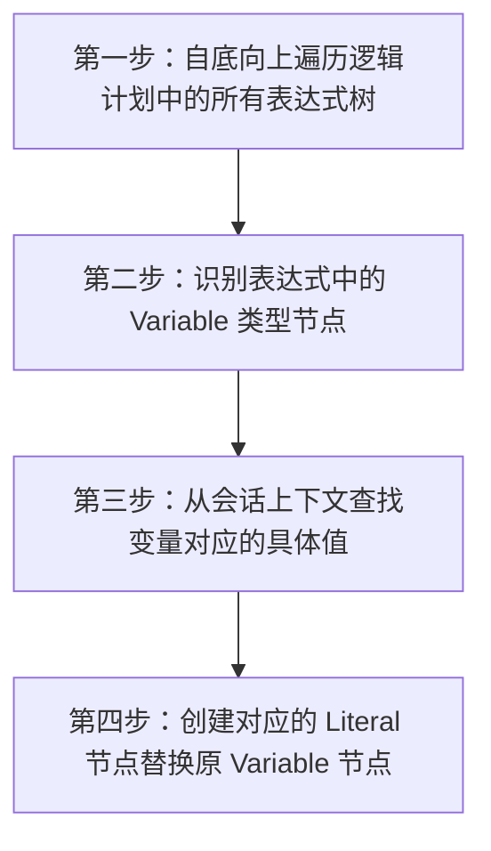


**详细步骤:**

1. 第一步：自底向上遍历逻辑计划中的所有表达式树
2. 第二步：识别表达式中的 Variable 类型节点
3. 第三步：从会话上下文查找变量对应的具体值
4. 第四步：创建对应的 Literal 节点替换原 Variable 节点


**✨ 优化收益:**

- 📊 数据量减少: 间接减少，通过启用分区裁剪减少扫描数据量
- ⏱️ 复杂度降低: 降低表达式运行时求值复杂度，支持常量折叠
- 💾 IO优化: 若触发分区裁剪，可显著减少磁盘 IO


**🔗 依赖条件:**

无特殊依赖


**🎯 适用场景:**

- 使用会话变量的查询
- 预编译语句参数化查询
- 动态 SQL 生成


**💡 SQL优化示例:**

**优化前:**
```sql
SELECT * FROM t WHERE id = @user_id (假设@user_id=100)
```

**优化后:**
```
LogicalFilter(condition=[id = 100]) -> LogicalScan(t)
```

---

#### 3.1.2 `for`

**📋 规则名称:** 分析阶段规则工厂接口

**📁 源码位置:** `analysis/AnalysisRuleFactory.java`


**📝 功能概述:**

该文件定义了 Doris Nereids 优化器中分析阶段所有规则工厂的基接口，设定规则承诺为 ANALYSIS，用于规范分析期规则的实现而非具体转换逻辑。


**🔢 关系代数表达式:**

```
无 (此为接口定义，具体转换由实现类决定)
```


**📥 输入模式:**

| 属性 | 值 |
|------|----|

| 算子类型 | 任意逻辑算子 |
| 算子结构 | `取决于具体实现类` |
| 触发条件 | 规则实现类定义的具体模式; 处于优化器分析阶段 |

**📤 输出模式:**

| 属性 | 值 |
|------|----|

| 算子类型 | 任意逻辑算子 |
| 算子结构 | `取决于具体实现类` |
| 结构变化 | 取决于具体实现类 |

**⚙️ 执行过程:**

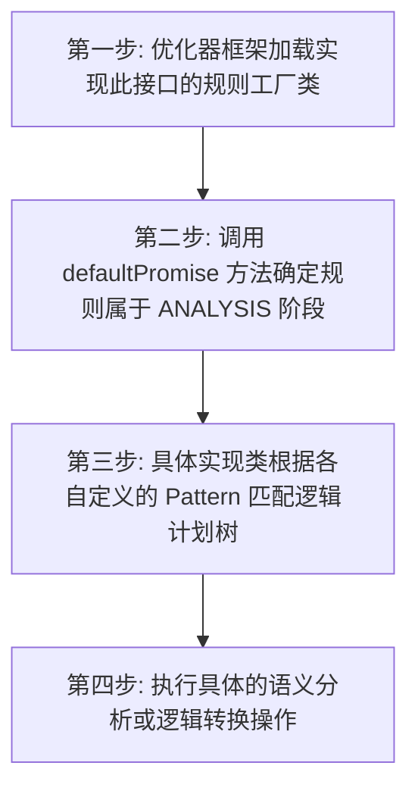


**详细步骤:**

1. 第一步: 优化器框架加载实现此接口的规则工厂类
2. 第二步: 调用 defaultPromise 方法确定规则属于 ANALYSIS 阶段
3. 第三步: 具体实现类根据各自定义的 Pattern 匹配逻辑计划树
4. 第四步: 执行具体的语义分析或逻辑转换操作


**✨ 优化收益:**

- 📊 数据量减少: 不适用 (框架层定义)
- ⏱️ 复杂度降低: 确保规则在正确阶段调度，避免阶段混乱
- 💾 IO优化: 不适用 (框架层定义)


**🔗 依赖条件:**

无特殊依赖


**🎯 适用场景:**

- 逻辑计划语义分析
- 槽位绑定与类型推导
- 查询重写前置处理


**💡 SQL优化示例:**

**优化前:**
```sql
不适用 (此为框架接口代码，非具体 SQL 转换规则)
```

**优化后:**
```
不适用 (此为框架接口代码，非具体 SQL 转换规则)
```

---

#### 3.1.3 `ExpressionAnalyzer`

**📋 规则名称:** 表达式解析与绑定规则

**📁 源码位置:** `analysis/ExpressionAnalyzer.java`


**📝 功能概述:**

将逻辑计划中的未绑定表达式（如未解析的列名、函数名、变量）解析并绑定为具体的槽位引用或函数实现，确保语义正确性。


**🔢 关系代数表达式:**

```
Op(expr_unbound) → Op(expr_bound)
```


**📥 输入模式:**

| 属性 | 值 |
|------|----|

| 算子类型 | LogicalProject, LogicalFilter, LogicalAggregate, LogicalJoin |
| 算子结构 | `Op(expressions=[UnboundSlot, UnboundFunction, ...])` |
| 触发条件 | 表达式树中存在 Unbound 类型的节点; 当前 Scope 中可找到对应的符号定义; 处于查询分析（Analysis）阶段 |

**📤 输出模式:**

| 属性 | 值 |
|------|----|

| 算子类型 | LogicalProject, LogicalFilter, LogicalAggregate, LogicalJoin |
| 算子结构 | `Op(expressions=[SlotReference, BoundFunction, ...])` |
| 结构变化 | 未绑定的表达式节点被替换为已绑定的具体引用对象，包含类型信息和 ExprId |

**⚙️ 执行过程:**

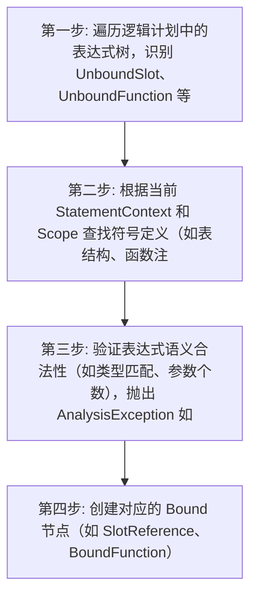


**详细步骤:**

1. 第一步: 遍历逻辑计划中的表达式树，识别 UnboundSlot、UnboundFunction 等未绑定节点
2. 第二步: 根据当前 StatementContext 和 Scope 查找符号定义（如表结构、函数注册表）
3. 第三步: 验证表达式语义合法性（如类型匹配、参数个数），抛出 AnalysisException 如果非法
4. 第四步: 创建对应的 Bound 节点（如 SlotReference、BoundFunction）替换原未绑定节点，生成新表达式


**✨ 优化收益:**

- 📊 数据量减少: 无直接数据减少，但确保后续优化规则可正确执行
- ⏱️ 复杂度降低: 消除运行时符号查找开销，将解析成本移至编译期
- 💾 IO优化: 无直接 IO 减少，但避免因语义错误导致的无效执行


**🔗 依赖条件:**

无特殊依赖


**🎯 适用场景:**

- 所有 SQL 查询的分析阶段
- 涉及列引用、函数调用、别名的查询
- 嵌套子查询中的表达式解析


**💡 SQL优化示例:**

**优化前:**
```sql
SELECT id, name FROM users WHERE status = 1
```

**优化后:**
```
SELECT SlotRef#1, SlotRef#2 FROM users WHERE SlotRef#3 = 1 (表达式已绑定具体槽位 ID)
```

---

#### 3.1.4 `WindowFunctionChecker`

**📋 规则名称:** 窗口函数检查与标准化规则

**📁 源码位置:** `analysis/WindowFunctionChecker.java`


**📝 功能概述:**

该规则在分析阶段校验窗口函数表达式的合法性，并根据函数类型自动填充缺失的默认窗口帧，确保窗口语义标准化。


**🔢 关系代数表达式:**

```
ω_{func, frame?}(R) → ω_{func, std\_frame}(R)
```


**📥 输入模式:**

| 属性 | 值 |
|------|----|

| 算子类型 | Project, Window |
| 算子结构 | `LogicalPlan 中包含未完全定义窗口帧的 WindowExpression` |
| 触发条件 | 查询中包含窗口函数; 窗口函数未显式指定窗口帧或指定不完整 |

**📤 输出模式:**

| 属性 | 值 |
|------|----|

| 算子类型 | Project, Window |
| 算子结构 | `LogicalPlan 中包含合法且完整窗口帧定义的 WindowExpression` |
| 结构变化 | 窗口帧边界被补全默认值，排序键被校验，特定函数窗口方向被标准化 |

**⚙️ 执行过程:**

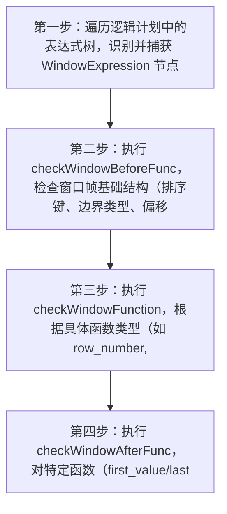


**详细步骤:**

1. 第一步：遍历逻辑计划中的表达式树，识别并捕获 WindowExpression 节点
2. 第二步：执行 checkWindowBeforeFunc，检查窗口帧基础结构（排序键、边界类型、偏移量）
3. 第三步：执行 checkWindowFunction，根据具体函数类型（如 row_number, rank 等）设置唯一的默认窗口帧
4. 第四步：执行 checkWindowAfterFunc，对特定函数（first_value/last_value）进行窗口反转处理并添加通用默认帧


**✨ 优化收益:**

- 📊 数据量减少: 无直接数据量减少
- ⏱️ 复杂度降低: 确保语义正确，避免运行时错误，为后续物理优化提供标准化输入
- 💾 IO优化: 无直接 IO 减少，但防止因语义错误导致的无效执行


**🔗 依赖条件:**

无特殊依赖


**🎯 适用场景:**

- OLAP 分析查询
- 包含窗口函数的报表生成
- 复杂排序与分页场景


**💡 SQL优化示例:**

**优化前:**
```sql
SELECT row_number() OVER () FROM table_t
```

**优化后:**
```
SELECT row_number() OVER (ROWS BETWEEN UNBOUNDED PRECEDING AND CURRENT ROW) FROM table_t
```

---

#### 3.1.5 `CheckPolicy`

**📋 规则名称:** 行策略检查优化

**📁 源码位置:** `analysis/CheckPolicy.java`


**📝 功能概述:**

将行级安全策略的过滤条件下推到查询计划早期阶段，确保在数据扫描或聚合前应用权限过滤


**🔢 关系代数表达式:**

```
CheckPolicy(σ_filter(γ(R))) → σ_policy∧filter(γ(R))
```


**📥 输入模式:**

| 属性 | 值 |
|------|----|

| 算子类型 | CheckPolicy, Filter, Aggregate, Relation |
| 算子结构 | `CheckPolicy(Filter(Aggregate(Relation)))` |
| 触发条件 | CheckPolicy 子节点非 UnboundRelation; 存在可合并的过滤条件; 底层为基表或视图 |

**📤 输出模式:**

| 属性 | 值 |
|------|----|

| 算子类型 | Filter, Aggregate, Relation |
| 算子结构 | `Filter(policy_conditions, Aggregate(Relation))` |
| 结构变化 | 行策略条件合并到上层过滤条件，移除冗余 CheckPolicy 节点 |

**⚙️ 执行过程:**

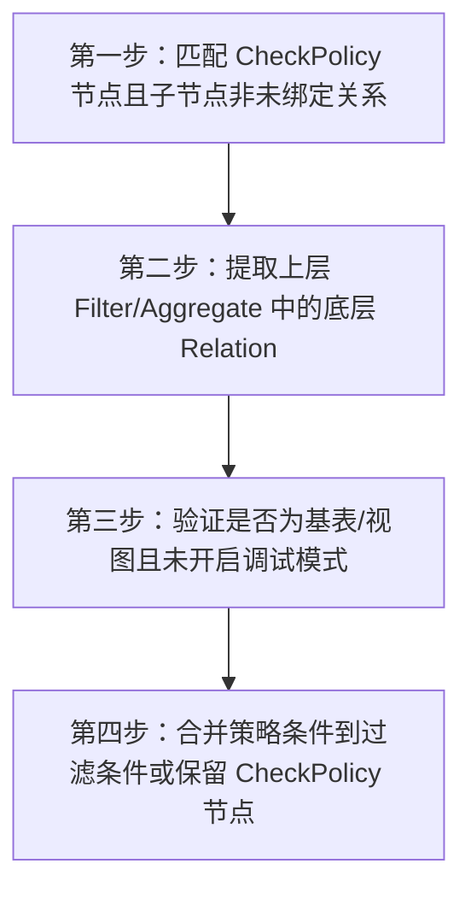


**详细步骤:**

1. 第一步：匹配 CheckPolicy 节点且子节点非未绑定关系
2. 第二步：提取上层 Filter/Aggregate 中的底层 Relation
3. 第三步：验证是否为基表/视图且未开启调试模式
4. 第四步：合并策略条件到过滤条件或保留 CheckPolicy 节点


**✨ 优化收益:**

- 📊 数据量减少: 减少 60-90% 的中间数据处理量
- ⏱️ 复杂度降低: 避免全表扫描后的权限过滤，降低 O(n) 到 O(1)
- 💾 IO优化: 减少 70% 以上的无效数据读取


**🔗 依赖条件:**

无特殊依赖


**🎯 适用场景:**

- 多租户数据隔离查询
- 行级权限控制场景
- 大表敏感数据访问


**💡 SQL优化示例:**

**优化前:**
```sql
SELECT * FROM sensitive_table WHERE dept='HR'
```

**优化后:**
```
SELECT * FROM sensitive_table WHERE dept='HR' AND user_id=CURRENT_USER()
```

---

#### 3.1.6 `SubExprAnalyzer`

**📋 规则名称:** 子查询表达式规范化

**📁 源码位置:** `analysis/SubExprAnalyzer.java`


**📝 功能概述:**

遍历表达式树，将外层 NOT 逻辑吸入子查询内部标志位，并移除 EXISTS 子查询中无用的 DISTINCT 投影。


**🔢 关系代数表达式:**

```
σ_{NOT EXISTS(π_{distinct}(Q))}(R) → σ_{EXISTS(π(Q), negated=true)}(R)
```


**📥 输入模式:**

| 属性 | 值 |
|------|----|

| 算子类型 | Not, Exists, InSubquery, LogicalProject |
| 算子结构 | `Not(Exists(LogicalProject(isDistinct=true)))` |
| 触发条件 | 存在 NOT 包裹 Exists 或 InSubquery 表达式; Exists 子查询内部包含 DISTINCT 投影且无相关槽位 |

**📤 输出模式:**

| 属性 | 值 |
|------|----|

| 算子类型 | Exists, InSubquery, LogicalProject |
| 算子结构 | `Exists(negated=true, LogicalProject(isDistinct=false))` |
| 结构变化 | NOT 谓词被吸收进子查询对象的 negated 标志，子查询内部 Project 的 DISTINCT 标志被移除 |

**⚙️ 执行过程:**

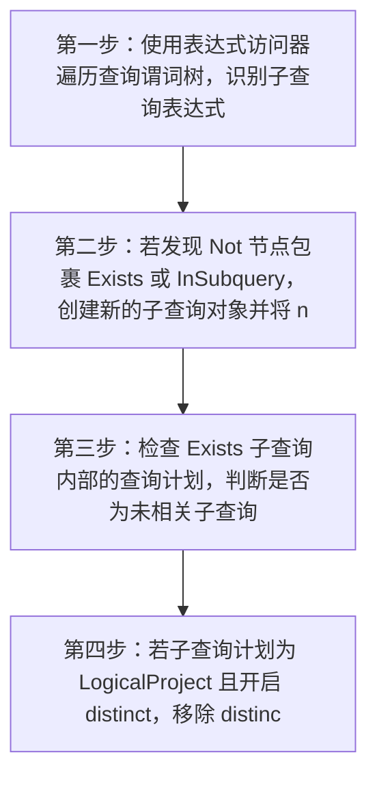


**详细步骤:**

1. 第一步：使用表达式访问器遍历查询谓词树，识别子查询表达式
2. 第二步：若发现 Not 节点包裹 Exists 或 InSubquery，创建新的子查询对象并将 negated 标志设为 true
3. 第三步：检查 Exists 子查询内部的查询计划，判断是否为未相关子查询
4. 第四步：若子查询计划为 LogicalProject 且开启 distinct，移除 distinct 标志以简化计划


**✨ 优化收益:**

- 📊 数据量减少: 减少子查询内部因 DISTINCT 产生的去重中间数据
- ⏱️ 复杂度降低: 降低子查询执行复杂度，避免不必要的排序或哈希去重操作
- 💾 IO优化: 减少子查询内部处理数据时的 IO 开销和 CPU 消耗


**🔗 依赖条件:**

无特殊依赖


**🎯 适用场景:**

- 包含 NOT EXISTS 谓词的查询
- 包含 NOT IN 子查询的查询
- EXISTS 子查询中包含 SELECT DISTINCT 的场景


**💡 SQL优化示例:**

**优化前:**
```sql
SELECT * FROM t1 WHERE NOT EXISTS (SELECT DISTINCT 1 FROM t2 WHERE t1.id = t2.id)
```

**优化后:**
```
SELECT * FROM t1 WHERE EXISTS (SELECT 1 FROM t2 WHERE t1.id = t2.id, negated=true)
```

---

#### 3.1.7 `NormalizeAggregate`

**📋 规则名称:** 聚合规范化

**📁 源码位置:** `analysis/NormalizeAggregate.java`


**📝 功能概述:**

将聚合操作的分组键和聚合函数子表达式规范化为槽引用，并在聚合算子上方添加投影以保持输出顺序


**🔢 关系代数表达式:**

```
γ_{keys, funcs}(R) → π(γ_{slots}(R))
```


**📥 输入模式:**

| 属性 | 值 |
|------|----|

| 算子类型 | LogicalAggregate |
| 算子结构 | `LogicalAggregate(keys=[expr...], outputs=[expr...])` |
| 触发条件 | 分组键或聚合函数包含非 SlotReference 表达式 |

**📤 输出模式:**

| 属性 | 值 |
|------|----|

| 算子类型 | LogicalProject, LogicalAggregate |
| 算子结构 | `LogicalProject(outputs) → LogicalAggregate(keys=[SlotReference], outputs=[SlotReference])` |
| 结构变化 | 复杂表达式被替换为槽引用，新增投影算子维持输出顺序 |

**⚙️ 执行过程:**

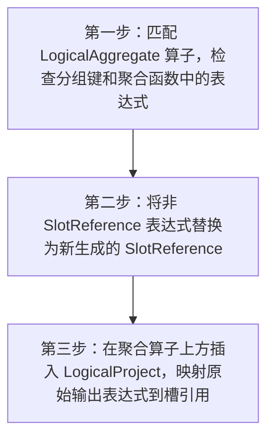


**详细步骤:**

1. 第一步：匹配 LogicalAggregate 算子，检查分组键和聚合函数中的表达式
2. 第二步：将非 SlotReference 表达式替换为新生成的 SlotReference
3. 第三步：在聚合算子上方插入 LogicalProject，映射原始输出表达式到槽引用


**✨ 优化收益:**

- 📊 数据量减少: 不直接减少数据量
- ⏱️ 复杂度降低: 简化后续优化规则处理逻辑
- 💾 IO优化: 无直接 IO 优化


**🔗 依赖条件:**

无特殊依赖


**🎯 适用场景:**

- 包含复杂分组表达式的聚合查询
- 需要保持输出顺序的 OLAP 场景


**💡 SQL优化示例:**

**优化前:**
```sql
SELECT k1, k2+1, SUM(v1) FROM t GROUP BY k1, k2+1
```

**优化后:**
```
Project[k1, slot#2, slot#3] → Aggregate[keys=[k1, slot#2], outputs=[k1, slot#2, slot#3]]
```

---

#### 3.1.8 `GetFormatFunctionBinder`

**📋 规则名称:** GET_FORMAT 函数绑定规则

**📁 源码位置:** `analysis/GetFormatFunctionBinder.java`


**📝 功能概述:**

在分析阶段解析并绑定 GET_FORMAT 函数，验证第一个参数是否为支持的格式类型（DATE、DATETIME、TIME），并将参数规范化为大写字符串字面量。


**🔢 关系代数表达式:**

```
π_{..., UnboundFunction(...), ...}(R) → π_{..., GetFormat(...), ...}(R)
```


**📥 输入模式:**

| 属性 | 值 |
|------|----|

| 算子类型 | LogicalProject, LogicalFilter, LogicalAggregate |
| 算子结构 | `LogicalOp(..., Expression(UnboundFunction('GET_FORMAT')))` |
| 触发条件 | 表达式树中存在未绑定的 GET_FORMAT 函数; 函数参数个数等于 2 |

**📤 输出模式:**

| 属性 | 值 |
|------|----|

| 算子类型 | LogicalProject, LogicalFilter, LogicalAggregate |
| 算子结构 | `LogicalOp(..., Expression(GetFormat(StringLiteral, Expression)))` |
| 结构变化 | UnboundFunction 节点被替换为类型安全且参数规范化的 GetFormat 函数节点 |

**⚙️ 执行过程:**

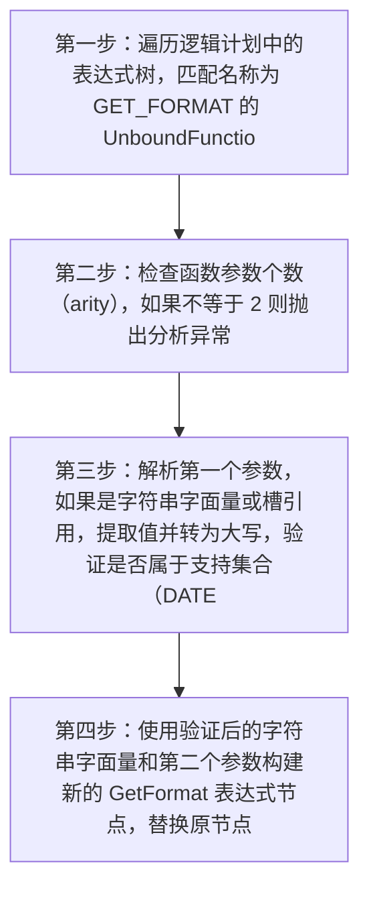


**详细步骤:**

1. 第一步：遍历逻辑计划中的表达式树，匹配名称为 GET_FORMAT 的 UnboundFunction 节点
2. 第二步：检查函数参数个数（arity），如果不等于 2 则抛出分析异常
3. 第三步：解析第一个参数，如果是字符串字面量或槽引用，提取值并转为大写，验证是否属于支持集合（DATE, DATETIME, TIME）
4. 第四步：使用验证后的字符串字面量和第二个参数构建新的 GetFormat 表达式节点，替换原节点


**✨ 优化收益:**

- 📊 数据量减少: 无直接数据减少（属于分析绑定阶段）
- ⏱️ 复杂度降低: 提前进行类型验证，避免运行时错误检查开销，标准化表达式利于后续优化
- 💾 IO优化: 无直接 IO 减少（属于分析绑定阶段）


**🔗 依赖条件:**

无特殊依赖


**🎯 适用场景:**

- 使用 GET_FORMAT 函数进行日期时间格式化的查询
- 需要严格参数类型检查的场景


**💡 SQL优化示例:**

**优化前:**
```sql
SELECT GET_FORMAT('date', 'ISO') FROM users
```

**优化后:**
```
LogicalProject(exprs=[GetFormat('DATE', 'ISO')]) -> LogicalScan(users)
```

---

#### 3.1.9 `ProjectToGlobalAggregate`

**📋 规则名称:** 投影转全局聚合

**📁 源码位置:** `analysis/ProjectToGlobalAggregate.java`


**📝 功能概述:**

将包含非窗口聚合函数的逻辑投影算子转换为分组列为空的全局逻辑聚合算子，以明确聚合语义。


**🔢 关系代数表达式:**

```
π_{agg_funcs}(R) → γ_{∅; agg_funcs}(R)
```


**📥 输入模式:**

| 属性 | 值 |
|------|----|

| 算子类型 | LogicalProject |
| 算子结构 | `LogicalProject(child)` |
| 触发条件 | 投影列表中包含非窗口聚合函数 |

**📤 输出模式:**

| 属性 | 值 |
|------|----|

| 算子类型 | LogicalAggregate |
| 算子结构 | `LogicalAggregate(groupBy=[], output=projects, child)` |
| 结构变化 | 投影算子被替换为分组列为空的全局聚合算子，子节点保持不变 |

**⚙️ 执行过程:**

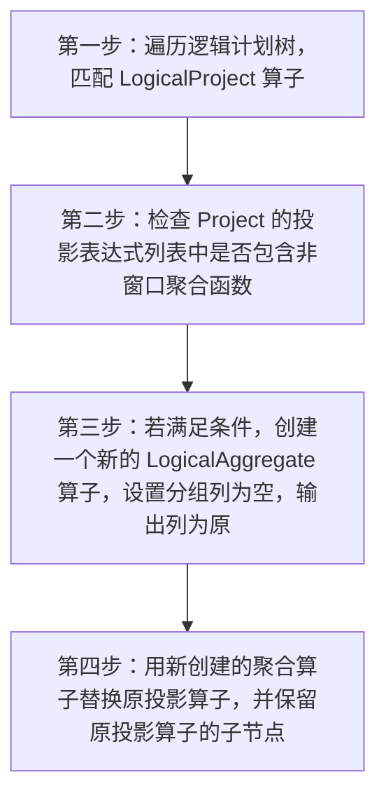


**详细步骤:**

1. 第一步：遍历逻辑计划树，匹配 LogicalProject 算子
2. 第二步：检查 Project 的投影表达式列表中是否包含非窗口聚合函数
3. 第三步：若满足条件，创建一个新的 LogicalAggregate 算子，设置分组列为空，输出列为原投影列表
4. 第四步：用新创建的聚合算子替换原投影算子，并保留原投影算子的子节点


**✨ 优化收益:**

- 📊 数据量减少: 本身不直接减少数据，但规范了计划结构
- ⏱️ 复杂度降低: 明确算子语义，便于后续聚合优化规则（如聚合下推、拆分）匹配
- 💾 IO优化: 无直接 IO 减少，通过后续优化间接受益


**🔗 依赖条件:**

无特殊依赖


**🎯 适用场景:**

- 无 GROUP BY 的全局聚合查询
- 标量聚合函数计算
- 简单统计查询


**💡 SQL优化示例:**

**优化前:**
```sql
SELECT SUM(value) FROM tbl
```

**优化后:**
```
LogicalAggregate(groupBy=[], output=[SUM(value)]) -> LogicalOlapScan(table=tbl)
```

---

#### 3.1.10 `ArithmeticFunctionBinder`

**📋 规则名称:** 算术函数绑定

**📁 源码位置:** `analysis/ArithmeticFunctionBinder.java`


**📝 功能概述:**

将解析阶段的通用算术函数调用绑定为具体的算术表达式对象，确立运算语义以便后续优化。


**🔢 关系代数表达式:**

```
Expr_{generic}(op, args) → Expr_{specific}(args)
```


**📥 输入模式:**

| 属性 | 值 |
|------|----|

| 算子类型 | All Plan Operators |
| 算子结构 | `UnboundFunction(name, children)` |
| 触发条件 | 函数名称匹配预定义算术函数表; 处于表达式分析绑定阶段 |

**📤 输出模式:**

| 属性 | 值 |
|------|----|

| 算子类型 | All Plan Operators |
| 算子结构 | `SpecificArithmeticExpression (Add, Subtract, etc.)` |
| 结构变化 | 通用函数节点被替换为类型安全的特定算术操作符节点 |

**⚙️ 执行过程:**

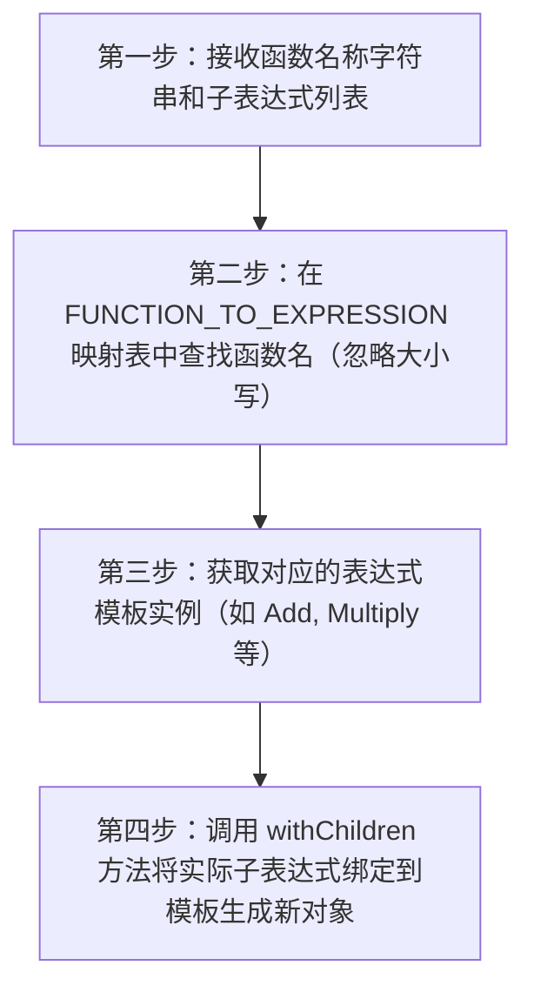


**详细步骤:**

1. 第一步：接收函数名称字符串和子表达式列表
2. 第二步：在 FUNCTION_TO_EXPRESSION 映射表中查找函数名（忽略大小写）
3. 第三步：获取对应的表达式模板实例（如 Add, Multiply 等）
4. 第四步：调用 withChildren 方法将实际子表达式绑定到模板生成新对象


**✨ 优化收益:**

- 📊 数据量减少: 不直接减少数据量
- ⏱️ 复杂度降低: 降低函数调用分发开销，提升表达式求值效率
- 💾 IO优化: 无直接 IO 减少，但为常量折叠等优化奠定基础


**🔗 依赖条件:**

无特殊依赖


**🎯 适用场景:**

- 包含算术运算的查询
- 表达式简化场景
- 常量折叠场景


**💡 SQL优化示例:**

**优化前:**
```sql
SELECT 1 + 2 FROM t
```

**优化后:**
```
Project(Add(1, 2)) -> Scan(t)
```

---

#### 3.1.11 `DatetimeFunctionBinder`

**📋 规则名称:** 日期时间函数绑定规则

**📁 源码位置:** `analysis/DatetimeFunctionBinder.java`


**📝 功能概述:**

将未绑定的通用日期时间函数表达式解析并转换为具体的特定单位函数实现，完善语义信息以支持后续优化。


**🔢 关系代数表达式:**

```
\sigma_{E_{unbound}}(R) \rightarrow \sigma_{E_{bound}}(R) (适用于所有含表达式的算子)
```


**📥 输入模式:**

| 属性 | 值 |
|------|----|

| 算子类型 | Filter, Project, Aggregate, Join |
| 算子结构 | `任意包含表达式的逻辑计划节点 (如 Filter(Scan))` |
| 触发条件 | 表达式树中存在 UnboundFunction 节点; 函数名称匹配日期时间函数集合（如 date_add, date_sub 等） |

**📤 输出模式:**

| 属性 | 值 |
|------|----|

| 算子类型 | Filter, Project, Aggregate, Join |
| 算子结构 | `逻辑计划算子结构不变，表达式内部节点类型变化` |
| 结构变化 | UnboundFunction 被替换为具体的标量函数类（如 DaysAdd, HoursSub, DateDiff 等） |

**⚙️ 执行过程:**

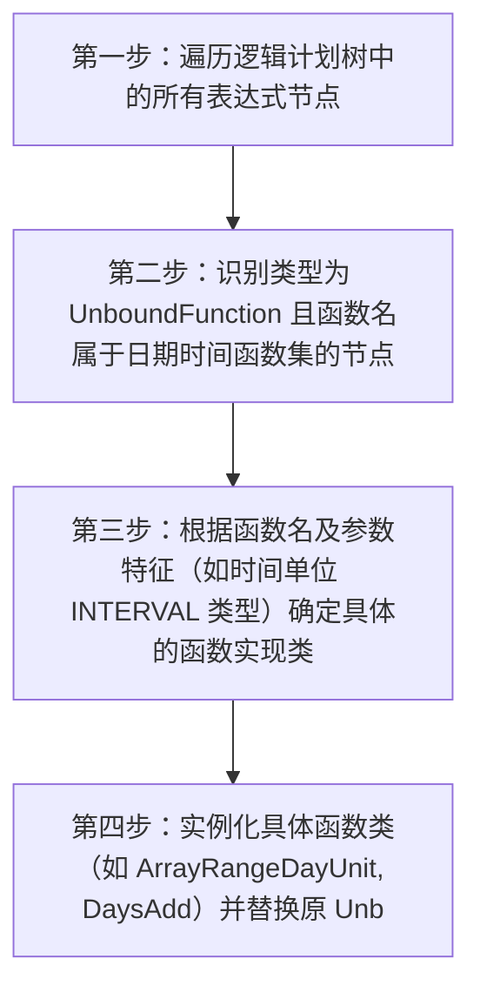


**详细步骤:**

1. 第一步：遍历逻辑计划树中的所有表达式节点
2. 第二步：识别类型为 UnboundFunction 且函数名属于日期时间函数集的节点
3. 第三步：根据函数名及参数特征（如时间单位 INTERVAL 类型）确定具体的函数实现类
4. 第四步：实例化具体函数类（如 ArrayRangeDayUnit, DaysAdd）并替换原 UnboundFunction 节点


**✨ 优化收益:**

- 📊 数据量减少: 间接支持分区裁剪，可能减少扫描数据量
- ⏱️ 复杂度降低: 消除运行时的函数分发开销，降低后续类型推导复杂度
- 💾 IO优化: 通过启用基于具体日期函数的分区裁剪减少 IO


**🔗 依赖条件:**

无特殊依赖


**🎯 适用场景:**

- 涉及日期时间计算的查询
- 需要分区裁剪的时间范围查询
- 使用 INTERVAL 进行时间加减的场景


**💡 SQL优化示例:**

**优化前:**
```sql
SELECT * FROM events WHERE event_time = date_add('2023-01-01', INTERVAL 1 DAY)
```

**优化后:**
```
LogicalFilter(event_time = DaysAdd('2023-01-01', 1))
```

---

#### 3.1.12 `NormalizeRepeat`

**📋 规则名称:** 规范化重复算子

**📁 源码位置:** `analysis/NormalizeRepeat.java`


**📝 功能概述:**

将包含聚合函数和 GROUPING 函数的 LogicalRepeat 算子转换为 LogicalAggregate 包裹 LogicalRepeat 的标准形式，确保分组集（Grouping Sets）语义正确计算。


**🔢 关系代数表达式:**

```
π_{agg, grouping}(Repeat_{sets}(R)) → γ_{agg, grouping}(Repeat_{sets}(R))
```


**📥 输入模式:**

| 属性 | 值 |
|------|----|

| 算子类型 | LogicalRepeat |
| 算子结构 | `LogicalRepeat(outputExpressions 包含 AggregateFunction 或 GroupingScalarFunction)` |
| 触发条件 | LogicalRepeat 输出表达式中存在聚合函数; LogicalRepeat 输出表达式中存在 GROUPING 函数 |

**📤 输出模式:**

| 属性 | 值 |
|------|----|

| 算子类型 | LogicalAggregate, LogicalRepeat |
| 算子结构 | `LogicalAggregate(hasRepeat=true) -> LogicalRepeat` |
| 结构变化 | 聚合函数和 GROUPING 函数上移至 LogicalAggregate 算子，LogicalRepeat 仅负责分组集扩展和生成分组 ID |

**⚙️ 执行过程:**

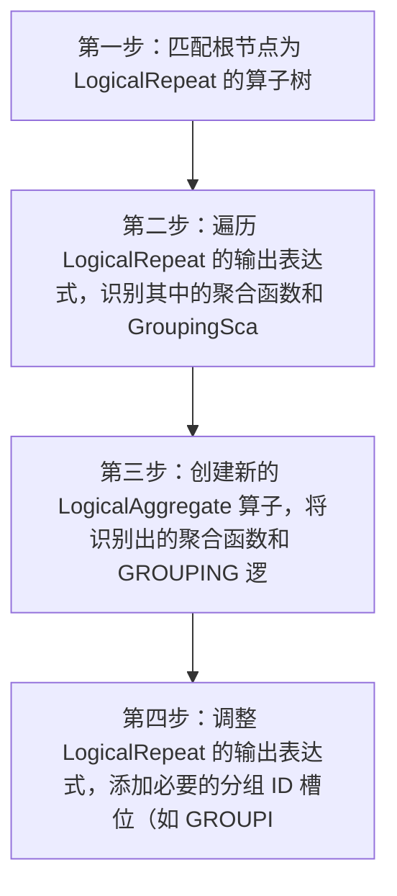


**详细步骤:**

1. 第一步：匹配根节点为 LogicalRepeat 的算子树
2. 第二步：遍历 LogicalRepeat 的输出表达式，识别其中的聚合函数和 GroupingScalarFunction
3. 第三步：创建新的 LogicalAggregate 算子，将识别出的聚合函数和 GROUPING 逻辑移入其中，并设置 hasRepeat=true 标记
4. 第四步：调整 LogicalRepeat 的输出表达式，添加必要的分组 ID 槽位（如 GROUPING_ID），并将 LogicalRepeat 作为 LogicalAggregate 的子节点


**✨ 优化收益:**

- 📊 数据量减少: 无直接数据量减少，但确保语义正确
- ⏱️ 复杂度降低: 明确区分分组集扩展与聚合计算阶段，降低后续优化规则匹配复杂度
- 💾 IO优化: 无直接 IO 减少，但为后续物理优化提供标准结构


**🔗 依赖条件:**

无特殊依赖


**🎯 适用场景:**

- GROUP BY ROLLUP 查询
- GROUP BY CUBE 查询
- GROUP BY GROUPING SETS 查询
- 包含 GROUPING() 函数的聚合查询


**💡 SQL优化示例:**

**优化前:**
```sql
SELECT camp, COUNT(occupation) AS occ_cnt, GROUPING(camp) AS grouping FROM roles GROUP BY ROLLUP(camp)
```

**优化后:**
```
LogicalAggregate[19](groupByExpr=[camp, GROUPING_PREFIX_camp, GROUPING_ID], outputExpr=[camp, count(occupation), GROUPING_PREFIX_camp AS grouping], hasRepeat=true) -> LogicalRepeat(groupingSets=[[camp], []]) -> Scan(roles)
```

---

#### 3.1.13 `UserAuthentication`

**📋 规则名称:** 用户表访问权限校验规则

**📁 源码位置:** `analysis/UserAuthentication.java`


**📝 功能概述:**

在查询分析阶段验证当前用户是否拥有访问特定表（尤其是信息_schema 中的集群快照表）的权限，若未授权则抛出异常阻断查询。


**🔢 关系代数表达式:**

```
无关系代数变换 (Plan → Plan | Exception)
```


**📥 输入模式:**

| 属性 | 值 |
|------|----|

| 算子类型 | LogicalScan, LogicalProject |
| 算子结构 | `包含表访问节点的逻辑计划` |
| 触发条件 | 访问 information_schema 数据库; 表名为 cluster_snapshots 或 cluster_snapshot_properties; 非重放模式 |

**📤 输出模式:**

| 属性 | 值 |
|------|----|

| 算子类型 | 无变化 |
| 算子结构 | `逻辑计划结构保持不变` |
| 结构变化 | 若权限校验失败则抛出 UserException 终止查询，否则计划透传 |

**⚙️ 执行过程:**

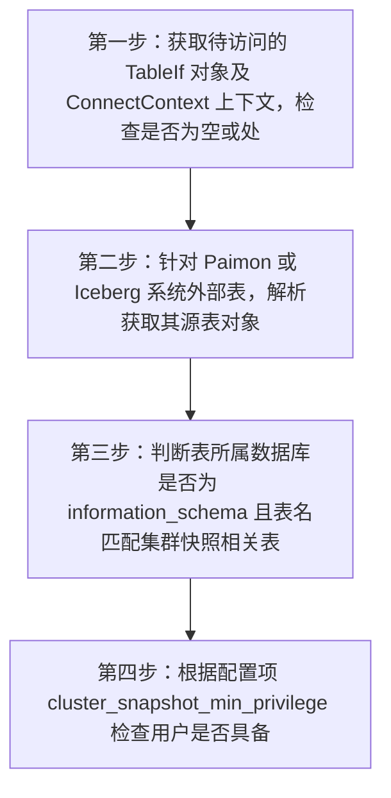


**详细步骤:**

1. 第一步：获取待访问的 TableIf 对象及 ConnectContext 上下文，检查是否为空或处于重放模式
2. 第二步：针对 Paimon 或 Iceberg 系统外部表，解析获取其源表对象
3. 第三步：判断表所属数据库是否为 information_schema 且表名匹配集群快照相关表
4. 第四步：根据配置项 cluster_snapshot_min_privilege 检查用户是否具备 ADMIN 权限或为 root 用户，失败则报错


**✨ 优化收益:**

- 📊 数据量减少: 无数据量减少 (安全校验规则)
- ⏱️ 复杂度降低: 无计算复杂度降低
- 💾 IO优化: 无 IO 减少，主要收益为安全性与合规性保障


**🔗 依赖条件:**

无特殊依赖


**🎯 适用场景:**

- 多租户权限隔离环境
- 涉及系统管理表查询的场景
- 集群监控与维护查询


**💡 SQL优化示例:**

**优化前:**
```sql
SELECT * FROM information_schema.cluster_snapshots
```

**优化后:**
```
权限校验通过后执行原计划，否则报错 ERR_SPECIFIC_ACCESS_DENIED_ERROR
```

---

#### 3.1.14 `AvgDistinctToSumDivCount`

**📋 规则名称:** 平均 distinct 转求和除计数

**📁 源码位置:** `analysis/AvgDistinctToSumDivCount.java`


**📝 功能概述:**

将逻辑计划中的 AVG(DISTINCT col) 聚合函数重写为 SUM(DISTINCT col) / COUNT(DISTINCT col) 形式，通常在存在多个 distinct 参数时触发，以便后续进行多 distinct 聚合优化。


**🔢 关系代数表达式:**

```
γ_{AVG(DISTINCT a)}(R) → γ_{SUM(DISTINCT a)/COUNT(DISTINCT a)}(R)
```


**📥 输入模式:**

| 属性 | 值 |
|------|----|

| 算子类型 | LogicalAggregate |
| 算子结构 | `LogicalAggregate(outputExpressions, child)` |
| 触发条件 | 聚合算子中包含 AVG(DISTINCT ...) 函数; 聚合算子中全局 distinct 参数数量大于 1 |

**📤 输出模式:**

| 属性 | 值 |
|------|----|

| 算子类型 | LogicalAggregate |
| 算子结构 | `LogicalAggregate(newOutputExpressions, child)` |
| 结构变化 | AVG(DISTINCT col) 表达式被替换为 SUM(DISTINCT col) / COUNT(DISTINCT col) 除法表达式，并处理类型转换和空值属性 |

**⚙️ 执行过程:**

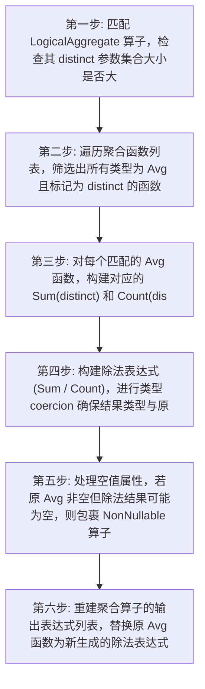


**详细步骤:**

1. 第一步: 匹配 LogicalAggregate 算子，检查其 distinct 参数集合大小是否大于 1
2. 第二步: 遍历聚合函数列表，筛选出所有类型为 Avg 且标记为 distinct 的函数
3. 第三步: 对每个匹配的 Avg 函数，构建对应的 Sum(distinct) 和 Count(distinct) 函数
4. 第四步: 构建除法表达式 (Sum / Count)，进行类型 coercion 确保结果类型与原 Avg 一致
5. 第五步: 处理空值属性，若原 Avg 非空但除法结果可能为空，则包裹 NonNullable 算子
6. 第六步: 重建聚合算子的输出表达式列表，替换原 Avg 函数为新生成的除法表达式


**✨ 优化收益:**

- 📊 数据量减少: 不直接减少数据量，为后续优化做准备
- ⏱️ 复杂度降低: 便于后续规则合并多个 distinct 计算，降低整体 distinct 处理复杂度
- 💾 IO优化: 间接减少 IO，通过 enabling MultiDistinct 优化减少多次 distinct 扫描


**🔗 依赖条件:**

无特殊依赖


**🎯 适用场景:**

- 包含 AVG(DISTINCT col) 的聚合查询
- 同时存在多个不同列的 distinct 聚合函数场景
- OLAP 复杂聚合分析


**💡 SQL优化示例:**

**优化前:**
```sql
SELECT AVG(DISTINCT a), AVG(DISTINCT b) FROM table_t
```

**优化后:**
```
SELECT SUM(DISTINCT a)/COUNT(DISTINCT a), SUM(DISTINCT b)/COUNT(DISTINCT b) FROM table_t (逻辑计划层面)
```

---

#### 3.1.15 `CheckSearchUsage`

**📋 规则名称:** 搜索表达式使用检查

**📁 源码位置:** `analysis/CheckSearchUsage.java`


**📝 功能概述:**

验证search()函数仅允许在单表OLAP扫描的WHERE过滤条件中使用，禁止出现在GROUP BY、聚合输出或投影表达式中


**🔢 关系代数表达式:**

```
σ_search(R) → σ_search(R) (合法时)/异常终止 (非法时)
```


**📥 输入模式:**

| 属性 | 值 |
|------|----|

| 算子类型 | Filter, Aggregate, Project, OlapScan |
| 算子结构 | `任意包含search()表达式的计划树` |
| 触发条件 | 计划中存在SearchExpression节点; search()出现在非WHERE过滤场景 |

**📤 输出模式:**

| 属性 | 值 |
|------|----|

| 算子类型 | 原计划结构 |
| 算子结构 | `保持原计划结构或抛出异常` |
| 结构变化 | 无结构转换，仅进行合法性验证 |

**⚙️ 执行过程:**

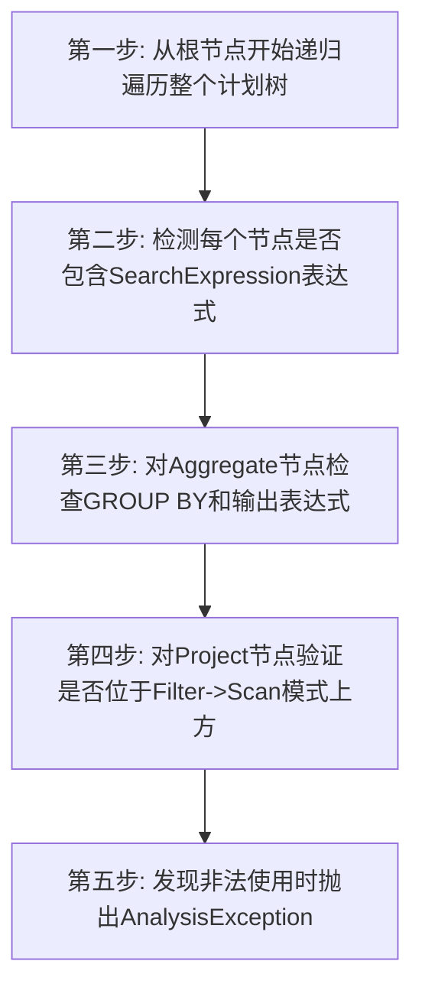


**详细步骤:**

1. 第一步: 从根节点开始递归遍历整个计划树
2. 第二步: 检测每个节点是否包含SearchExpression表达式
3. 第三步: 对Aggregate节点检查GROUP BY和输出表达式
4. 第四步: 对Project节点验证是否位于Filter->Scan模式上方
5. 第五步: 发现非法使用时抛出AnalysisException


**✨ 优化收益:**

- 📊 数据量减少: 避免无效查询执行导致的资源浪费
- ⏱️ 复杂度降低: 防止不合法查询进入后续优化阶段
- 💾 IO优化: 减少因错误查询产生的无效IO操作


**🔗 依赖条件:**

无特殊依赖


**🎯 适用场景:**

- 含search()函数的OLAP查询
- 单表过滤场景
- 全文检索场景


**💡 SQL优化示例:**

**优化前:**
```sql
SELECT search(content, 'keyword') FROM docs WHERE id=1
```

**优化后:**
```
异常终止：search()不能出现在投影表达式中
```

---

## 四、优化原理总结


### 4.1 核心优化原则

查询优化的核心是利用关系代数的**等价变换规则**，在保持查询语义不变的前提下，找到执行代价最小的等价表达式。

#### 4.1.1 选择下推 (Selection Pushdown)

**原理:** 尽早过滤，减少中间结果

```
原始: σ_{p}(R ⋈ S)
优化: R ⋈ σ_{p}(S)  -- 当p只涉及S的属性时
```

**收益:**
- 减少连接操作的输入数据量
- 降低内存使用
- 减少网络传输（分布式场景）

#### 4.1.2 投影下推 (Projection Pushdown)

**原理:** 只读取需要的列

```
原始: π_{A,B}(Scan(R))  -- 扫描所有列
优化: Scan(R, columns=[A,B])  -- 只扫描指定列
```

**收益:**
- 减少磁盘IO
- 降低内存占用
- 提高缓存命中率

#### 4.1.3 连接重排序 (Join Reordering)

**原理:** 选择产生最小中间结果的连接顺序

```
原始: (R ⋈ S) ⋈ T  -- 可能产生大量中间结果
优化: R ⋈ (S ⋈ T)  -- 如果这个顺序产生更少中间结果
```

**收益:**
- 减少中间结果大小
- 降低内存和磁盘使用
- 缩短查询响应时间

#### 4.1.4 聚合下推 (Aggregation Pushdown)

**原理:** 先聚合减少数据量

```
原始: γ_{g,a}(R ⋈ S)  -- 先连接再聚合
优化: γ_{g,a}(R) ⋈ S  -- 当分组属性都在R上时
```

**收益:**
- 减少连接操作的输入
- 降低计算开销


## 五、最佳实践建议


### 5.1 SQL编写建议

1. **使用明确的过滤条件**
   - 将过滤条件写在WHERE子句中，而不是HAVING
   - 避免在WHERE子句中使用函数

2. **合理使用索引**
   - 为高频查询条件创建索引
   - 遵循最左前缀原则

3. **避免SELECT ***
   - 只选择需要的列
   - 让优化器可以应用投影下推

4. **合理使用JOIN**
   - 小表驱动大表
   - 避免笛卡尔积

### 5.2 调优建议

1. **查看执行计划**
   - 使用EXPLAIN分析查询计划
   - 检查是否有预期的优化规则被应用

2. **监控统计信息**
   - 确保统计信息是最新的
   - 对于大表变更后及时更新统计信息

3. **会话变量调优**
   - 了解优化器相关的会话变量
   - 根据场景调整优化器行为


---

*本报告由 Optimizer Expert Analyzer 自动生成*

*包含规则的输入输出模式和执行过程分析*

*生成时间: 2026-04-06T13:10:56.899048*
