# StarRocks 优化规则深度分析报告

> **生成时间:** 2026-04-06 12:41:41

> **引擎类型:** columnar_olap

> **优化器风格:** cascades

> **分析规则数:** 15


## 📑 目录

- [一、规则概览](#一规则概览)
- [二、关系代数符号说明](#二关系代数符号说明)
- [三、规则详细分析](#三规则详细分析)
  - [转换规则 (Transformation)](#三1-转换规则-(Transformation))
- [四、优化原理总结](#四优化原理总结)
- [五、最佳实践建议](#五最佳实践建议)

## 一、规则概览

### 1.1 规则分类统计

| 规则类别 | 数量 |
|----------|------|

| 转换规则 (Transformation) | 15 |
| **总计** | **15** |

### 1.2 分析完成度

- 成功深度分析: 15/15 (100.0%)

## 二、关系代数符号说明


| 符号 | 名称 | 含义 | 示例 |
|------|------|------|------|
| σ | Sigma (选择) | 筛选满足条件的行 | `σ_{age>18}(Student)` |
| π | Pi (投影) | 选择特定列 | `π_{name,age}(Student)` |
| ⋈ | Theta Join | 条件连接 | `R ⋈_{R.id=S.id} S` |
| × | Cartesian | 笛卡尔积 | `R × S` |
| γ | Gamma (聚合) | 分组聚合 | `γ_{dept, AVG(salary)}(Employee)` |
| τ | Tau (排序) | 排序 | `τ_{salary DESC}(Employee)` |
| ∪ | Union | 并集 | `R ∪ S` |
| ∩ | Intersect | 交集 | `R ∩ S` |
| − | Difference | 差集 | `R − S` |
| → | Transform | 转换为 | `A → B` |
| ρ | Rho (重命名) | 重命名 | `ρ_{S}(R)` |

### 2.1 常用优化等价式

```
1. 选择下推: σ_{p}(R ⋈ S) ≡ R ⋈ σ_{p}(S)  (当p只涉及S的属性)
2. 投影下推: π_{A}(σ_{p}(R)) ≡ π_{A}(R)  (当A包含p的所有属性)
3. 选择合并: σ_{p1}(σ_{p2}(R)) ≡ σ_{p1∧p2}(R)
4. 投影合并: π_{A}(π_{B}(R)) ≡ π_{A∩B}(R)
5. 连接交换: R ⋈ S ≡ S ⋈ R  (对于内连接)
6. 连接结合: (R ⋈ S) ⋈ T ≡ R ⋈ (S ⋈ T)
```


## 三、规则详细分析


### 3.1 转换规则 (Transformation)

> 共 15 条规则


#### 3.1.1 `PushDownLimitCTEAnchor`

**📋 规则名称:** 下推 Limit 到 CTE 锚点

**📁 源码位置:** `transformation/PushDownLimitCTEAnchor.java`


**📝 功能概述:**

将 Limit 算子下推到 CTE Anchor 的右侧子节点，减少中间数据处理量


**🔢 关系代数表达式:**

```
τ_{limit}(CTEAnchor(R, S)) → CTEAnchor(R, τ_{limit}(S))
```


**📥 输入模式:**

| 属性 | 值 |
|------|----|

| 算子类型 | LogicalLimit, LogicalCTEAnchor |
| 算子结构 | `Limit(CTEAnchor(Leaf1, Leaf2))` |
| 触发条件 | Limit 算子直接作用于 CTE Anchor; CTE Anchor 包含多个子节点 |

**📤 输出模式:**

| 属性 | 值 |
|------|----|

| 算子类型 | LogicalCTEAnchor, LogicalLimit |
| 算子结构 | `CTEAnchor(Leaf1, Limit(Leaf2))` |
| 结构变化 | Limit 算子从 CTE Anchor 外部移动到其第二个子节点内部 |

**⚙️ 执行过程:**

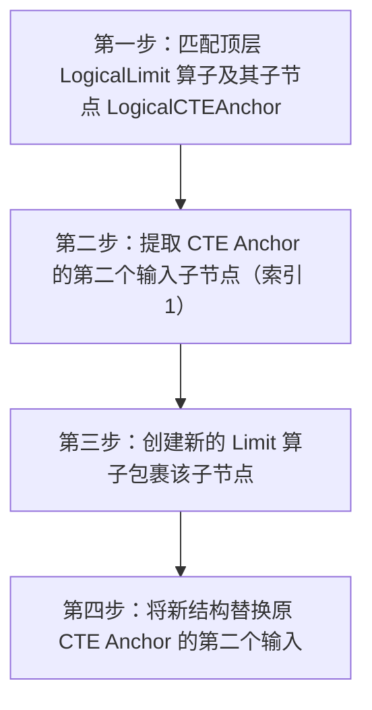


**详细步骤:**

1. 第一步：匹配顶层 LogicalLimit 算子及其子节点 LogicalCTEAnchor
2. 第二步：提取 CTE Anchor 的第二个输入子节点（索引 1）
3. 第三步：创建新的 Limit 算子包裹该子节点
4. 第四步：将新结构替换原 CTE Anchor 的第二个输入


**✨ 优化收益:**

- 📊 数据量减少: 减少 CTE 右侧分支的中间结果集大小
- ⏱️ 复杂度降低: 降低后续算子的处理数据量
- 💾 IO优化: 减少网络传输和内存占用


**🔗 依赖条件:**

无特殊依赖


**🎯 适用场景:**

- CTE 查询优化
- 分页查询
- Top-N 查询


**💡 SQL优化示例:**

**优化前:**
```sql
WITH cte AS (SELECT * FROM t1 UNION ALL SELECT * FROM t2) SELECT * FROM cte LIMIT 10
```

**优化后:**
```
CTEAnchor(Scan(t1), Limit(Scan(t2), limit=10))
```

---

#### 3.1.2 `MultiDistinctByMultiFuncRewriter`

**📋 规则名称:** 多Distinct聚合函数重写规则

**📁 源码位置:** `transformation/MultiDistinctByMultiFuncRewriter.java`


**📝 功能概述:**

识别聚合算子中的多个 DISTINCT 聚合函数（如 COUNT DISTINCT, SUM DISTINCT），将其重写为内部优化形式，为后续的多列去重优化（如聚合拆分）做准备。


**🔢 关系代数表达式:**

```
γ_{F}(R) → γ_{F'}(R)
```


**📥 输入模式:**

| 属性 | 值 |
|------|----|

| 算子类型 | LogicalAggregation |
| 算子结构 | `LogicalAggregation(child)` |
| 触发条件 | 聚合算子中包含至少一个 DISTINCT 聚合函数; 函数类型为 COUNT, SUM 或 ARRAY_AGG |

**📤 输出模式:**

| 属性 | 值 |
|------|----|

| 算子类型 | LogicalAggregation |
| 算子结构 | `LogicalAggregation(child)` |
| 结构变化 | 聚合函数表达式被替换为优化后的版本（如标记为多Distinct兼容或类型标准化） |

**⚙️ 执行过程:**

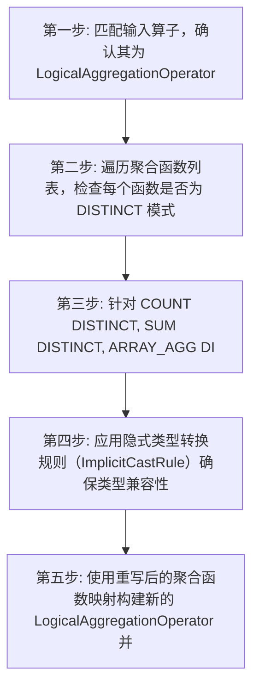


**详细步骤:**

1. 第一步: 匹配输入算子，确认其为 LogicalAggregationOperator
2. 第二步: 遍历聚合函数列表，检查每个函数是否为 DISTINCT 模式
3. 第三步: 针对 COUNT DISTINCT, SUM DISTINCT, ARRAY_AGG DISTINCT 调用对应的构建方法（如 buildMultiCountDistinct）进行重写
4. 第四步: 应用隐式类型转换规则（ImplicitCastRule）确保类型兼容性
5. 第五步: 使用重写后的聚合函数映射构建新的 LogicalAggregationOperator 并返回


**✨ 优化收益:**

- 📊 数据量减少: 减少 Shuffle 阶段的数据量，避免多列 DISTINCT 导致的键组合爆炸
- ⏱️ 复杂度降低: 降低聚合计算复杂度，为后续聚合拆分规则创造条件
- 💾 IO优化: 减少网络传输开销和中间结果内存消耗


**🔗 依赖条件:**

无特殊依赖


**🎯 适用场景:**

- OLAP 分析查询
- 包含多个不同列的 COUNT DISTINCT 查询
- 大数据量去重统计场景


**💡 SQL优化示例:**

**优化前:**
```sql
SELECT COUNT(DISTINCT user_id), COUNT(DISTINCT item_id) FROM logs GROUP BY date
```

**优化后:**
```
LogicalAggregation([multi_distinct_count(user_id), multi_distinct_count(item_id)], group_by=[date])
```

---

#### 3.1.3 `PruneValuesColumnsRule`

**📋 规则名称:** Values 算子列裁剪规则

**📁 源码位置:** `transformation/PruneValuesColumnsRule.java`


**📝 功能概述:**

该规则用于裁剪 LogicalValues 算子中未被上层查询引用的列，仅保留必要列以减少数据传输和处理开销。


**🔢 关系代数表达式:**

```
π_{required}(VALUES(Rows)) → VALUES(Rows[required])
```


**📥 输入模式:**

| 属性 | 值 |
|------|----|

| 算子类型 | LogicalValues |
| 算子结构 | `LogicalValues` |
| 触发条件 | 上层算子只需要 Values 算子输出列的子集 |

**📤 输出模式:**

| 属性 | 值 |
|------|----|

| 算子类型 | LogicalValues |
| 算子结构 | `LogicalValues (裁剪后)` |
| 结构变化 | Values 算子输出的列数减少，仅保留必要列，行数据对应裁剪 |

**⚙️ 执行过程:**

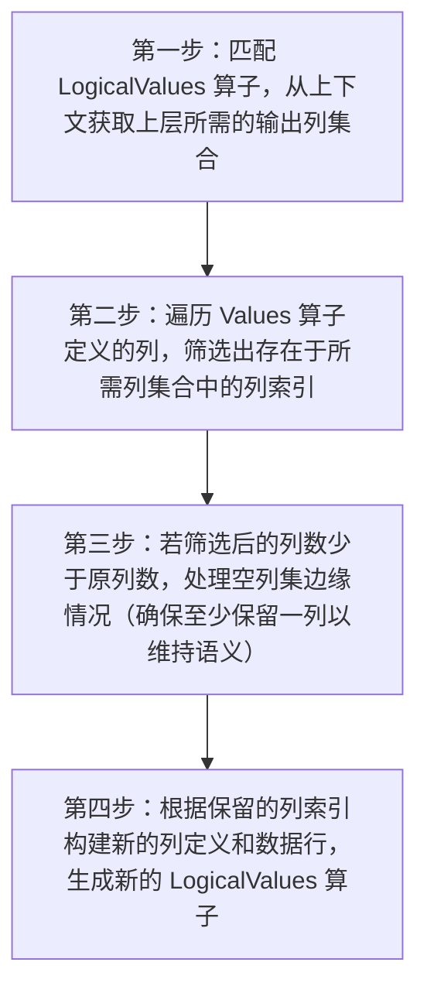


**详细步骤:**

1. 第一步：匹配 LogicalValues 算子，从上下文获取上层所需的输出列集合
2. 第二步：遍历 Values 算子定义的列，筛选出存在于所需列集合中的列索引
3. 第三步：若筛选后的列数少于原列数，处理空列集边缘情况（确保至少保留一列以维持语义）
4. 第四步：根据保留的列索引构建新的列定义和数据行，生成新的 LogicalValues 算子


**✨ 优化收益:**

- 📊 数据量减少: 减少 Values 算子输出到上层算子的数据列数
- ⏱️ 复杂度降低: 降低后续算子处理无关列的计算和内存开销
- 💾 IO优化: 减少内存中数据行的宽度，降低带宽消耗


**🔗 依赖条件:**

需要: 物理属性


**🎯 适用场景:**

- 包含 VALUES 子句的查询
- 子查询中包含常量列表
- CTE 中包含常量数据且仅引用部分列


**💡 SQL优化示例:**

**优化前:**
```sql
SELECT a FROM (SELECT 1 AS a, 2 AS b) AS t
```

**优化后:**
```
LogicalValues(columns=[a], rows=[(1)])
```

---

#### 3.1.4 `ConvertToEqualForNullRule`

**📋 规则名称:** 空值等值转换规则

**📁 源码位置:** `transformation/ConvertToEqualForNullRule.java`


**📝 功能概述:**

将连接条件中涉及 NULL 的 OR 谓词转换为等值比较形式，优化连接条件处理逻辑


**🔢 关系代数表达式:**

```
⋈_(p OR q IS NULL)(R, S) → ⋈_(p OR q = NULL)(R, S)
```


**📥 输入模式:**

| 属性 | 值 |
|------|----|

| 算子类型 | LogicalJoin |
| 算子结构 | `LogicalJoin(Leaf, Leaf)` |
| 触发条件 | 存在 ON 连接谓词; 谓词包含 OR 连接的复合条件 |

**📤 输出模式:**

| 属性 | 值 |
|------|----|

| 算子类型 | LogicalJoin |
| 算子结构 | `LogicalJoin(Leaf, Leaf)` |
| 结构变化 | ON 谓词中的 NULL 检查被转换为等值比较形式 |

**⚙️ 执行过程:**

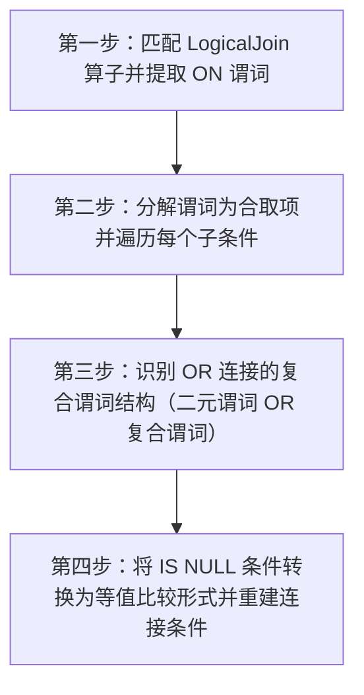


**详细步骤:**

1. 第一步：匹配 LogicalJoin 算子并提取 ON 谓词
2. 第二步：分解谓词为合取项并遍历每个子条件
3. 第三步：识别 OR 连接的复合谓词结构（二元谓词 OR 复合谓词）
4. 第四步：将 IS NULL 条件转换为等值比较形式并重建连接条件


**✨ 优化收益:**

- 📊 数据量减少: 减少连接时的条件判断开销
- ⏱️ 复杂度降低: 简化谓词评估逻辑，降低 CPU 计算复杂度
- 💾 IO优化: 无直接 IO 优化，但可能间接减少中间结果集


**🔗 依赖条件:**

无特殊依赖


**🎯 适用场景:**

- 外连接优化
- 含 NULL 值的连接条件
- 复杂谓词简化


**💡 SQL优化示例:**

**优化前:**
```sql
SELECT * FROM t1 JOIN t2 ON t1.id = t2.id OR t2.id IS NULL
```

**优化后:**
```
SELECT * FROM t1 JOIN t2 ON t1.id = t2.id OR t2.id = NULL
```

---

#### 3.1.5 `PushDownPredicateAggRule`

**📋 规则名称:** 聚合前谓词下推规则

**📁 源码位置:** `transformation/PushDownPredicateAggRule.java`


**📝 功能概述:**

将仅依赖分组列的过滤谓词下推到聚合算子下方执行，提前减少输入数据量。


**🔢 关系代数表达式:**

```
σ_P(γ_G(R)) → γ_G(σ_P_push(R)) (其中 P_push 的列 ⊆ G，剩余谓词保留在聚合算子中)
```


**📥 输入模式:**

| 属性 | 值 |
|------|----|

| 算子类型 | LogicalFilter, LogicalAggregation |
| 算子结构 | `LogicalFilter(LogicalAggregation(Child))` |
| 触发条件 | 顶层为 Filter 算子; 子节点为 Aggregation 算子; Filter 谓词中存在仅引用分组列的部分 |

**📤 输出模式:**

| 属性 | 值 |
|------|----|

| 算子类型 | LogicalAggregation, LogicalFilter |
| 算子结构 | `LogicalAggregation(LogicalFilter(Child))` |
| 结构变化 | 部分谓词下推至 Aggregation 下方形成新 Filter，剩余谓词合并入 Aggregation 谓词 |

**⚙️ 执行过程:**

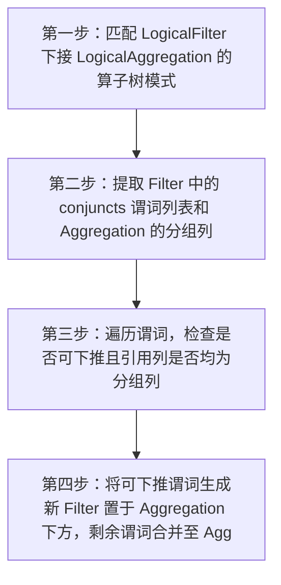


**详细步骤:**

1. 第一步：匹配 LogicalFilter 下接 LogicalAggregation 的算子树模式
2. 第二步：提取 Filter 中的 conjuncts 谓词列表和 Aggregation 的分组列
3. 第三步：遍历谓词，检查是否可下推且引用列是否均为分组列
4. 第四步：将可下推谓词生成新 Filter 置于 Aggregation 下方，剩余谓词合并至 Aggregation 内部


**✨ 优化收益:**

- 📊 数据量减少: 显著减少进入聚合算子的行数
- ⏱️ 复杂度降低: 降低聚合阶段的哈希表构建或排序开销
- 💾 IO优化: 若下推至存储层，可减少磁盘读取量


**🔗 依赖条件:**

无特殊依赖


**🎯 适用场景:**

- GROUP BY 查询
- 过滤条件包含分组列
- 大表聚合场景


**💡 SQL优化示例:**

**优化前:**
```sql
SELECT k, count(*) FROM t WHERE k > 10 GROUP BY k
```

**优化后:**
```
Aggregate(k, count) -> Filter(k > 10) -> Scan(t)
```

---

#### 3.1.6 `PushDownPredicateSetRule`

**📋 规则名称:** 集合算子谓词下推规则

**📁 源码位置:** `transformation/PushDownPredicateSetRule.java`


**📝 功能概述:**

将位于集合算子（如 UNION）上方的过滤谓词下推到集合算子的各个子分支中，以便在数据合并前尽早过滤减少数据量。


**🔢 关系代数表达式:**

```
σ_p(Set(R₁, R₂, ...)) → Set(σ_p'(R₁), σ_p'(R₂), ...)
```


**📥 输入模式:**

| 属性 | 值 |
|------|----|

| 算子类型 | LogicalFilter, LogicalSetOperator |
| 算子结构 | `Filter(Set(Child1, Child2, ...))` |
| 触发条件 | Filter 算子直接位于 Set 算子之上; 谓词列可以通过列映射关系转换到子分支 |

**📤 输出模式:**

| 属性 | 值 |
|------|----|

| 算子类型 | LogicalSetOperator, LogicalFilter |
| 算子结构 | `Set(Filter(Child1), Filter(Child2), ...)` |
| 结构变化 | 原 Filter 算子被消除，在 Set 算子的每个输入分支前插入新的 Filter 算子 |

**⚙️ 执行过程:**

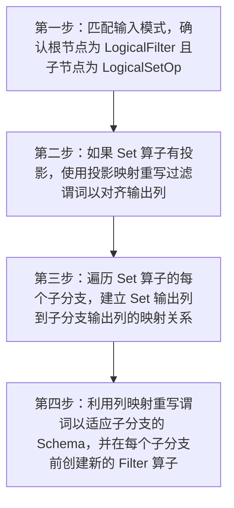


**详细步骤:**

1. 第一步：匹配输入模式，确认根节点为 LogicalFilter 且子节点为 LogicalSetOperator
2. 第二步：如果 Set 算子有投影，使用投影映射重写过滤谓词以对齐输出列
3. 第三步：遍历 Set 算子的每个子分支，建立 Set 输出列到子分支输出列的映射关系
4. 第四步：利用列映射重写谓词以适应子分支的 Schema，并在每个子分支前创建新的 Filter 算子


**✨ 优化收益:**

- 📊 数据量减少: 减少参与集合操作的数据量，降低网络传输和内存消耗
- ⏱️ 复杂度降低: 避免全量数据合并后再过滤，降低后续算子的处理复杂度
- 💾 IO优化: 若子分支为扫描算子，可能进一步下推从而减少磁盘 IO


**🔗 依赖条件:**

无特殊依赖


**🎯 适用场景:**

- UNION ALL 查询带外部过滤条件
- 包含集合操作的子查询
- 多表数据合并后筛选的场景


**💡 SQL优化示例:**

**优化前:**
```sql
SELECT * FROM (SELECT k FROM t1 UNION ALL SELECT k FROM t2) AS sub WHERE k > 10
```

**优化后:**
```
SELECT * FROM (SELECT k FROM t1 WHERE k > 10 UNION ALL SELECT k FROM t2 WHERE k > 10) AS sub
```

---

#### 3.1.7 `PushDownApplyLeftRule`

**📋 规则名称:** Apply 左子树下推规则

**📁 源码位置:** `transformation/PushDownApplyLeftRule.java`


**📝 功能概述:**

将 Apply 算子下推到其左子节点（如 Join 或 Filter）的内部，使 Apply 仅作用于包含相关列的子分支，缩小计算作用域。


**🔢 关系代数表达式:**

```
⋈_apply(⋈(A, B), S) → ⋈(A, ⋈_apply(B, S))
```


**📥 输入模式:**

| 属性 | 值 |
|------|----|

| 算子类型 | LogicalApply, LogicalJoin, LogicalFilter |
| 算子结构 | `Apply(Join/Filter/Apply, Subquery)` |
| 触发条件 | 根节点为 LogicalApply 且代表标量子查询; 左子节点为 Join、Filter 或 Apply 且在白名单内; Apply 算子存在外部引用列（outerColumns） |

**📤 输出模式:**

| 属性 | 值 |
|------|----|

| 算子类型 | LogicalJoin, LogicalFilter, LogicalApply |
| 算子结构 | `Join/Filter/Apply(Child_No_Corr, Apply(Child_With_Corr, Subquery))` |
| 结构变化 | Apply 算子位置下移，仅包裹包含相关列的子分支，另一分支独立执行 |

**⚙️ 执行过程:**

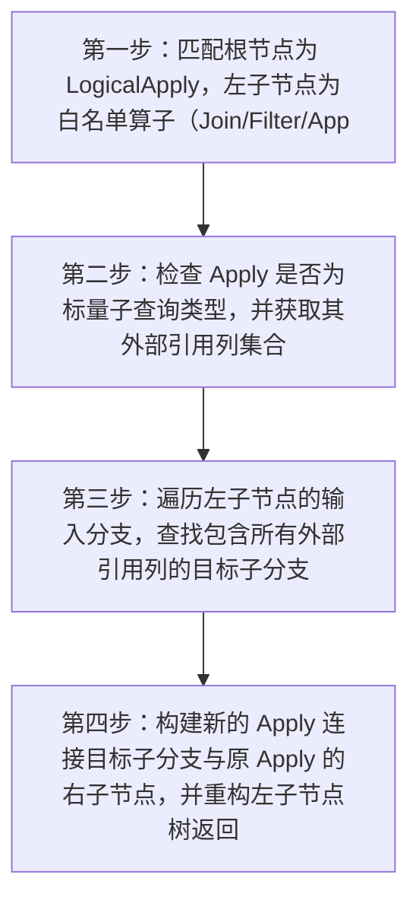


**详细步骤:**

1. 第一步：匹配根节点为 LogicalApply，左子节点为白名单算子（Join/Filter/Apply）的模式
2. 第二步：检查 Apply 是否为标量子查询类型，并获取其外部引用列集合
3. 第三步：遍历左子节点的输入分支，查找包含所有外部引用列的目标子分支
4. 第四步：构建新的 Apply 连接目标子分支与原 Apply 的右子节点，并重构左子节点树返回


**✨ 优化收益:**

- 📊 数据量减少: 减少 Apply 算子处理的数据行数，仅处理相关分支数据而非连接后的全量数据
- ⏱️ 复杂度降低: 降低子查询计算的复杂度，避免在大表连接结果上执行子查询
- 💾 IO优化: 减少中间结果集的大小，降低后续算子的内存和 IO 开销


**🔗 依赖条件:**

无特殊依赖


**🎯 适用场景:**

- 包含相关子查询的连接查询
- 子查询仅关联连接树中某一侧表的场景
- 大表连接后过滤的优化


**💡 SQL优化示例:**

**优化前:**
```sql
SELECT * FROM A JOIN B ON A.id = B.id WHERE B.val = (SELECT max(c.val) FROM C WHERE C.id = B.id)
```

**优化后:**
```
SELECT * FROM A JOIN (SELECT * FROM B WHERE B.val = (SELECT max(c.val) FROM C WHERE C.id = B.id)) ON A.id = B.id
```

---

#### 3.1.8 `PruneProjectEmptyRule`

**📋 规则名称:** 空值投影剪枝规则

**📁 源码位置:** `transformation/PruneProjectEmptyRule.java`


**📝 功能概述:**

当投影算子（Project）下方的值列表算子（Values）为空时，移除投影算子，直接返回带有相同列定义的空值列表算子。


**🔢 关系代数表达式:**

```
π_cols(Values([])) → Values([], cols)
```


**📥 输入模式:**

| 属性 | 值 |
|------|----|

| 算子类型 | LogicalProject, LogicalValues |
| 算子结构 | `LogicalProject(LogicalValues)` |
| 触发条件 | LogicalValues 算子中的行数据列表为空 (isEmpty) |

**📤 输出模式:**

| 属性 | 值 |
|------|----|

| 算子类型 | LogicalValues |
| 算子结构 | `LogicalValues` |
| 结构变化 | 移除了上层的 LogicalProject 算子，将投影列定义合并到新的 LogicalValues 算子中，数据行保持为空 |

**⚙️ 执行过程:**

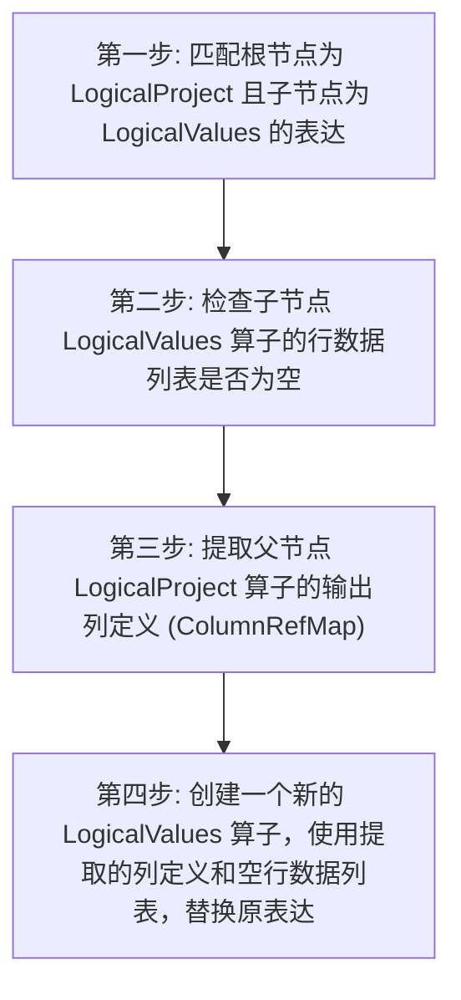


**详细步骤:**

1. 第一步: 匹配根节点为 LogicalProject 且子节点为 LogicalValues 的表达式结构
2. 第二步: 检查子节点 LogicalValues 算子的行数据列表是否为空
3. 第三步: 提取父节点 LogicalProject 算子的输出列定义 (ColumnRefMap)
4. 第四步: 创建一个新的 LogicalValues 算子，使用提取的列定义和空行数据列表，替换原表达式


**✨ 优化收益:**

- 📊 数据量减少: 无数据减少（源数据已为空），但消除了冗余算子
- ⏱️ 复杂度降低: 降低执行计划树的高度，减少后续规则匹配和执行的开销
- 💾 IO优化: 无磁盘 IO 影响，仅减少内存中的算子处理逻辑


**🔗 依赖条件:**

无特殊依赖


**🎯 适用场景:**

- 常量表查询且条件矛盾
- 子查询优化后结果为空集
- 逻辑优化阶段的计划简化


**💡 SQL优化示例:**

**优化前:**
```sql
SELECT k FROM (VALUES (1)) AS t(k) WHERE 1 = 0 (计划：Project(k) -> Values([]))
```

**优化后:**
```
SELECT k FROM (VALUES (1)) AS t(k) WHERE 1 = 0 (计划：Values(cols=[k], rows=[]))
```

---

#### 3.1.9 `does`

**📋 规则名称:** 分区裁剪规则

**📁 源码位置:** `transformation/PartitionPruneRule.java`


**📝 功能概述:**

根据查询谓词裁剪 OLAP 表的不相关分区，减少扫描数据量，若分区范围完全满足谓词则移除该谓词，并将依赖谓词下推至扫描节点。


**🔢 关系代数表达式:**

```
Scan(T) → Scan(T|partitions={p_i})
```


**📥 输入模式:**

| 属性 | 值 |
|------|----|

| 算子类型 | LogicalOlapScan |
| 算子结构 | `LogicalOlapScanOperator` |
| 触发条件 | 算子类型为 LogicalOlapScan; 算子未标记为已分区裁剪 (OP_PARTITION_PRUNED); 扫描算子中包含可用于分区裁剪的谓词 |

**📤 输出模式:**

| 属性 | 值 |
|------|----|

| 算子类型 | LogicalOlapScan |
| 算子结构 | `LogicalOlapScanOperator (with selectedPartitionId)` |
| 结构变化 | 选中分区 ID 列表被更新，OP_PARTITION_PRUNED 标志位被设置 |

**⚙️ 执行过程:**

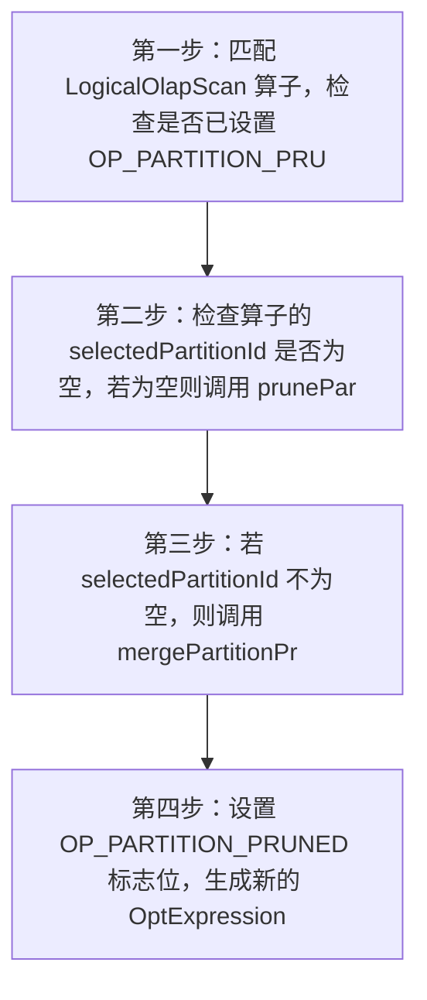


**详细步骤:**

1. 第一步：匹配 LogicalOlapScan 算子，检查是否已设置 OP_PARTITION_PRUNED 标志，若已设置则跳过
2. 第二步：检查算子的 selectedPartitionId 是否为空，若为空则调用 prunePartitions 进行初始分区裁剪
3. 第三步：若 selectedPartitionId 不为空，则调用 mergePartitionPrune 合并现有裁剪结果与新裁剪结果
4. 第四步：设置 OP_PARTITION_PRUNED 标志位，生成新的 OptExpression 返回


**✨ 优化收益:**

- 📊 数据量减少: 仅扫描匹配谓词的分区，大幅减少读取行数
- ⏱️ 复杂度降低: 降低后续算子的数据处理复杂度
- 💾 IO优化: 显著减少磁盘 IO 次数，跳过无关分区文件


**🔗 依赖条件:**

无特殊依赖


**🎯 适用场景:**

- OLAP 表查询
- 单分区列裁剪
- 包含二分谓词（如=, >, <, >=, <=）的过滤查询
- 时间范围查询场景


**💡 SQL优化示例:**

**优化前:**
```sql
SELECT * FROM events WHERE event_date >= '2020-04-01' AND event_date < '2020-09-01'
```

**优化后:**
```
Scan(events, partitions=[p3, p4], filter=[event_date >= '2020-04-01' AND event_date < '2020-09-01'])
```

---

#### 3.1.10 `PruneTableFunctionColumnRule`

**📋 规则名称:** 表函数列裁剪规则

**📁 源码位置:** `transformation/PruneTableFunctionColumnRule.java`


**📝 功能概述:**

裁剪表函数算子中未被上层查询需要的输出列，减少不必要的数据处理


**🔢 关系代数表达式:**

```
π_required(LogicalTableFunction(R)) → π_required'(LogicalTableFunction(R))
```


**📥 输入模式:**

| 属性 | 值 |
|------|----|

| 算子类型 | LogicalTableFunction |
| 算子结构 | `LogicalTableFunction(LeafOperator)` |
| 触发条件 | 存在未被上层查询需要的输出列 |

**📤 输出模式:**

| 属性 | 值 |
|------|----|

| 算子类型 | LogicalTableFunction |
| 算子结构 | `LogicalTableFunction(LeafOperator)` |
| 结构变化 | 表函数输出列集合被裁剪为仅包含需要的列 |

**⚙️ 执行过程:**

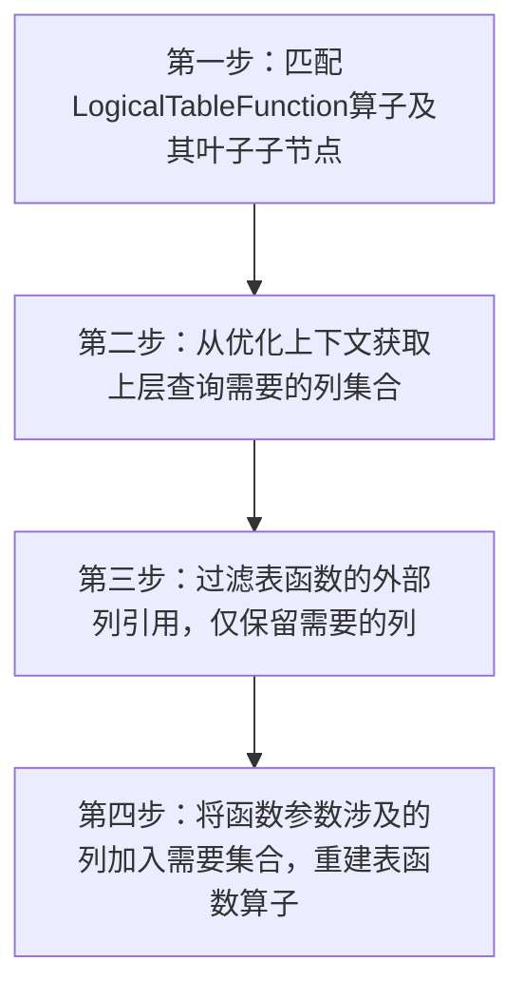


**详细步骤:**

1. 第一步：匹配LogicalTableFunction算子及其叶子子节点
2. 第二步：从优化上下文获取上层查询需要的列集合
3. 第三步：过滤表函数的外部列引用，仅保留需要的列
4. 第四步：将函数参数涉及的列加入需要集合，重建表函数算子


**✨ 优化收益:**

- 📊 数据量减少: 减少未使用列的数据传输量
- ⏱️ 复杂度降低: 降低后续算子的列处理开销
- 💾 IO优化: 减少内存中不必要列的存储和传递


**🔗 依赖条件:**

需要: 物理属性


**🎯 适用场景:**

- 表函数查询
- 多列输出场景
- 列裁剪优化


**💡 SQL优化示例:**

**优化前:**
```sql
SELECT col1 FROM table, LATERAL VIEW udtf(col1, col2) t AS col1, col2 WHERE col1 > 10
```

**优化后:**
```
LogicalTableFunction(仅输出col1, 参数包含col1/col2)
```

---

#### 3.1.11 `PruneUKFKJoinRule`

**📋 规则名称:** 唯一键外键连接剪枝规则

**📁 源码位置:** `transformation/PruneUKFKJoinRule.java`


**📝 功能概述:**

当连接条件满足外键关联唯一键约束，且查询投影未引用唯一键表的非连接列时，直接移除该连接操作及唯一键表扫描。


**🔢 关系代数表达式:**

```
π_{cols}(R ⋈_{R.fk=S.uk} S) → π_{cols}(R) (其中 S.uk 为唯一键，cols 不包含 S 的非连接列)
```


**📥 输入模式:**

| 属性 | 值 |
|------|----|

| 算子类型 | LogicalProject, LogicalJoin, Scan |
| 算子结构 | `LogicalProject(LogicalJoin(Scan, Scan))` |
| 触发条件 | 会话变量 enable_uk_fk_opt 开启; 存在有效的 UK/FK 约束关系; 连接类型符合剪枝条件（Inner/Outer/Semi） |

**📤 输出模式:**

| 属性 | 值 |
|------|----|

| 算子类型 | LogicalProject, Scan |
| 算子结构 | `LogicalProject(Scan)` |
| 结构变化 | 移除 Join 算子和唯一键侧的子表扫描，保留外键侧子树 |

**⚙️ 执行过程:**

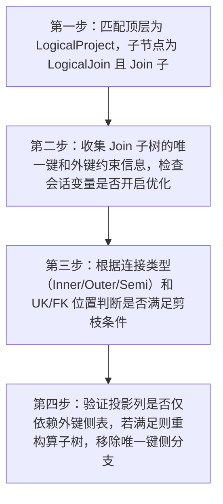


**详细步骤:**

1. 第一步：匹配顶层为 LogicalProject，子节点为 LogicalJoin 且 Join 子节点为 Leaf 的算子树
2. 第二步：收集 Join 子树的唯一键和外键约束信息，检查会话变量是否开启优化
3. 第三步：根据连接类型（Inner/Outer/Semi）和 UK/FK 位置判断是否满足剪枝条件
4. 第四步：验证投影列是否仅依赖外键侧表，若满足则重构算子树，移除唯一键侧分支


**✨ 优化收益:**

- 📊 数据量减少: 消除唯一键表的全量或分区扫描数据
- ⏱️ 复杂度降低: 将 O(N*M) 的连接复杂度降低为 O(N) 的单表扫描
- 💾 IO优化: 减少一次表扫描带来的磁盘 IO 和网络传输开销


**🔗 依赖条件:**

需要: 物理属性


**🎯 适用场景:**

- 星型模型事实表与维度表关联
- 外键约束明确的业务查询
- 仅需外键表列的冗余连接场景


**💡 SQL优化示例:**

**优化前:**
```sql
SELECT o.order_id FROM orders o JOIN customers c ON o.cust_id = c.id
```

**优化后:**
```
SELECT o.order_id FROM orders o
```

---

#### 3.1.12 `JoinCommutativityRule`

**📋 规则名称:** 连接交换性规则

**📁 源码位置:** `transformation/JoinCommutativityRule.java`


**📝 功能概述:**

该规则通过交换连接操作的左右输入表并调整连接类型，生成语义等价的执行计划，为后续优化提供更多可能性。


**🔢 关系代数表达式:**

```
R ⋈_type S → S ⋈_type' R (type'为对应交换后的连接类型)
```


**📥 输入模式:**

| 属性 | 值 |
|------|----|

| 算子类型 | LogicalJoin |
| 算子结构 | `Join(Leaf, Leaf)` |
| 触发条件 | 无Join Hint指定; 未设置连接重排序交换掩码 |

**📤 输出模式:**

| 属性 | 值 |
|------|----|

| 算子类型 | LogicalJoin |
| 算子结构 | `Join(Leaf, Leaf)` |
| 结构变化 | 左右子节点顺序交换，连接类型按映射表转换 |

**⚙️ 执行过程:**

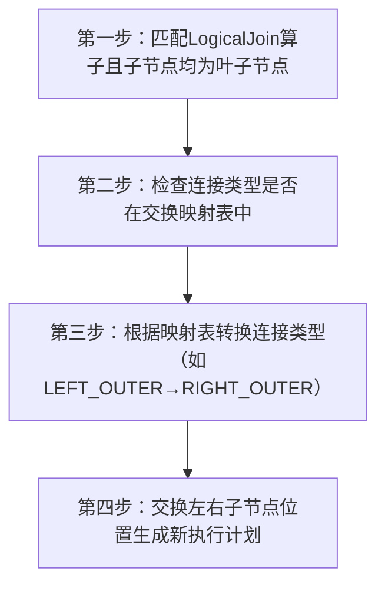


**详细步骤:**

1. 第一步：匹配LogicalJoin算子且子节点均为叶子节点
2. 第二步：检查连接类型是否在交换映射表中
3. 第三步：根据映射表转换连接类型（如LEFT_OUTER→RIGHT_OUTER）
4. 第四步：交换左右子节点位置生成新执行计划


**✨ 优化收益:**

- 📊 数据量减少: 可能减少中间结果集大小（取决于后续优化）
- ⏱️ 复杂度降低: 为连接重排序提供基础，可能降低整体连接代价
- 💾 IO优化: 间接减少磁盘IO（通过优化连接顺序）


**🔗 依赖条件:**

无特殊依赖


**🎯 适用场景:**

- 多表连接查询
- 存在外连接的场景
- 需要连接重排序的复杂查询


**💡 SQL优化示例:**

**优化前:**
```sql
SELECT * FROM A LEFT JOIN B ON A.id=B.id
```

**优化后:**
```
LogicalJoin(type=RIGHT_OUTER, left=B, right=A)
```

---

#### 3.1.13 `ForceCTEReuseRule`

**📋 规则名称:** 强制 CTE 复用规则

**📁 源码位置:** `transformation/ForceCTEReuseRule.java`


**📝 功能概述:**

当 CTE 定义中包含非确定性函数或无 ORDER BY 的 LIMIT 时，强制标记该 CTE 为复用模式，防止优化器内联展开导致结果错误或不确定。


**🔢 关系代数表达式:**

```
CTE_{produce} → CTE_{produce} (Context: ForceReuse)
```


**📥 输入模式:**

| 属性 | 值 |
|------|----|

| 算子类型 | LogicalCTEProduce |
| 算子结构 | `LogicalCTEProduce(Child)` |
| 触发条件 | 子树中包含非确定性函数 (如 rand(), uuid()); 子树中包含 LIMIT 且无 ORDER BY (且会话变量启用) |

**📤 输出模式:**

| 属性 | 值 |
|------|----|

| 算子类型 | LogicalCTEProduce |
| 算子结构 | `LogicalCTEProduce(Child)` |
| 结构变化 | 逻辑算子树结构不变，但优化器上下文 (CTEContext) 中标记该 CTE ID 为强制复用 |

**⚙️ 执行过程:**

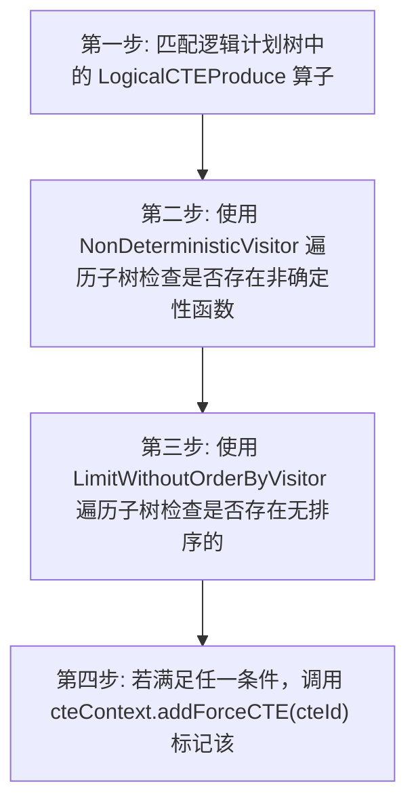


**详细步骤:**

1. 第一步: 匹配逻辑计划树中的 LogicalCTEProduce 算子
2. 第二步: 使用 NonDeterministicVisitor 遍历子树检查是否存在非确定性函数
3. 第三步: 使用 LimitWithoutOrderByVisitor 遍历子树检查是否存在无排序的 LIMIT 算子
4. 第四步: 若满足任一条件，调用 cteContext.addForceCTE(cteId) 标记该 CTE 强制物化复用


**✨ 优化收益:**

- 📊 数据量减少: 不减少数据量，主要保证语义正确性
- ⏱️ 复杂度降低: 避免多次计算非确定性函数带来的逻辑复杂性
- 💾 IO优化: 避免因内联导致多次扫描相同子查询，但可能增加物化开销


**🔗 依赖条件:**

无特殊依赖


**🎯 适用场景:**

- CTE 被多次引用的查询
- CTE 定义中包含 rand(), uuid() 等非确定性函数
- CTE 定义中包含 LIMIT 但未指定 ORDER BY


**💡 SQL优化示例:**

**优化前:**
```sql
WITH t AS (SELECT rand() as r FROM src) SELECT * FROM t UNION ALL SELECT * FROM t
```

**优化后:**
```
CTE t 被物化一次 (Materialize), 两次引用获取相同的 r 值，而非内联导致每次引用重新计算 rand()
```

---

#### 3.1.14 `PruneEmptyExceptRule`

**📋 规则名称:** 剪枝空除规则

**📁 源码位置:** `transformation/PruneEmptyExceptRule.java`


**📝 功能概述:**

优化 EXCEPT 操作中涉及空输入的情况，移除空的子节点或简化整个表达式


**🔢 关系代数表达式:**

```
R ∅ S → ∅ (若 R 为空) 或 R (若 S 为空)
```


**📥 输入模式:**

| 属性 | 值 |
|------|----|

| 算子类型 | LogicalExcept, LogicalValues |
| 算子结构 | `Except(Values(empty), Child1, Child2...)` |
| 触发条件 | 存在至少一个子节点为空的 LogicalValuesOperator |

**📤 输出模式:**

| 属性 | 值 |
|------|----|

| 算子类型 | LogicalValues, LogicalExcept |
| 算子结构 | `空 Values 算子或简化后的 Except 算子` |
| 结构变化 | 移除空子节点或替换为空结果 |

**⚙️ 执行过程:**

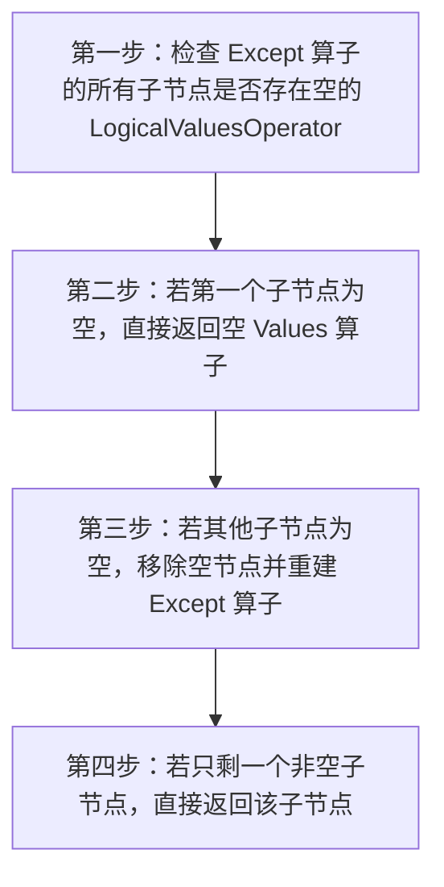


**详细步骤:**

1. 第一步：检查 Except 算子的所有子节点是否存在空的 LogicalValuesOperator
2. 第二步：若第一个子节点为空，直接返回空 Values 算子
3. 第三步：若其他子节点为空，移除空节点并重建 Except 算子
4. 第四步：若只剩一个非空子节点，直接返回该子节点


**✨ 优化收益:**

- 📊 数据量减少: 消除空数据集的传递和处理
- ⏱️ 复杂度降低: 避免冗余的 EXCEPT 计算逻辑
- 💾 IO优化: 减少空中间结果的物化开销


**🔗 依赖条件:**

无特殊依赖


**🎯 适用场景:**

- 包含 EXCEPT 的查询
- 子查询可能返回空结果的场景


**💡 SQL优化示例:**

**优化前:**
```sql
SELECT * FROM t1 EXCEPT SELECT * FROM t2 WHERE 1=0
```

**优化后:**
```
Scan(t1) [直接返回 t1 结果，因右侧为空]
```

---

#### 3.1.15 `RewriteToVectorPlanRule`

**📋 规则名称:** 向量查询重写规则

**📁 源码位置:** `transformation/RewriteToVectorPlanRule.java`


**📝 功能概述:**

将基于向量相似度排序的 TopN 查询转换为利用向量索引的扫描操作，优化向量搜索性能


**🔢 关系代数表达式:**

```
τ_{v}(π(σ(R))) → σ_{vector}(R)
```


**📥 输入模式:**

| 属性 | 值 |
|------|----|

| 算子类型 | LogicalTopN, LogicalOlapScan |
| 算子结构 | `LogicalTopN(LogicalOlapScan)` |
| 触发条件 | 启用实验性向量功能 (enable_experimental_vector); TopN 存在有效 LIMIT 且仅单个排序字段; 扫描算子包含投影信息 |

**📤 输出模式:**

| 属性 | 值 |
|------|----|

| 算子类型 | LogicalOlapScan |
| 算子结构 | `LogicalOlapScan(vector_search_options)` |
| 结构变化 | TopN 算子被消除，向量搜索参数下推到扫描算子 |

**⚙️ 执行过程:**

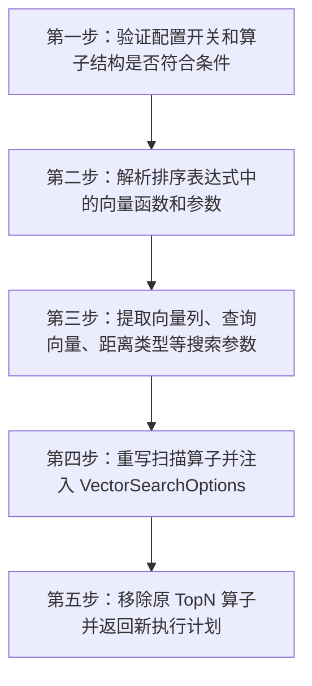


**详细步骤:**

1. 第一步：验证配置开关和算子结构是否符合条件
2. 第二步：解析排序表达式中的向量函数和参数
3. 第三步：提取向量列、查询向量、距离类型等搜索参数
4. 第四步：重写扫描算子并注入 VectorSearchOptions
5. 第五步：移除原 TopN 算子并返回新执行计划


**✨ 优化收益:**

- 📊 数据量减少: 避免全表扫描，仅检索相关向量数据
- ⏱️ 复杂度降低: 从 O(n log n) 排序降为 O(k) 索引查找 (k<<n)
- 💾 IO优化: 减少 90%+ 的磁盘 IO 通过向量索引剪枝


**🔗 依赖条件:**

需要: 物理属性


**🎯 适用场景:**

- 向量相似度搜索
- 推荐系统召回
- 高维数据近似最近邻查询


**💡 SQL优化示例:**

**优化前:**
```sql
SELECT * FROM items ORDER BY cosine_similarity(embedding, [1.2,3.4]) LIMIT 10
```

**优化后:**
```
OlapScan(items, vector_index=[embedding], query_vector=[1.2,3.4], limit=10)
```

---

## 四、优化原理总结


### 4.1 核心优化原则

查询优化的核心是利用关系代数的**等价变换规则**，在保持查询语义不变的前提下，找到执行代价最小的等价表达式。

#### 4.1.1 选择下推 (Selection Pushdown)

**原理:** 尽早过滤，减少中间结果

```
原始: σ_{p}(R ⋈ S)
优化: R ⋈ σ_{p}(S)  -- 当p只涉及S的属性时
```

**收益:**
- 减少连接操作的输入数据量
- 降低内存使用
- 减少网络传输（分布式场景）

#### 4.1.2 投影下推 (Projection Pushdown)

**原理:** 只读取需要的列

```
原始: π_{A,B}(Scan(R))  -- 扫描所有列
优化: Scan(R, columns=[A,B])  -- 只扫描指定列
```

**收益:**
- 减少磁盘IO
- 降低内存占用
- 提高缓存命中率

#### 4.1.3 连接重排序 (Join Reordering)

**原理:** 选择产生最小中间结果的连接顺序

```
原始: (R ⋈ S) ⋈ T  -- 可能产生大量中间结果
优化: R ⋈ (S ⋈ T)  -- 如果这个顺序产生更少中间结果
```

**收益:**
- 减少中间结果大小
- 降低内存和磁盘使用
- 缩短查询响应时间

#### 4.1.4 聚合下推 (Aggregation Pushdown)

**原理:** 先聚合减少数据量

```
原始: γ_{g,a}(R ⋈ S)  -- 先连接再聚合
优化: γ_{g,a}(R) ⋈ S  -- 当分组属性都在R上时
```

**收益:**
- 减少连接操作的输入
- 降低计算开销


## 五、最佳实践建议


### 5.1 SQL编写建议

1. **使用明确的过滤条件**
   - 将过滤条件写在WHERE子句中，而不是HAVING
   - 避免在WHERE子句中使用函数

2. **合理使用索引**
   - 为高频查询条件创建索引
   - 遵循最左前缀原则

3. **避免SELECT ***
   - 只选择需要的列
   - 让优化器可以应用投影下推

4. **合理使用JOIN**
   - 小表驱动大表
   - 避免笛卡尔积

### 5.2 调优建议

1. **查看执行计划**
   - 使用EXPLAIN分析查询计划
   - 检查是否有预期的优化规则被应用

2. **监控统计信息**
   - 确保统计信息是最新的
   - 对于大表变更后及时更新统计信息

3. **会话变量调优**
   - 了解优化器相关的会话变量
   - 根据场景调整优化器行为


---

*本报告由 Optimizer Expert Analyzer 自动生成*

*包含规则的输入输出模式和执行过程分析*

*生成时间: 2026-04-06T12:41:41.186837*
