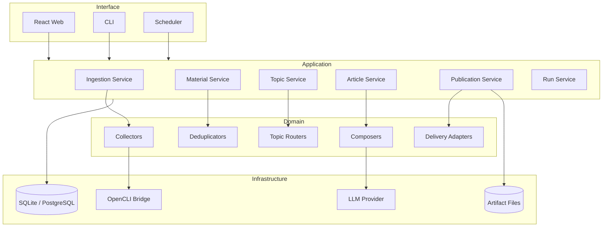

# Tech Radar 内容工作台：技术设计文档

状态：Draft for review
版本：0.2
日期：2026-10-07
关联文档：[产品设计](product-design.md)

## 1. 设计目标

本设计将现有 `tech-radar` CLI 演进为一个本地优先的 Web 内容工作台，同时保留：

- 当前 OpenCLI Collector、Processor、Publisher 插件和 CLI。
- SQLite 中已经采集的 Signal、来源关系和发布记录。
- 无 Web、无 LLM 时仍可运行的确定性基础流水线。
- Windows + WSL 环境中的本地文件和浏览器登录态。

技术设计优先保证正确性、幂等和可恢复，然后才考虑并行度和分布式扩展。

## 2. 当前实现基线

当前实现是同步模块化单体：

```text
TOML Config -> Collector -> Processor[] -> SignalStore -> Publisher[]
```

已有扩展点：

- `tech_radar.collectors`
- `tech_radar.processors`
- `tech_radar.publishers`

当前数据库只有 `signals`、`signal_sources` 和 `deliveries`。这足以生成日报，但不能
表达游标、跨源事件、Topic 素材池、文章版本、证据和平台发布状态。

## 3. 技术原则

1. 模块化单体优先，明确边界后再拆进程。
2. 原始证据不可变；派生结果可重新计算。
3. 所有阶段都必须幂等。
4. Cursor 只在事务成功后推进。
5. 素材消费和平台发布使用不同 ledger。
6. Web、CLI 和 Scheduler 调用同一 Application Service。
7. Extension 通过 capability manifest 描述能力，UI 不硬编码平台。
8. 无 LLM、无 embedding 时系统仍可正确运行。
9. 外部最终发布不是可自动重试的普通任务。

## 4. 目标架构



## 5. 模块边界

建议代码结构：

```text
src/tech_radar/
├── domain/
│   ├── sources.py
│   ├── materials.py
│   ├── topics.py
│   ├── articles.py
│   └── publications.py
├── application/
│   ├── ingestion.py
│   ├── material_service.py
│   ├── topic_service.py
│   ├── article_service.py
│   ├── publication_service.py
│   └── daily.py
├── plugins/
│   ├── contracts.py
│   ├── registry.py
│   └── manifests.py
├── infrastructure/
│   ├── db/
│   ├── artifacts/
│   ├── opencli/
│   └── llm/
├── web/
│   ├── api/
│   └── sse.py
└── cli.py

web/
├── src/
│   ├── app/
│   ├── features/
│   ├── components/
│   └── api/
└── package.json
```

Domain 不依赖 FastAPI、SQLite、OpenCLI 或 React。Application 只依赖 Domain 和
Repository/Plugin Protocol。Infrastructure 实现具体适配。

## 6. 技术选型

### 6.1 后端

- Python 3.13。
- FastAPI：本地 API、OpenAPI、SSE endpoint。
- Pydantic v2：API 和插件配置 schema，不替代 Domain dataclass。
- SQLAlchemy 2.x Core/ORM：SQLite/PostgreSQL 双后端和事务边界。
- Alembic：显式 schema migration。
- APScheduler：MVP 内置每日调度；单进程串行运行。
- structlog 或标准 logging JSON formatter：结构化日志。

保留现有 `sqlite3` Store 作为兼容读取层，Milestone 0 后迁移到 Repository。

### 6.2 前端

- React + TypeScript + Vite。
- TanStack Query：服务端状态、失效和重试。
- React Router：对象级 URL，可从搜索直接回到上下文。
- Markdown editor/preview：第一阶段使用 textarea + preview，后续替换为 CodeMirror。
- SSE：运行进度和 Activity 更新；第一阶段不需要 WebSocket。

不使用重型全局状态库。筛选器写入 URL；临时选择状态留在组件内。

### 6.3 文件与媒体

```text
var/
├── tech-radar.sqlite3
├── artifacts/
│   ├── articles/<article-id>/<version-id>/
│   └── publications/<job-id>/
├── cache/media/
└── logs/
```

数据库只保存路径、MIME、大小、哈希和状态，不保存图片 BLOB。

## 7. 数据模型

### 7.1 运行和来源

`ingestion_runs`

- `id`, `trigger`, `started_at`, `finished_at`, `status`
- `config_hash`, `summary_json`, `error`

`target_runs`

- `id`, `run_id`, `target_id`, `status`
- `cursor_before`, `cursor_after`
- `fetched`, `inserted`, `updated`, `duplicates`, `filtered`
- `started_at`, `finished_at`, `error`

`source_cursors`

- `target_id` primary key
- `cursor_type`, `cursor_value_json`, `watermark_at`
- `last_success_at`, `consecutive_failures`, `version`

### 7.2 Material 和 Event

`materials`

- `id` UUID/ULID primary key
- `platform`, `external_id`, unique constraint
- `author`, `title`, `content`, `canonical_url`
- `published_at`, `first_seen_at`, `last_seen_at`
- `priority`, `quality_score`, `status`
- `raw_json`, `metrics_json`, `media_json`

`material_sources`

- `material_id`, `target_id`, `first_seen_run_id`
- unique `(material_id, target_id)`

`material_fingerprints`

- `material_id`
- `url_hash`, `content_hash`, `simhash64`
- `normalizer_version`

`events`

- `id`, `canonical_title`, `event_type`
- `entities_json`, `event_time`, `status`
- `created_at`, `updated_at`

`event_materials`

- `event_id`, `material_id`, `role`, `confidence`, `reason_json`
- unique `(event_id, material_id)`

### 7.3 Topic

`topics`

- `id`, `slug`, `name`, `description`, `enabled`

`topic_versions`

- `id`, `topic_id`, `version`
- `rules_json`, `writing_policy_json`, `created_at`

`topic_materials`

- `topic_id`, `event_id`, `topic_version_id`
- `relevance`, `novelty`, `quality`, `status`
- `assigned_at`, `reviewed_at`

### 7.4 Article

`articles`

- `id`, `topic_id`, `article_type`, `slug`, `status`
- `current_version_id`, `created_at`, `updated_at`

`article_versions`

- `id`, `article_id`, `version`
- `parent_version_id`, `origin` rule/llm/manual
- `title`, `summary`, `body_markdown`
- `material_set_hash`, `composer_id`, `composer_version`
- `model`, `prompt_hash`, `created_at`

`article_evidence`

- `article_version_id`, `event_id`, `material_id`
- `claim_id`, `citation_order`, `note`

### 7.5 Publication

`publication_jobs`

- `id`, `article_version_id`, `platform`, `adapter_id`
- `status`, `idempotency_key`, `attempt_count`
- `created_at`, `updated_at`, `last_error`

`publication_artifacts`

- `id`, `job_id`, `kind`, `path`, `sha256`, `metadata_json`

`publication_records`

- `job_id`, `status`, `external_draft_id`, `external_url`
- `prepared_at`, `previewed_at`, `published_at`
- `confirmed_by`, `confirmation_note`

### 7.6 Audit

`audit_events`

- `id`, `actor_type`, `actor_id`, `action`
- `object_type`, `object_id`, `before_json`, `after_json`
- `run_id`, `created_at`

## 8. 数据迁移

当前表到新模型的映射：

| 当前 | 目标 | 迁移动作 |
|---|---|---|
| `signals` | `materials` | 保留所有字段，补 first/last seen |
| `signal_sources` | `material_sources` | 关联生成的新 Material ID |
| `deliveries` | legacy report record | 不映射为平台发布 |
| `annotations_json.topic` | `topic_materials` | 标记 `migration-v1` 来源 |

迁移先复制再切换，不删除旧表。完成双读校验后将旧表改名为 `legacy_*`，至少保留
一个版本周期。

## 9. Incremental Collector Contract

```python
@dataclass(frozen=True, slots=True)
class CollectionBatch:
    records: tuple[RawRecord, ...]
    next_cursor: CursorValue | None
    complete: bool
    diagnostics: Mapping[str, object]


class SourceConnector(Protocol):
    manifest: SourceManifest

    def collect(
        self,
        target: SourceTarget,
        cursor: SourceCursor | None,
        context: CollectionContext,
    ) -> CollectionBatch: ...
```

约束：

- `collect` 不写业务数据库。
- `next_cursor` 只有在 records 事务提交后更新。
- `complete=False` 表示部分结果，不能覆盖现有 cursor。
- Record 带稳定 external ID 或能生成稳定 source fingerprint。
- Connector 声明认证类型、速率限制和支持的增量模式。

现有 OpenCLI Collector 通过 Legacy Adapter 转换为此接口。

## 10. Source Extension Manifest

```json
{
  "id": "github-release",
  "version": "1.0.0",
  "kind": "source",
  "capabilities": ["incremental", "test-connection", "media"],
  "auth": "token",
  "cursor": "published-at",
  "config_schema": {},
  "secret_fields": ["token_env"],
  "permissions": ["network:api.github.com"]
}
```

Web 根据 `config_schema` 生成表单。Secret 字段只保存环境变量名或系统凭据引用，
不通过普通配置 API 返回。

## 11. Delivery Adapter Contract

```python
class DeliveryAdapter(Protocol):
    manifest: DeliveryManifest

    def prepare(
        self, version: ArticleVersion, context: DeliveryContext
    ) -> PreparedArtifact: ...

    def validate(self, artifact: PreparedArtifact) -> ValidationResult: ...

    def preview(self, artifact: PreparedArtifact) -> PreviewResult: ...

    def record_published(
        self, artifact: PreparedArtifact, external_url: str
    ) -> PublicationRecord: ...
```

Manifest 声明：

- `prepare`
- `validate`
- `preview`
- `create-draft`
- `publish`
- `manual-confirmation-required`

UI 只渲染 Adapter 明确支持的操作。小红书 Adapter 不暴露无人值守 `publish`。

## 12. 去重与 Event 聚类

处理顺序：

1. 平台 ID exact match。
2. canonical URL hash match。
3. normalized content SHA-256 match。
4. SimHash Hamming distance 候选。
5. entity + event type + time window 规则。
6. 可选 embedding rerank。

自动合并条件必须可解释并保存 `reason_json`。低置信度只建立 merge suggestion，
进入 `needs_review`，不自动改变 Event。

删除或撤销合并只修改 `event_materials`，不删除 Material。

## 13. Topic Router

Router 输入 Event 聚合文本、实体、来源、作者和质量分，输出零到多个 Assignment。

```python
@dataclass(frozen=True, slots=True)
class TopicAssignment:
    topic_id: str
    relevance: float
    novelty: float
    reasons: tuple[str, ...]
    router_version: str
```

规则 Router 是正确性基线；LLM Router 只能补充候选和解释。TopicVersion 固定后，
Assignment 不随规则更新静默改变。重新分类产生新版本和 audit event。

## 14. Article Composer

Composer 输入 `CompositionRequest`：

- Topic 和 Writing Policy。
- 已选 Event 和每个 Event 的代表 Material。
- 现有 ArticleVersion，可选。
- 目标 article type。
- 语言、长度和引用规范。

输出结构化 Draft：

```json
{
  "title": "...",
  "summary": "...",
  "outline": [],
  "claims": [
    {
      "id": "claim-1",
      "text": "...",
      "evidence_ids": ["material-id"],
      "confidence": 0.92
    }
  ],
  "body_markdown": "...",
  "open_questions": []
}
```

事实性 claim 没有 evidence 时，版本只能进入 `review_required`，不能进入 approved。

## 15. Daily Orchestration

```text
Acquire Run Lock
  -> Create IngestionRun
  -> Collect Targets
  -> Normalize and Upsert
  -> Assign Events
  -> Route Topics
  -> Evaluate Candidate Policies
  -> Compose Drafts
  -> Prepare Approved Publications
  -> Emit Run Summary
  -> Release Lock
```

每个阶段写 checkpoint。Daily 命令重启时读取未完成 Run，继续安全阶段。`publish`
不是 daily 的默认阶段，只有 `prepare` 可以自动执行。

## 16. Job 与重试语义

### 自动重试

- 网络读取超时。
- 429/5xx，且 Adapter 标记 retryable。
- LLM 暂时性错误。
- Artifact 文件的临时写入失败。

### 不自动重试

- 登录失效。
- 配置或验证错误。
- 平台页面结构变化。
- 小红书或其他外部平台最终发布。
- 需要人工判断的 Event 合并。

退避建议：30 秒、2 分钟、10 分钟；单次 daily 最多三次。所有重试复用同一个
idempotency key。

## 17. Application API

### 17.1 Materials

```text
GET    /api/materials
GET    /api/materials/{id}
POST   /api/materials/batch/accept
POST   /api/materials/batch/reject
POST   /api/materials/batch/route
POST   /api/events/merge-suggestions/{id}/accept
POST   /api/events/merge-suggestions/{id}/reject
```

### 17.2 Topics and Articles

```text
GET    /api/topics
GET    /api/topics/{id}/delta
POST   /api/topics/{id}/candidates
POST   /api/articles
GET    /api/articles/{id}
POST   /api/articles/{id}/versions
POST   /api/article-versions/{id}/approve
```

### 17.3 Publications and Runs

```text
POST   /api/article-versions/{id}/publications
POST   /api/publication-jobs/{id}/prepare
POST   /api/publication-jobs/{id}/preview
POST   /api/publication-jobs/{id}/record-published
GET    /api/runs
POST   /api/runs/daily
GET    /api/events/stream
```

所有修改 API 接受 `Idempotency-Key`。批量操作返回受影响对象和 audit event ID。

## 18. Web 数据流

- 首屏通过 REST 获取稳定快照。
- TanStack Query 管理分页、过滤和详情缓存。
- SSE 只传 run progress、activity invalidation 和 review-required 通知。
- 收到 invalidation 后客户端重新获取对象，不把 SSE 当事实数据库。
- Material list 使用 cursor pagination，不使用 offset。
- 搜索条件写入 URL，支持恢复工作上下文。

## 19. 搜索

MVP 使用 SQLite FTS5：

- Material 标题、正文、作者。
- Event canonical title 和实体。
- Article 标题、摘要和正文。

搜索结果携带 object type 和 object ID，打开后跳回详情。PostgreSQL 阶段迁移到
`tsvector`。Embedding 检索只作为后续混合检索，不替代精确过滤。

## 20. 并发与一致性

### SQLite 阶段

- WAL 模式。
- 单个后台 Worker 串行执行写任务。
- Web 修改通过同一 Application Service 进入写队列。
- 乐观版本字段防止两个浏览器标签覆盖人工修改。

### PostgreSQL 阶段

- `SELECT FOR UPDATE SKIP LOCKED` 领取 Job。
- Transactional Outbox 发布事件。
- 多 Worker 按 Target、Composer、Delivery 队列隔离。

在引入多 Worker 前不实现 Outbox 或分布式锁。

## 21. 安全

- 默认只监听 `127.0.0.1`。
- 暴露到局域网或公网前必须增加认证、CSRF、防反向代理误配。
- OpenCLI Cookie 和浏览器 Profile 永远不进入数据库。
- Extension secret 使用环境变量或系统凭据存储。
- Artifact 路径必须限制在配置的 workspace root。
- Markdown/HTML Preview 使用 sanitizer，外部 HTML 不直接执行。
- 插件第一阶段在进程内运行，因此只加载显式 allowlist 中的受信任包。

## 22. 可观测性

统一字段：

- `run_id`
- `target_id`
- `material_id`
- `event_id`
- `article_id`
- `publication_job_id`
- `plugin_id` 和 `plugin_version`

最小指标：阶段延迟、采集数、去重命中、Topic Delta、草稿数、证据缺失、发布状态和
失败原因。Web 的 Runs 页面直接读取结构化 run summary，不解析日志文本。

## 23. 扩展性边界

### 继续使用 SQLite 的条件

- 单用户。
- 单写 Worker。
- 每日 Material 小于 10 万。
- Web 和调度运行在同一主机。

### 迁移 PostgreSQL 的条件

- 多用户或多 Worker。
- 远程长期运行。
- 写锁进入性能关键路径。
- 需要可靠事件 Outbox。

### 引入任务队列的条件

- 图片和 LLM 任务需要并行。
- 单次 daily 超过目标窗口。
- 不同 Delivery 需要独立资源和重试策略。

### 插件进程隔离的条件

- 开始加载第三方非受信任插件。
- 插件依赖冲突不可控。
- 需要 CPU/内存/网络权限隔离。

## 24. 测试策略

### 单元测试

- URL、内容和 SimHash 指纹。
- Cursor 事务语义。
- Topic Policy 和 material set hash。
- Publication capability 和状态机。

### Contract 测试

- 每个 Source Connector 使用录制 fixture。
- 每个 Delivery Adapter 验证 prepare/validate，不执行外部发布。
- Manifest schema 的向前兼容。

### 集成测试

- 相同批次重复运行没有新增。
- Target 中途失败不推进 cursor。
- 跨平台 Signal 合并到 Event。
- Article 版本引用完整。
- 小红书相同 fingerprint 被拒绝重复准备。

### E2E

- Material Inbox 审核到 Article Candidate。
- Article Approval 到 Blog Artifact。
- 小红书 Prepare 到 Previewed，不存在自动 Published 路径。

## 25. 实施里程碑

### M0：项目骨架和迁移

- 引入 Domain/Application/Infrastructure 目录。
- Alembic migration 和 legacy schema import。
- FastAPI health/config API。
- React Web Shell 和只读 Activity/Materials/Runs。

### M1：增量与 Event

- SourceCursor、Run、TargetRun。
- Material 指纹和 Event 聚类。
- 现有 OpenCLI Legacy Adapter。
- Web 中展示去重原因和运行进度。

### M2：Topic 素材池

- TopicVersion、TopicMaterial、Delta。
- Topic Room 和批量路由。
- Candidate Policy。

### M3：文章和证据

- Article、Version、Evidence。
- Rule Composer 和 LLM Composer。
- Article Studio、版本差异和无证据检查。

### M4：Distribution

- Blog Adapter。
- 小红书 Package/Validate/Preview Adapter。
- Publication Center 和 artifact ledger。

### M5：扩展管理和调度

- Manifest 驱动配置 UI。
- APScheduler 和 daily 配置。
- GitHub/RSS Connector。
- 备份、恢复和数据保留策略。

## 26. 首个实施切片

第一批实现应形成一个可演示的纵向闭环，而不是先建全量基础设施：

1. 迁移现有 Signal 为 Material。
2. 显示只读 Material Inbox 和 Run 状态。
3. 为现有数据生成 exact/URL/content fingerprint。
4. 手动将选中 Material 加入一个 Topic。
5. 生成一个带 evidence 的规则版 Article Draft。
6. 输出 Blog Markdown。

这条切片不包含 LLM、自动调度或小红书，先验证领域模型和 Web 工作流。

## 27. 评审问题

- Web 前端是否接受 React + TypeScript，还是要求保持纯 Python 模板。
- 第一个 Blog Adapter 是否直接写入现有 Hugo 仓库。
- Event 自动合并的置信度阈值由谁配置。
- Topic 是否允许一个 Event 多重归属。
- Article Studio 的 Markdown 编辑是否需要第一阶段引入 CodeMirror。
- 本地 Web 是否只监听 WSL，还是需要 Windows 浏览器直接访问。

默认建议：React + TypeScript；Hugo 直接写入；多 Topic 归属；第一阶段简单编辑器；
FastAPI 监听 `127.0.0.1` 并通过 WSL localhost 转发供 Windows Chrome 访问。
