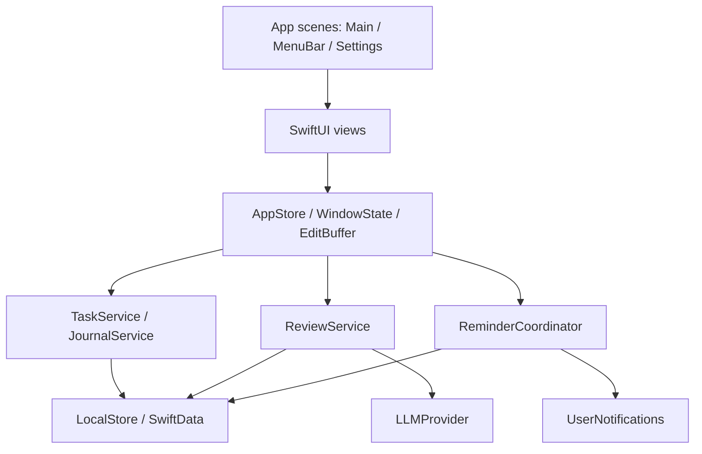

# DayLog 技术设计与实现方案

版本：v0.3 / 2026-09-18。对应用户选定的 **C · Graphite Studio** 和当前 C3 交互稿。

**状态：v0.1 已落地，高优先级持久化问题已修复，见 [修复记录](persistence-fix-2026-09-18.md)。当前代码、构建方式、验证与差异以 [运行说明](running.md) 为准。** 下文保留完整目标设计，标为“计划/预期”的类型拆分与验收项不代表全部完成；交互依据见 [Studio v0.3](studio-v3.md)，开发排期见 [TASKS](../TASKS.md)。

## 1. 范围与技术决策

目标是原生 macOS 单机工作日记：今日任务、步骤、进展、历史、提醒，以及可选的 LLM 回顾。工作记录在无网络和无模型服务时仍然可用。

| 决策 | 方案与理由 |
| --- | --- |
| UI | SwiftUI 原生 App；C3 的 HTML 仅作为交互参考，不嵌入正式 App |
| 系统基线 | 暂定 macOS 14+，Swift 6；当前 C 风格不要求 Liquid Glass |
| 主窗口 | 窄导航 + 可调宽度工作区/详情区；系统标题栏和 toolbar |
| 持久化 | 已落地为 Core Data/SQLite 版本化原子文档；CLT 缺少 SwiftData 宏插件，详见运行说明 |
| 状态 | Observation + MainActor；持久化状态与临时编辑状态分开 |
| 提醒 | UserNotifications，系统负责已提交请求的交付 |
| 模型 | 自定义 LLMProvider 适配；真实接入使用用户授权的 ~/.env 配置，Mock 用于离线 UI/测试 |
| 密钥 | 开发模式可只读 ~/.env；沙盒 App 导入后使用 Keychain，非秘密配置另存 |
| 分发 | 先做本机 .app 验证；公开分发的签名、公证与发布另设阶段 |

首版不加入协作、账号系统、向量数据库、后台主动代理或复杂项目管理。

## 2. 架构与依赖方向

View 发送明确业务动作，不直接绑定可写的持久化实体，也不直接请求模型。应用服务控制校验、保存和回滚；store 输出视图所需的值类型快照。

### 模块与预期文件

| 目录 | 计划文件 / 类型 | 职责 |
| --- | --- | --- |
| `DayLog/App/` | DayLogApp、AppDependencies、AppStore | 场景、依赖组装、应用级共享状态 |
| `Features/Workspace/` | WorkspaceView、NavigationRail、WindowState | 路由、选择项、详情显示与窗口尺寸 |
| `Features/Today/` | TodayView、TaskGroupView、TaskRow、QuickAddView | 日期重点、任务分组、快捷输入 |
| `Features/TaskDetail/` | TaskDetailView、TaskStepsView、TaskProgressView | 标题/状态/备注/步骤/进展 |
| `Features/Journal/` | WorkTimelineView、PersonalJournalView | 工作记录与个人日记 |
| `Features/Review/` | ReviewInspectorView、ReviewViewModel | 输入范围、生成、编辑、采纳 |
| `Features/History/` | HistoryView、DayDetailView | 日期列表与历史快照 |
| `Features/MenuBar/` | MenuBarView | 快速新增、完成任务、打开主窗口 |
| `Features/Settings/` | SettingsView | 提醒、外观、模型、备份配置 |
| `Models/` | SchemaV1、领域枚举、DTO | 数据实体与边界值类型 |
| `Services/` | LocalStore、TaskService、JournalService、ReviewService、ReminderCoordinator、ExportService | 业务与外部能力 |
| `Resources/` | Assets、Localizable.xcstrings | 深浅色语义资源与本地化 |

这些子目录按阶段实际创建，避免先堆空文件。当前实际文件布局见运行说明；首版使用较少文件集中实现。

## 3. C3 到 SwiftUI 的映射

### 3.1 窗口骨架

主窗口采用一条约 62–72 pt 的 NavigationRail，右边用 HSplitView 布局 TodayColumn 和 Inspector。这样可以保留 C 的窄导航，并让用户调整详情宽度。HSplitView 是 macOS 的可调分隔容器，见 [Apple 文档](https://developer.apple.com/documentation/swiftui/hsplitview)。

这是对早期 NavigationSplitView 建议的收敛：C3 需要固定窄导航，先采用 HStack + HSplitView；如果真机可访问性或窗口行为不理想，再切换到系统标准侧栏。系统标题栏、窗口按钮和 toolbar 不手绘。

建议初始窗口约 1080 × 760 pt，详情默认约 350 pt，可在 310–420 pt 调整。内容宽度不足时收起常驻详情，以 sheet 或独立详情页面呈现，不压缩任务文字。具体阈值由原生原型测定。

| C3 组件 | 原生方案 | 状态归属 |
| --- | --- | --- |
| 左侧导航 | 带 SF Symbols 与可访问标签的 Button | WindowState.route |
| 分组任务列表 | List + Section，稳定 taskID 作为 selection | WindowState.selectedTaskID |
| 行内完成框 | Toggle / 自定义样式，保留键盘语义 | TaskService.changeStatus |
| 详情编辑 | TextField / TextEditor + 编辑缓冲 | EditBuffer(taskID) |
| 状态与日内安排 | Picker | TaskService / DailyPlanService |
| 步骤 | 按 sortIndex 排序的 Toggle 列表 | TaskStep |
| 工作时间线 | 稳定 entryID 的列表 | JournalService |
| 回顾 | 独立 inspector 模式 | ReviewViewModel |
| 菜单栏 | MenuBarExtra，window 样式 | 共享 AppStore |
| 设置 | Settings scene + Form | Preferences / ReminderRule |

MenuBarExtra 用于应用未激活时仍可访问的菜单栏入口，见 [Apple 文档](https://developer.apple.com/documentation/swiftui/menubarextra)。主窗口和面板共享业务服务，不各自维护一份任务数据库。

### 3.2 视觉实现

将 Canvas、Panel、PrimaryText、SecondaryText、Separator、Accent、SelectedRow 作为语义颜色；深浅模式分别配置，不把网页十六进制颜色散落到 View 中。

间距统一为 4/8/12/16/24/32；任务行约 44–56 pt；圆角主要使用 6/8/12。铜色只强调当前选择、焦点和少数关键状态。状态同时带文字/形状。默认无循环动画，尊重系统减少动态效果设置。

布局偏好（详情宽度、紧凑模式、外观）保存于 UserDefaults；实际日记与任务进入 SwiftData。

### 3.3 键盘和输入

原生首版使用标准菜单 Commands 和可发现的快捷键；原型中的 N、Space 仅在任务列表获得焦点时生效。输入框或中文输入法组词期间不截获普通字符和回车。切换任务后恢复列表选择和编辑焦点。

先使用 SwiftUI 原生输入控件和 FocusState。只有真机验证发现无法满足中文输入/选区要求时，再局部引入 AppKit 包装，不预先重写编辑器。

## 4. 数据模型

所有实体使用 UUID；可编辑实体带 revision、createdAt、updatedAt。跨实体引用与删除规则在 SchemaV1 中明确建立。

| 实体 | 关键字段 | 语义 |
| --- | --- | --- |
| WorkDay | localDate、timeZoneID、startAt、endAt、focus | 一天的固定归属与时间边界 |
| TodoItem | title、notes、status、lastOpenStatus、deletedAt | 跨日存在的任务当前状态 |
| DailyPlanItem | workDayID、taskID、daySection、sortIndex、removedAt | 某一天的安排；day / closing 不是任务永久属性 |
| TaskStep | taskID、text、isDone、sortIndex、deletedAt | 步骤独立于主任务完成状态 |
| TaskEvent | taskID、occurredAt、sequence、kind、before、after | 任务/步骤/安排修改的重建依据 |
| JournalEntry | workDayID、taskID?、kind、origin、body | 工作随记、关联进展或个人日记 |
| DayTaskSnapshot | workDayID、taskID、title、status、notes、steps、daySection、schemaVersion | 当日截止状态，不随当前任务变化 |
| SummaryDraft | range、sourceManifest、providerID、content、generationState、acceptedEntryID? | 有来源的可编辑草稿 |
| ReminderRule | kind、localTime、weekdays、timeZoneID、enabled | 提醒规则 |
| WorkdayOverride | localDate、isWorkday | 休假/调休的日期例外 |

`sourceManifest` 包含输入来源 ID、revision、日期范围和来源集合摘要；保存为有版本的可编码值，避免隐式依赖模型内部对象布局。

事件中的 before/after 初版使用带版本的完整任务投影（含被修改的步骤或日计划信息），以较多存储换取简单、可验证的历史重建。事件以 occurredAt + sequence 排序；后续再根据真实数据量决定是否压缩。

服务层保证每个工作日期仅一个 WorkDay，同一天同一 taskID 仅一个有效 DailyPlanItem。删除采用软删除以保护历史与撤销。首版不自动清理仍被历史快照或总结引用的数据。

## 5. 状态、编辑与保存

### 单一写入入口

首版采用一个由 MainActor 管理的 ModelContext，关闭该业务上下文的自动保存。视图只修改 EditBuffer，业务动作才把变化应用到 context 并显式 save。ModelContext 的内存变化与落盘行为有区别，见 [Apple 文档](https://developer.apple.com/documentation/swiftdata/modelcontext)。

一次命令遵循：验证 expectedRevision → 写实体与 TaskEvent → 显式保存 → 发布新 DTO → 注册撤销。失败时 rollback 本次上下文修改，保留 EditBuffer 并展示重试。命令应用到 save/rollback 之间不 await，不混入另一个未提交动作。

这一方案适合首版小规模本地数据；不得在主线程做模型推理或长时间导出。若真机发现保存影响 UI，再将 store 隔离到专用 actor，UI/服务契约继续使用值类型快照。

### 状态分层

- AppStore：共享只读任务/日记投影和服务状态。
- WindowState：当前路由、日期、selectedTaskID、inspectorMode、面板宽度。
- EditBuffer：按实体/字段标识保存文本、baseRevision、dirty 与校验错误。
- SaveState：clean / dirty / saving / failed；仅在 save 成功后显示已保存。
- ReviewState：idle / generating / ready / stale / failed / cancelled。

标题与备注建议 400–600 ms 防抖提交，并在失焦、切换任务、正常退出前提交；状态/步骤点击立即保存。未落盘文本在强制退出时仍有丢失风险，恢复草稿机制可在可靠性阶段补齐。

菜单栏和主窗口同时修改同一任务时使用 expectedRevision 检查；过期编辑不静默覆盖新内容，保留缓冲并提供重新载入或明确覆盖。撤销也携带预期 revision，防止覆盖后续修改。

## 6. 核心操作契约

| 操作 | 输入 / 行为 | 不变量 |
| --- | --- | --- |
| createTask | 日期、标题 → 创建任务与 DailyPlanItem | 两者一起保存，空标题不写入 |
| updateTask | taskID、patch、expectedRevision | 写事件；失败保留编辑缓冲 |
| changeStatus | taskID、新状态、expectedRevision | 完成前保留 lastOpenStatus，撤销恢复它 |
| setDaySection | dayID、taskID、day/closing | 只改变该日计划，不改截止日期/提醒 |
| updateStep | stepID、完成状态 | 不自动完成主任务 |
| appendProgress | dayID、taskID、正文 | 只写一条 JournalEntry，两个视图共同展示 |
| carryToDay | taskID、目标日期 | 新建目标日期关联；不移动或重写昨日关联 |
| generateReview | 日期范围、显式来源范围、provider | 冻结输入快照；无权直接修改任务 |
| acceptReview | draftID、expectedManifest | 检查仍有效且未采纳，一次性建立关联记录 |

今日分组优先级：done → 已完成；doing → 进行中；todo + closing → 收尾时；其余 → 接下来。

## 7. 日期与历史

工作日期创建时固定工作时区及当天的 UTC 起止边界；使用 Calendar 计算边界，不把一天硬编码为 86400 秒。更改设置只影响新日期的归属策略，不重新划分旧记录。

今日页显示当前任务状态，历史页显示 DayTaskSnapshot。关闭一天时按 endAt 和事件序列生成快照；如果应用跨午夜未运行，下次启动先按历史事件重建，而不是复制启动时的当前任务。

例：周五创建任务未完成，周一勾选完成 → 周一当前任务显示完成，周五仍显示当日未完成。加入周一只是增加关联，不能把周五计划改成周一。

首版可补写/修订历史日记，保留其归属日和实际编辑时间；历史任务状态纠错需要专门的显式操作，不能被今天的普通编辑隐式触发。

## 8. LLM 回顾流水线

1. 提交选定来源的待保存编辑；失败则停在保存错误，不悄悄总结旧文本。
2. 获取只读 ReviewInput：日期范围、任务事实、工作记录、sourceManifest。默认排除个人日记和 acceptedSummary。
3. 事实统计由程序完成；模型只做表达与建议。通过 LLMProvider 发送不可变、可跨并发边界的值类型。
4. 使用 requestID 区分请求；取消后或新请求开始后，旧响应不能覆盖当前草稿。
5. 返回时校验来源引用和当前 manifest。范围成员变化、来源 revision 变化或存在新的 dirty 编辑均标记 stale。
6. 用户可编辑草稿；重新生成不得默默覆盖人工编辑，可另建草稿版本。
7. 采纳时再次检查来源并提交 SummaryDraft.acceptedEntryID 与 JournalEntry；已有 acceptedEntryID 则返回已有结果，防止重复。

真实接入优先采用用户已授权的 `~/.env` 中 `LLM_BASE_URL / LLM_API_KEY / LLM_MODEL / LLM_TIMEOUT` 完整配置组；当前已确认四项存在，但协议与连通性尚未验证。MockProvider 保留用于离线 UI 与测试。详细配置来源、沙盒导入、错误处理与候选适配器契约见 [LLM 配置与接口设计](llm-configuration.md)。

云端传输使用 URLSession，首版先做非流式生成与取消。Apple 系统模型、Ollama 保留为后续可选适配，不再作为当前默认真实后端。开发模式只读 `.env` 的凭据留在内存；沙盒版导入后从 Keychain 获取，不进入日志或导出。

## 9. 提醒与应用生命周期

提醒由规则纯函数计算 desired requests，再与系统已有请求做差异协调。请求 ID 以逻辑日期、规则 ID 和提醒类型稳定生成；规则版本用于内容比较，避免升级后遗留重复请求。

默认工作周可使用重复规则；有休假/调休例外时预排未来有限窗口（初始建议 14 天，需真机验证），在启动、唤醒、日期或设置变化时刷新。单日例外优先于周规则。

通知点击携带 dayID/taskID，交给 AppRouter 打开对应页面。权限拒绝、专注模式和睡眠可能影响显示，不承诺唤醒机器；应用长期不运行时，自定义排期窗口外的提醒不能保证。

关闭主窗口保留菜单栏；显式退出时提交缓冲，保存失败要保留恢复机会。登录启动通过 SMAppService 由设置开关启用；不修改系统电源策略。

## 10. 数据位置、备份与发布

SwiftData 文件位于应用 Application Support；Sandbox 开启时位于容器内。偏好在 UserDefaults，正式 App 的凭据在 Keychain；开发模式可使用用户 `.env` 的只读内存凭据。日记、数据库、模型响应和密钥都不进入 Git。

Markdown 用于阅读导出，JSON 用于完整恢复，包含 schemaVersion、关系 ID、事件、快照及草稿。通过保存面板选择导出位置。

恢复先校验到临时 store，再保留旧库备份并在受控重新打开 store 的阶段切换；不在线覆盖正在使用的 SQLite 文件。恢复失败保留旧库。发布后每次 schema 变更都必须有迁移样本验证。

本机签名、Sandbox、通知与登录启动必须以真实 .app 验证。公开分发再准备 Developer ID/公证或 App Store 配置；本轮不进行安装或签名操作。

## 11. 分阶段实现与验收

| 阶段 | 实现内容 | 完成标准 |
| --- | --- | --- |
| P0 原生骨架 | 工程、依赖组装、C3 窗口、菜单栏、Mock 数据 | 可构建运行，调整分栏、键盘与中文输入正常 |
| P1 记录闭环 | SwiftData、任务、步骤、关联进展、编辑缓冲 | 重启保留数据；双入口一致；保存失败可恢复 |
| P2 历史与提醒 | 事件/快照、日期规则、通知、导出恢复 | 跨日不改历史；调休/唤醒去重；备份往返一致 |
| P3 智能回顾 | Provider、草稿版本、来源校验、采纳 | 取消/过期不覆盖；无模型仍能正常记录 |
| P4 打磨 | 个人日记、登录启动、辅助功能、性能 | Reduce Motion、深浅色、真实系统行为与指标验收 |

重点自动测试：分组优先级、状态撤销、步骤不改任务状态、写入失败回滚、过期 revision、进展单次存储、周五/周一快照、时区边界、调休排期、AI 迟到响应/重复采纳、JSON 恢复及迁移。

重点真机测试：中文输入法、焦点、菜单栏和窗口互操作、退出时保存、通知授权/点击、登录启动和 VoiceOver。性能以 Release 测量：首轮目标是空闲 CPU 接近零、无模型常驻内存争取低于 100 MB、菜单栏打开约 200 ms 内；这些是目标，不是实测结果。

## 12. 开工前检查

1. 重查 Xcode 与 SDK。前序环境快照显示仅 CLT 路径可用，不能据此认定今天仍未安装完整 Xcode。
2. 固定 Bundle ID、本机开发签名、macOS deployment target，确认资源和数据目录不混入源码。
3. 先完成 P0 的真实 .app 验证，再建立持久化模型；不要把浏览器交互稿当作原生功能验收。
4. C 方向已由用户明确；步骤清单、收尾时、默认密度仍是当前设计建议，按实现阶段处理细节反馈。
